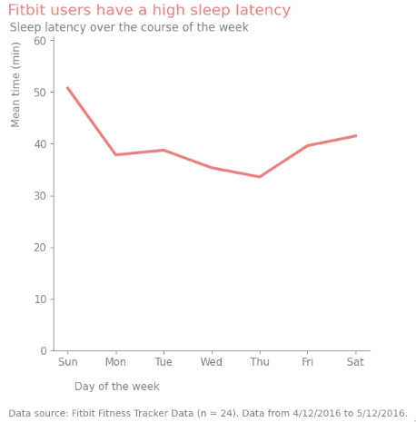

## Summary

### Goal

The objective of this project is to use the data analytics life cycle to solve the business task of CBellabeat, a woman wellness company. I use the Fitbit fitness tracker data to support my case. My insights will help to design a marketing campaign to unlock new grow opportunities for the company.


### Process

I begin the data analytic process by obtaining the questions that will drive my analysis. Once I have identified these questions, I retrieve the necessary data from Divvy and merge them into a single feather-formatted file. Before proceeding with the analysis, I verify the data integrity and clean data where necessary. On the analysis phase, I perform data transformation to extract meaningful insights. Once I have identified the key findings, I share my conclusions. Finally, I present my recommendations to drive decision-making.


### Highlights

This project is carried out using Python, using data-science related libraries given its capabilities to handle medium to large sized datasets.

Fitbit users tend to support a sedentary lifestyle consistently across different periods. Other health related measures support the previous result. This suggest a preliminary trend that could poten
 lead to long-term negative effects on their health and overall well-being.

[Click here for the code of this project](https://www.kaggle.com/code/christianmontenegro/bellabeat-case-study)

## Introduction

The current and future market of activity tracking, consumer health informatics, and personally generated health data is poised for significant growth and innovation. As technology continues to advance, we can expect to see more sophisticated wearable devices and mobile applications that not only track a wide array of health metrics but also provide actionable insights and personalized health recommendations. The integration of artificial intelligence and machine learning will enable these tools to offer more accurate and predictive analytics, potentially improving individual health outcomes and prompting timely interventions [1-2]. This situation creates a good opportunity to explore and step into this sector. An excellent business profile is Bellabeat.

## Background

Urška Sršen and Sando Mur founded Bellabeat, a high-tech company that manufactures health-focused smart products. Sršen used her background as an artist to develop beautifully designed technology that informs and inspires women around the world. Collecting data on activity, sleep, stress, and reproductive health has allowed Bellabeat to empower women with knowledge about their own health and habits. Since it was founded in 2013, Bellabeat has grown rapidly and quickly positioned itself as a tech-driven wellness company for women.

## Business task

The company's marketing strategy has invested in traditional advertising media, such as radio, out-of-home billboards, print, and television, but focuses on digital marketing extensively. Bellabeat invests year-round in Google Search, maintaining active Facebook and Instagram pages, and consistently engages consumers on Twitter. Additionally, Bellabeat runs video ads on Youtube and display ads on the Google Display Network to support campaigns around key marketing dates.

Bellabeat is a successful small company, but they have the potential to become a larger player in the global smart device market. Urška Sršen, cofounder and Chief Creative Officer of Bellabeat, believes that analyzing smart device fitness data could help unlock new growth opportunities for the company.

## Scenario

This capstone project involves a junior data analyst working for Bellabeat in the marketing analyst team. The solution will utilize the six stages proposed in the Google Data Analytics Professional Certificate: Ask, Prepare, Process, Analyze, Share, and Act. These stages define how data is generated, collected, processed, used, and analyzed to achieve business goals. Furthermore, the project will apply these stages to the specific context of Bellabeat's marketing analyst team. The results of this project will aid stakeholders in making informed decisions.
```python
## Load required libraries
# Library for the Python programming language, adding support for large,
# multi-dimensional arrays and matrices, along with a large collection
# of high-level mathematical functions to operate on these arrays
import numpy as np

# Library for data manipulation and analysis.
import pandas as pd

# A comprehensive library for creating static, animated,
# and interactive visualizations in Python
import matplotlib.pyplot as plt

# Data visualization library based on matplotlib. It provides a high-level
# interface for drawing attractive and informative statistical graphics.
import seaborn as sns

# Library that provides a portable way of using operating system
# dependent functionality
import os

# Library that provides a Python API for the Arrow C++ library
# that contains a set of technologies that enable big data systems
# to store, process and move asdata fast.
import pyarrow.feather as feather
```
## Ask

Sršen asks you to analyze smart device usage data in order to gain insight into how consumers use non-Bellabeat smart devices. She then wants you to select one Bellabeat product to apply these insights to in your presentation. These questions will guide your analysis:

What are some trends in smart device usage?
How could these trends apply to Bellabeat customers?
How could these trends help influence Bellabeat marketing strategy?

## Prepare

In this phase, I gather the data, describe it, ensure it has the correct format, credibility, and understand its limitations. I use the Fitbit Fitness Tracker data recommended for this case study. The data was in csv format, which has reading and writing performance limitations. With that in mind, I adopted the feather format. There are some problems with the credibility, so the insights obtained from this data will not be of a completely prescriptive nature.

### Describe data

Sršen encourages you to use public data that explores smart device users’ daily habits. She points you to a specific data set, Fitbit Fitness Tracker Data [3]. This Kaggle data set contains personal fitness tracker from thirty fitbit users n=33
. Thirty three eligible Fitbit users consented to the submission of personal tracker data, including minute-level output for physical activity, heart rate, and sleep monitoring. It includes information about daily activity, steps, and heart rate that can be used to explore users’ habits. There are 18 files (csv format) describing the information before mentioned at diferent granularity levels, collected from 03-12-2016 to 05-12-2016 (two months of observations).

### Move and format data

The feather file storage format, has become a popular choice for data storage due to its demonstrated benefits of speed and file size compared to the csv format as discussed in [4-8]. Finally, we save them as a feather file in a separate directory (`cs2-Bellabit-preparation-step`), implemented in the ``convert_csv_to_feather` function.
```python
def convert_csv_to_feather(input_dir, output_dir):
   # Ensure output directory exists
   os.makedirs(output_dir, exist_ok=True)

   # Iterate over all files in input directory
   for filename in os.listdir(input_dir):
       # Check if file represent data on a daily basis
       if filename.endswith(".csv"):
           # Construct full file paths
           input_file = os.path.join(input_dir, filename)
           output_file = os.path.join(output_dir, os.path.splitext(os.path.basename(filename))[0] + '.ftr')

           # Read CSV file into DataFrame
           df = pd.read_csv(input_file)

           # Write DataFrame to Feather file
           feather.write_feather(df, output_file)
   print("All the files located at", input_dir, "were succesfully convert to feather format" )
convert_csv_to_feather(input_dir = "/kaggle/input/fitbit/Fitabase Data 4.12.16-5.12.16/",
    output_dir = "/kaggle/working/cs2-Bellabit-preparation-step")
```
### Check data credibility

The credibility and integrity of our data can be determined using the ROCCC system proposed in the certification:

The data is not reliable because the sample size is insufficient for a quantitative study like this. So, it's important to consider the findings of similar studies, to make an informed estimate of the population proportion and variability.

The data is not original, because it was collected by a third-party provider (Amazon Mechanical Turk).
The data is comprehensive due to its parameters at diferent levels of granularity, matching those from Bellabit's products.

The data is not current, because the data was collected almost eight years ago.

The data is not cited because the third-party provider not cited the original source.

### Understand data limitations

The data was collected six years ago (outdated) with data collected for over two months and the sample size is insufficient (n=33), leading to an irrelevant and unreliable source to know the true population of users habits wearing smart devices. So this case study will be helpful as a quantitative exploratory study or analysis to provide preliminary trends in smart device usage habits.

## Process

To make sure the data we're working with is accurate and reliable, I used certain tools and techniques to process it. First, I looked at each piece of data closely to understand its limitations and challenges. Then, I applied processes to clean the data and remove any errors or inconsistencies. By doing this, we can trust that our results are based on accurate information.

Since the Fitbit Fitness tracker data has observations for two months, we will continue with Python. Python owns data-manipulation libraries that could help me in this phase and provides a good performance with the amount of data available.

### Explore data

To understand the structure of the data, we can load the feather files that contains observations from two months. By examining this data, we can gain insights into the usage patterns of the data collected by Fitbit and make informed decisions about its operation and improvement.

```python
def load_dataframe(filename):
    """Load a DataFrame from a feather file."""
    return pd.read_feather(filename)

# Define file paths
filepaths = {
    "DAILY": ["dailyActivity", "dailyCalories", "dailyIntensities", "dailySteps", "sleepDay", "weightLogInfo"],
    "HOURLY": ["hourlyIntensities", "hourlySteps", "hourlyCalories"],
    "MINUTE": ["minuteIntensitiesNarrow", "minuteStepsNarrow", "minuteMETsNarrow", "minuteCaloriesNarrow", "minuteSleep",
               "minuteIntensitiesWide", "minuteStepsWide", "minuteCaloriesWide"],
    "SECONDS": ["heartrate_seconds"]
}

# Initialize dictionaries to store DataFrames
dataframes = {}

# Loop through each granularity level and load corresponding DataFrames
for granularity, filenames in filepaths.items():
    for filename in filenames:
        full_filename = f"/kaggle/working/cs2-Bellabit-preparation-step/{filename}_merged.ftr"
        df = load_dataframe(full_filename)
        dataframes[f"{filename}"] = df
# Print summary information of data
for name, df in dataframes.items():
    print("--------------------------\n")
    pd.options.display.max_columns = df.shape[1]
    print(name)
    print("SUMMARY")
    print(df.describe(include=[np.number])) # For numerical columns
    print(df.describe(include=['O'])) # For object (string) columns
    print("DATA TYPES")
    df.info()
    print("UNIQUE DATA")
    print(df.nunique())
    print("-------------------------\n")
```

This dataset is classified as longitudinal because it repeatedly captures data about individual users of a smart devices company over a two-month period. Longitudinal datasets like this are valuable for tracking changes and patterns over time, offering insights into user behavior and device usage trends.

The Fitbit Fitness Tracker dataset comprises files that record data at varying levels of granularity. One such file, `daily_activity_merged.ftr`, aggregates daily activity data and includes information previously found in `daily_calories_merged.ftr`, `daily_steps_merged.ftr`, and `daily_intensities_merged.ftr`. Due to the redundancy, the latter files will not be considered in further analysis. The `daily_activity_merged.ftr` file features 15 columns, such as `Id` for user identification, `ActivityDate` for the date of activity, and `TotalSteps`, which records the total number of steps taken by a user within a 24-hour period. It also includes columns for distances covered at various activity levels—`TotalDistance`, `TrackerDistance`, `VeryActiveDistance`, `ModeratelyActiveDistance`, `LightActiveDistance`, and `SedentaryActiveDistance`—and for minutes spent in different activity intensities—`VeryActiveMinutes`, `FairlyActiveMinutes`, `LightlyActiveMinutes`, and `SedentaryMinutes`. The `Calories` column notes the number of calories burned per day. Additionally, `sleep_day_merged.ftr` provides insights into sleep patterns with columns like `TotalSleepRecords`, `TotalMinutesAsleep`, and `TotalTimeInBed`. Lastly, `weightLogInfo_merged.ftr` contains eight columns related to users' daily weight measures.

Starting from the highest level of granularity, there are three files that represent data about intensities, steps, and calories. These files contain the same variables recorded at the daily level of granularity. Moving down to a lower level, there are eight files. Four of these contain the same data at the daily and hourly level. There is also one file that measures METs. The remaining files represent the data in a wide format that is not useful in our analysis. Lastly, at the second level of granularity, there is one file that records heart rate measurements every five seconds.

### Check data integrity

Determining data integrity is a critical process in data analysis to ensure that the data is both accurate and complete, and remains consistent throughout the analysis. In the following sections, I will demonstrate the application of various techniques designed to achieve this goal. These techniques aim to provide a thorough and effective means of managing and controlling the data during the analysis process.

#### Determine the statistical power of data

As previously mentioned, the sample size of the dataset is insufficient to produce reliable recommendations for Bellabeat's marketing team, particularly in the realm of prescriptive analytics. Consequently, any conclusions drawn from this analysis will be purely descriptive.

#### Overcome the challenges of insufficient data

No datasets fit enough to serve as proxy data were found. I check the most relevant websites like Kaggle, Google's Dataset Search, data.world, USA government open datasets, etc. Resulting in Apple Watch and Fitbit data. This dataset has a larger sample size of 46, but only tracks them for 65 minutes, making it useless to achieve the objectives.

#### Discover data constraints and clean data

Inappropiate data types were found in features representing dates at different levels of granularity. To solve this, all dates were standarized to a single format assigning the UTC time format.

```python
def convert_object_to_datetime(dfs):
  """
  Converts datetime-like strings in multiple DataFrames to actual datetime objects.

  Args:
    dfs (list[pd.DataFrame]): A list of pandas DataFrames to be processed.
  """

  for df in dfs.values():
    # Identify columns with object data type
    object_cols = df.select_dtypes(include=['object']).columns

    # Apply to_datetime() to columns, handling potential errors
    for col in object_cols:
      try:
        df[col] = pd.to_datetime(df[col], errors='coerce')
      except (ValueError, TypeError) as e:
        print(f"Error converting column '{col}': {e}")
convert_object_to_datetime(dataframes)
```
Data range for each column was verified for accuracy. Based on certain conditions like date range and ID length, etc., filters were applied [9-11]. Following this, we proceeded to reduce the data across various categories. Daily activity data was reduced from 940 observations to 936, representing a decrease of 0.42%. Sleep day data remains the same. Weight data was reduced from 67 observations to 28, a decrease of 58.20%. Hourly intensities data was reduced from 22099 observations to 21859, a decrease of 1.08%. Similar reductions occurred with hourly steps and calories. Minute intensities data was reduced from 1,325,580 observations to 1,310,419, a decrease of 1.14%. Almost identical reductions also occurred with minute steps data, minute METs data, minute calories data, and minute sleep data (1.53%). Heart rate data was reduced from 2,483,658 observations to 2,462,069, a decrease of 0.86%.

```python
# Filter daily activity data
daily_activity_corrected_data_ranges = dataframes['dailyActivity'][
    # Check if Id has a length of 10
    (dataframes['dailyActivity']['Id'].astype(str).apply(lambda x: len(x) == 10)) &
    # Check if ActivityDate falls between a date range
    (dataframes['dailyActivity']["ActivityDate"] >= "2016-03-12") &
    (dataframes['dailyActivity']["ActivityDate"] <= "2016-05-12") &
    # Check if TotalSteps is greater or equal to 0
    (dataframes['dailyActivity']["TotalSteps"] >= 0) &
    # Check if TotalDistance is greater or equal to 0
    (dataframes['dailyActivity']["TotalDistance"] >= 0) &
    # Check if TrackerDistance is greater or equal to 0
    (dataframes['dailyActivity']["TrackerDistance"] >= 0) &
    # Check if LoggedActivitiesDistance is greater or equal to 0
    (dataframes['dailyActivity']["LoggedActivitiesDistance"] >= 0) &
    # Check if VeryActiveDistance is greater or equal to 0
    (dataframes['dailyActivity']["VeryActiveDistance"] >= 0) &
    # Check if ModeratelyActiveDistance is greater or equal to 0
    (dataframes['dailyActivity']["ModeratelyActiveDistance"] >= 0) &
    # Check if LightActiveDistance is greater or equal to 0
    (dataframes['dailyActivity']["LightActiveDistance"] >= 0) &
    # Check if SedentaryActiveDistance is greater or equal to 0
    (dataframes['dailyActivity']["SedentaryActiveDistance"] >= 0) &
    # Check if VeryActiveMinutes is greater or equal to 0
    # but less or equal to 1440 min (24 h)
    (dataframes['dailyActivity']["VeryActiveMinutes"] >= 0) &
    (dataframes['dailyActivity']["VeryActiveMinutes"] <= 1440) &
    # Check if FairlyActiveMinutes is greater or equal to 0
    # but less or equal to 1440 min (24 h)
    (dataframes['dailyActivity']["FairlyActiveMinutes"] >= 0) &
    (dataframes['dailyActivity']["FairlyActiveMinutes"] <= 1440) &
    # Check if LightlyActiveMinutes is greater or equal to 0
    # but less or equal to 1440 min (24 h)
    (dataframes['dailyActivity']["LightlyActiveMinutes"] >= 0) &
    (dataframes['dailyActivity']["LightlyActiveMinutes"] <= 1440) &
    # Check if SedentaryMinutes is greater or equal to 0
    # but less or equal to 1440 min (24 h)
    (dataframes['dailyActivity']["SedentaryMinutes"] >= 0) &
    # Check if calories are greater than 0
    (dataframes['dailyActivity']["Calories"] > 0)
    ]
print("Observations after filtering of data:", daily_activity_corrected_data_ranges.shape[0])

# Filter sleep day data
sleep_day_corrected_data_ranges = dataframes["sleepDay"][
    # Check if Id has a length of 10
    (dataframes["sleepDay"]['Id'].astype(str).apply(lambda x: len(x) == 10)) &
    # Check if "SleepDay" falls between a date range
    (dataframes["sleepDay"]["SleepDay"] >= "2016-03-12") &
    (dataframes["sleepDay"]["SleepDay"] <= "2016-05-12") &
    # Check if recorded sleep periods are greater than 0
    (dataframes["sleepDay"]["TotalSleepRecords"] > 0) &
    # Check if the amount of minutes classified as
    # being asleep falls between a time range
    (dataframes["sleepDay"]["TotalMinutesAsleep"] >= 0) &
    (dataframes["sleepDay"]["TotalMinutesAsleep"] <= 1440) &
    # Check if the amount of minutes classified as
    # being asleep falls between a time range
    (dataframes["sleepDay"]["TotalTimeInBed"] >= 0) &
    (dataframes["sleepDay"]["TotalTimeInBed"] <= 1440)
    ]
print("Observations after filtering of data:", sleep_day_corrected_data_ranges.shape[0])

# Filter weight data under certain conditions
weight_log_info_corrected_data_ranges = dataframes["weightLogInfo"][
    # Check if Id has a length of 10
    (dataframes["weightLogInfo"]['Id'].astype(str).apply(lambda x: len(x) == 10)) &
    # Check if "Date" falls between a date range
    (dataframes["weightLogInfo"]["Date"] >= "2016-03-12") &
    (dataframes["weightLogInfo"]["Date"] <= "2016-05-12") &
    # Check if WeightKg is greater than 0
    (dataframes["weightLogInfo"]["WeightKg"] > 0) &
    # Check if WeightPounds is greater than 0
    (dataframes["weightLogInfo"]["WeightPounds"] > 0) &
    # Check if Fat falls between established range
    (dataframes["weightLogInfo"]["Fat"] > 0) &
    (dataframes["weightLogInfo"]["Fat"] < 100) &
    # Check if BMI falls between an established range
    (dataframes["weightLogInfo"]["BMI"] > 0) &
    (dataframes["weightLogInfo"]["BMI"] < 100) &
    # Check if IsManualReport falls between a discrete established range
    (dataframes["weightLogInfo"]["IsManualReport"] == True) | (dataframes["weightLogInfo"]["IsManualReport"] == False) &
    # Check if LogId has a length of 13
    (dataframes["weightLogInfo"]['LogId'].astype(str).apply(lambda x: len(x) == 13))
    ]
print("Observations after filtering of data:", weight_log_info_corrected_data_ranges.shape[0])

# Filter hourly intensities data
hourly_intensities_corrected_data_ranges = dataframes["hourlyIntensities"][
    # Check if Id has a length of 10
    (dataframes["hourlyIntensities"]['Id'].astype(str).apply(lambda x: len(x) == 10)) &
    # Check if ActivityHour falls between a date range
    (dataframes["hourlyIntensities"]["ActivityHour"] >= "2016-03-12") &
    (dataframes["hourlyIntensities"]["ActivityHour"] <= "2016-05-12") &
    # Check if TotalIntensity falls betweeen a range of values
    (dataframes["hourlyIntensities"]["TotalIntensity"] >= 0) &
    (dataframes["hourlyIntensities"]["TotalIntensity"] <= 180) &
    # Check if AverageIntensity falls between a range of values
    (dataframes["hourlyIntensities"]["AverageIntensity"] >= 0) &
    (dataframes["hourlyIntensities"]["AverageIntensity"] <= 3)
    ]

print("Observations after filtering of data:", hourly_intensities_corrected_data_ranges.shape[0])

# Filter hourly steps data
hourly_steps_corrected_data_ranges = dataframes["hourlySteps"][
    # Check if Id has a length of 10
    (dataframes["hourlySteps"]['Id'].astype(str).apply(lambda x: len(x) == 10)) &
    # Check if ActivityHour falls between a date range
    (dataframes["hourlySteps"]["ActivityHour"] >= "2016-03-12") &
    (dataframes["hourlySteps"]["ActivityHour"] <= "2016-05-12") &
    # Check if StepTotal is greater than 0
    (dataframes["hourlySteps"]["StepTotal"] >= 0)
    ]
print("Observations after filtering of data:", hourlySteps_corrected_data_ranges.shape[0])

# Filter hourly calories data
hourly_calories_corrected_data_ranges = dataframes["hourlyCalories"][
    # Check if Id has a length of 10
    (dataframes["hourlyCalories"]['Id'].astype(str).apply(lambda x: len(x) == 10)) &
    # Check if ActivityHour falls between a date range
    (dataframes["hourlyCalories"]["ActivityHour"] >= "2016-03-12") &
    (dataframes["hourlyCalories"]["ActivityHour"] <= "2016-05-12") &
    # Check if calories are greater than 0
    (dataframes["hourlyCalories"]["Calories"] > 0)
    ]
print("Observations after filtering of data:", hourly_calories_corrected_data_ranges.shape[0])

# Filter minute intensities data
minute_intensities_corrected_data_ranges = dataframes["minuteIntensitiesNarrow"][
    # Check if Id has a length of 10
    (dataframes["minuteIntensitiesNarrow"]["Id"].astype(str).apply(lambda x: len(x) == 10)) &
    # Check if ActivityMinute falls between a date range
    (dataframes["minuteIntensitiesNarrow"]["ActivityMinute"] >= "2016-03-12") &
    (dataframes["minuteIntensitiesNarrow"]["ActivityMinute"] <= "2016-05-12") &
    # Check if Intensity falls between a discrete established range
    (dataframes["minuteIntensitiesNarrow"]["Intensity"] == 0) |
    (dataframes["minuteIntensitiesNarrow"]["Intensity"] == 1) |
    (dataframes["minuteIntensitiesNarrow"]["Intensity"] == 2) |
    (dataframes["minuteIntensitiesNarrow"]["Intensity"] == 3)
    ]
print("Observations after filtering of data:", minute_intensities_corrected_data_ranges.shape[0])

# Filter minute steps data
minute_steps_corrected_data_ranges = dataframes["minuteStepsNarrow"][
     # Check if Id has a length of 10
    (dataframes["minuteStepsNarrow"]['Id'].astype(str).apply(lambda x: len(x) == 10)) &
    # Check if ActivityMinute falls between a date range
    (dataframes["minuteStepsNarrow"]["ActivityMinute"] >= "2016-03-12") &
    (dataframes["minuteStepsNarrow"]["ActivityMinute"] <= "2016-05-12") &
    # Check if Steps is greater than 0
    (dataframes["minuteStepsNarrow"]["Steps"] >= 0)
    ]
print("Observations after filtering of data:", minute_steps_corrected_data_ranges.shape[0])

# Downscale METs values by 10 (run once not multiple times)
dataframes["minuteMETsNarrow"]["METs"] = dataframes["minuteMETsNarrow"]["METs"] / 10

# Filter minute METs data
minute_METs_corrected_data_ranges = dataframes["minuteMETsNarrow"][
    # Check if Id has a length of 10
    (dataframes["minuteMETsNarrow"]['Id'].astype(str).apply(lambda x: len(x) == 10)) &
    # Check if ActivityMinute falls between a date range
    (dataframes["minuteMETsNarrow"]["ActivityMinute"] >= "2016-03-12") &
    (dataframes["minuteMETsNarrow"]["ActivityMinute"] <= "2016-05-12") &
    # Check if METs is greater than 0.9
    (dataframes["minuteMETsNarrow"]["METs"] >= 0.9)
    ]
print("Observations after filtering of data:", minute_METs_corrected_data_ranges.shape[0])

# Filter minute calories data
minute_calories_corrected_data_ranges = dataframes["minuteCaloriesNarrow"][
    # Check if Id has a length of 10
    (dataframes["minuteCaloriesNarrow"]['Id'].astype(str).apply(lambda x: len(x) == 10)) &
    # Check if ActivityMinute falls between a date range
    (dataframes["minuteCaloriesNarrow"]["ActivityMinute"] >= "2016-03-12") &
    (dataframes["minuteCaloriesNarrow"]["ActivityMinute"] <= "2016-05-12") &
    # Check if Calories are greater than 0
    (dataframes["minuteCaloriesNarrow"]["Calories"] > 0)
    ]
print("Observations after filtering of data:", minute_calories_corrected_data_ranges.shape[0])

# Filter minute sleep data
minute_sleep_corrected_data_ranges = dataframes["minuteSleep"][
    # Check if Id has a length of 10
    (dataframes["minuteSleep"]['Id'].astype(str).apply(lambda x: len(x) == 10)) &
    # Check if ActivityMinute falls between a date range
    (dataframes["minuteSleep"]["date"] >= "2016-03-12") &
    (dataframes["minuteSleep"]["date"] <= "2016-05-12") &
    # Check if value falls between a discrete established range
    (dataframes["minuteSleep"]["value"] == 1) |
    (dataframes["minuteSleep"]["value"] == 2) |
    (dataframes["minuteSleep"]["value"] == 3) &
    # Check if logId has a length of 11
    (dataframes["minuteSleep"]['logId'].astype(str).apply(lambda x: len(x) == 11))
    ]
print("Observations after filtering of data:", minute_sleep_corrected_data_ranges.shape[0])

# Filter heartrate data (in seconds)
heartrate_seconds_corrected_data_ranges =  dataframes['heartrate_seconds'][
    # Check if Id has a length of 10
    (dataframes['heartrate_seconds']['Id'].astype(str).apply(lambda x: len(x) == 10)) &
    # Check if ActivityMinute falls between a date range
    (dataframes['heartrate_seconds']["Time"] >= "2016-03-12") &
    (dataframes['heartrate_seconds']["Time"] <= "2016-05-12") &
    # Check if Value is greater than 0
    (dataframes['heartrate_seconds']["Value"] > 0)
    ]
print("Observations after filtering of data:", heartrate_seconds_corrected_data_ranges.shape[0])
```
After removing duplicate data, some dataframes present no change in their size, those that do are sleep-related ones. The sleep data at the daily level of granularity decreased from 413 to 410 entries, a reduction of 0.72%. Similarly, at the minute level of detail, decreased from 185,619 to 185,076 records, a reduction of 0.29%.
```python
def drop_duplicates(df, desc):
    df_unique = df.drop_duplicates(keep='first')
    print(f"{desc} unique Ids:", df_unique["Id"].nunique())
    print(f"Observations before removal of duplicate {desc}:", df.shape[0])
    print(f"Observations after removal of duplicate {desc}:", df_unique.shape[0])
    return df_unique

# Apply the function to each DataFrame
daily_activity_unique = drop_duplicates(daily_activity_corrected_data_ranges, "daily_activity")

sleep_day_unique = drop_duplicates(sleep_day_corrected_data_ranges, "sleep_day")

weight_log_info_unique = drop_duplicates(weight_log_info_corrected_data_ranges, "weight_log_info")

hourly_intensities_unique = drop_duplicates(hourly_intensities_corrected_data_ranges, "hourly_intensities")

hourly_steps_unique = drop_duplicates(hourly_steps_corrected_data_ranges, "hourly_steps")

hourly_calories_unique = drop_duplicates(hourly_calories_corrected_data_ranges, "hourly_calories")

minute_intensities_unique = drop_duplicates(minute_intensities_corrected_data_ranges, "minute_intensities")

minute_steps_unique = drop_duplicates(minute_steps_corrected_data_ranges, "minute_steps")

minute_METs_unique = drop_duplicates(minute_METs_corrected_data_ranges, "minute_METs")

minute_calories_unique = drop_duplicates(minute_calories_corrected_data_ranges, "minute_calories")

minute_sleep_unique = drop_duplicates(minute_sleep_corrected_data_ranges, "minute_sleep")

heartrate_seconds_unique = drop_duplicates(heartrate_seconds_corrected_data_ranges, "heartrate_seconds")
```

Cross-validation only happens with data at the daily level of granularity. Reducing daily activity data means a decrease from 936 observations to 300 observations (67.94%). This lets us with 23 users instead of 33. The sleep data remains almost the same with 409 observations and same amount of users. And, thee weight data remains the same.

```python
# Cross-field validate daily activity data
daily_activity_cross_validated = daily_activity_unique[
    # The distance tracked by Fitbit device should be equal
    # to the sum of distance at different activity levels
    (daily_activity_unique["TrackerDistance"] == daily_activity_unique["VeryActiveDistance"] +
    daily_activity_unique["ModeratelyActiveDistance"] +
    daily_activity_unique["LightActiveDistance"] +
    daily_activity_unique["SedentaryActiveDistance"])
]
print("Observations after cross-validation of data:", daily_activity_cross_validated.shape[0])
print("Daily activity unique Ids:", daily_activity_cross_validated["Id"].nunique())

# Cross-field validate daily sleep data
sleep_day_cross_validated = sleep_day_unique[
   # TotalTimeInBed should be greater than TotalMinutesAsleep
   (sleep_day_unique["TotalTimeInBed"] > sleep_day_unique["TotalMinutesAsleep"])
]
print("Observations after cross-validation of data:", sleep_day_merged_cross_validated.shape[0])
print("Sleep day unique Ids:",sleep_day_merged_cross_validated["Id"].nunique())

# Cross-field validate weight data
weight_log_info_cross_validated = weight_log_info_unique[
    # WeightPounds is always greater than WeightKg
    (weight_log_info_unique["WeightPounds"] > weight_log_info_unique["WeightKg"])
]
print("Observations after cross-validation of data:", weight_log_info_cross_validated.shape[0])
print("Daily weight info unique Ids:", weight_log_info_cross_validated["Id"].nunique())
```

Across all the variables and files in the dataset, there are missing values only in the weight data. The missing data is present in 92.85% of the values in the Fat column. In this situation the right thing to do is remove the column [12-15].

It's important to note that there are data for all Fitbit users at the hourly and minute level of granularity, with the exception of sleep-related data which is available at the minute level of granularity for  n=24 users. At the daily level of granularity, there are data for  n=31 users for daily activity data,  n=24 for sleep-related data, and  n=5 for weight-related data. Additionally, at the second level of granularity, there are data for  n=14 users for heart-related data.

```python
def observed_and_null_values_count(df):
    # Calculate missing values count
    missing_values_count = df.isnull().sum()

    # Calculate observed values count
    observed_values_count = df.notnull().sum()

    # Create a DataFrame with the counts
    counts_df = pd.DataFrame({
        'feature': df.columns,
        'missing_values_count': missing_values_count,
        'observed_values_count': observed_values_count
    })

    # Calculate percentages
    counts_df['missing_percent'] = (counts_df['missing_values_count'] / counts_df[['missing_values_count', 'observed_values_count']].sum(axis = 1)) * 100
    counts_df['observed_percent'] = (counts_df['observed_values_count'] / counts_df[['missing_values_count', 'observed_values_count']].sum(axis = 1)) * 100

    return counts_df

# Dictionary to hold all dataframes
dfs = {
    'daily_activity': daily_activity_cross_validated,
    'sleep_day': sleep_day_cross_validated,
    'weight': weight_log_info_cross_validated,
    'hourly_intensities': hourly_intensities_unique,
    'hourly_steps': hourly_steps_unique,
    'hourly_calories': hourly_calories_unique,
    'minute_intensities': minute_intensities_unique,
    'minute_steps': minute_steps_unique,
    'minute_METs': minute_METs_unique,
    'minute_calories': minute_calories_unique,
    'minute_sleep': minute_sleep_unique,
    'heartrate_data': heartrate_seconds_unique
}

# Apply the function to all dataframes and store the results in a dictionary
missing_data_counts = {key: observed_and_null_values_count(value) for key, value in dfs.items()}
```
Finnally, I exported the data for further use in the following sections. The same format remains.

```python
# Define the directory path
directory_path = "/kaggle/working/cs2-Bellabit-process-step/"

def ensure_clean_directory(path):
    """
    Ensures the existence of a clean directory at the specified path.

    Args:
        path (str): The path to the directory to create or clean.

    Raises:
        OSError: If an error occurs while removing or creating the directory.
    """

    if os.path.exists(path):
        # Remove existing directory and its contents
        shutil.rmtree(path)

    # Create the directory, ignoring any errors if it already exists
    os.makedirs(path, exist_ok=True)

def write_feather_files(data_dict, base_path):
    """
    Writes multiple Feather files to a specified directory, using data from a dictionary.

    Args:
        data_dict (dict): A dictionary where keys are filenames (without extensions) and values are data to be saved as Feather files.
        base_path (str): The base path of the directory where the files will be written.

    Raises:
        OSError: If an error occurs while creating file paths or writing files.
        ImportError: If the feather library is not installed.
    """

    try:
        for filename, data in data_dict.items():
            file_path = os.path.join(base_path, f"{filename}.ftr")  # Construct full file path with .ftr extension
            feather.write_feather(data, file_path)  # Write data to Feather file
    except OSError as e:
        raise OSError(f"Error writing Feather files: {e}") from e
    except ImportError as e:
        raise ImportError("feather library is required for this function. Please install it using 'pip install feather-format'") from e

# Ensure the directory is clean
ensure_clean_directory(directory_path)

# Data to be exported in the feather format
data_to_export = {
    "daily_activity_processed": daily_activity_cross_validated,
    "sleep_day_processed": sleep_day_cross_validated,
    "weight_log_info_processed": weight_log_info_cross_validated,
    "hourly_intensities_processed": hourly_intensities_unique,
    "hourly_steps_processed": hourly_steps_unique,
    "hourly_calories_processed": hourly_calories_unique,
    "minute_intensities_processed": minute_intensities_unique,
    "minute_steps_processed": minute_steps_unique,
    "minute_METs_processed": minute_METs_unique,
    "minute_calories_processed": minute_calories_unique,
    "minute_sleep_processed": minute_sleep_unique,
    "heartrate_seconds_processed": heartrate_seconds_unique,
}

# Write all feather files to the directory
write_feather_files(data_to_export, directory_path)
```
## Analyze

In this phase, I answer the proposed first guiding question. The aim was to discover trends or patterns at different levels of granularity. I choose daily and hourly data to have a balance between observing broad trends and short-term fluctuations (in-depth behavioral insights) in physical activity and health metrics. I achieved this by organizing, formatting, adjusting, and transforming data.

### Organize the data

I performed time-based sorting of the data. This will facilitate the aggregation, visualization, and comparison of users to find population-level trends.

```python
# Load processed data
daily_activity_data = load_dataframe("/kaggle/working/cs2-Bellabit-process-step/daily_activity_processed.ftr")
sleep_day_data = load_dataframe("/kaggle/working/cs2-Bellabit-process-step/sleep_day_processed.ftr")
weight_log_info_data = load_dataframe("/kaggle/working/cs2-Bellabit-process-step/weight_log_info_processed.ftr")
hourly_intensities_data = load_dataframe("/kaggle/working/cs2-Bellabit-process-step/hourly_intensities_processed.ftr")
hourly_steps_data = load_dataframe("/kaggle/working/cs2-Bellabit-process-step/hourly_steps_processed.ftr")
hourly_calories_data = load_dataframe("/kaggle/working/cs2-Bellabit-process-step/hourly_calories_processed.ftr")
minute_intensities_data = load_dataframe("/kaggle/working/cs2-Bellabit-process-step/minute_intensities_processed.ftr")
minute_steps_data = load_dataframe("/kaggle/working/cs2-Bellabit-process-step/minute_steps_processed.ftr")
minute_METs_data = load_dataframe("/kaggle/working/cs2-Bellabit-process-step/minute_METs_processed.ftr")
minute_calories_data = load_dataframe("/kaggle/working/cs2-Bellabit-process-step/hourly_calories_processed.ftr")
minute_sleep_data = load_dataframe("/kaggle/working/cs2-Bellabit-process-step/minute_sleep_processed.ftr")
heartrate_seconds_data = load_dataframe("/kaggle/working/cs2-Bellabit-process-step/heartrate_seconds_processed.ftr")

# Store dataframes in a list
processed_dataframes = [daily_activity_data, sleep_day_data,
    weight_log_info_data, hourly_intensities_data,
    hourly_steps_data, hourly_calories_data, minute_intensities_data,
    minute_steps_data,  minute_METs_data, minute_calories_data,
    minute_sleep_data, heartrate_seconds_data
]

def sort_dataframes_by_time(dfs):
  """
  Sorts multiple DataFrames by their datetime columns in ascending order.

  Args:
    dfs (list of pd.DataFrame): A list of DataFrames to sort.

  Returns:
    None (modifies the DataFrames in-place)
  """

  for df in dfs:
    # Identify datetime columns
    datetime_cols = df.select_dtypes(include=['datetime64']).columns

    # Sort in-place for each datetime column
    for col in datetime_cols:
      df.sort_values(by=col, ascending=True, inplace=True)
      print(f"First 5 values of sorted '{col}': {df[col][0:5]}")  # Print sorted values

sort_dataframes_by_time(processed_dataframes)

# Filter data leaving only useful columns
daily_activity_data_filtered = daily_activity_data.drop(["TotalDistance"], axis = 1)
sleep_day_data_filtered = sleep_day_data[["Id", "SleepDay", "TotalMinutesAsleep", "TotalTimeInBed"]]
weight_log_info_data_filtered = weight_log_info_data[["Id", "Date", "BMI"]]

print(daily_activity_data_filtered.head())
print(sleep_day_data_filtered.head())
print(weight_log_info_data_filtered.head())
```

### Format and adjust the data

Formatting and adjusting the data ensures data quality, enhances our analysis efficiency, and facilitates visualization. By creating new useful features, we accomplished this. The DayOfWeek feature keeps track of the day when an observation for a user was recorded. SleepEfficiency represents the rate a person spends time asleep and the total time dedicated to trying to sleep. The SleepLatency feature represents the time a person takes to fall asleep. We took an observation for a user at a specific hour, indicated by Hour.

I re-sampled the heart rate data with measures at 5s intervals to other time intervals. A low level of granularity fits best with the project’s objectives. For that reason, I conducted the resampling for hours and days.
```python
def add_day_of_week_column(df, date_col):
  """
  Adds a new column 'DayOfWeek' to a DataFrame, containing the day of the
  week numbers (0-6, Sunday-Saturday) based on a specified
  date column. Aligns with the US custom week start (Sunday=0).

  Args:
    df (pd.DataFrame): The DataFrame to modify.
    date_col (str): The name of the column containing date-time values.

  Raises:
    ValueError: If the date column cannot be converted to datetime format.
  """

  try:
    # Ensure the date column is in datetime format
    df.loc[:, date_col] = pd.to_datetime(df[date_col])
  except ValueError as e:
    raise ValueError(f"Cannot convert '{date_col}' column to datetime format.") from e

  # Create a new column for the day of the week numbers
  df.loc[:, 'DayOfWeek'] = df[date_col].dt.dayofweek

  # Adjust the values to align with US custom week start (Sunday=0)
  df.loc[:, 'DayOfWeek'] = (df['DayOfWeek'] + 1) % 7

add_day_of_week_column(daily_activity_data_filtered, "ActivityDate")
add_day_of_week_column(sleep_day_data_filtered, "SleepDay")
add_day_of_week_column(weight_log_info_data_filtered, "Date")

# Calculate the sleep efficiency as the ratio of total time asleep to total time in bed
# and then convert it to a percentage
sleep_day_data_filtered["SleepEfficiency"] = (sleep_day_data_filtered["TotalMinutesAsleep"] / sleep_day_data_filtered["TotalTimeInBed"]) *  100

# Calculate the sleep latency
sleep_day_data_filtered['SleepLatency'] = sleep_day_data_filtered["TotalTimeInBed"] - sleep_day_data_filtered["TotalMinutesAsleep"]

print(daily_activity_data.head())
print(sleep_day_data_filtered.head())
print(weight_log_info_data_filtered.head())

def add_hour_column(df, date_col):
  """
  Adds a new column 'Hour' to a DataFrame, containing the hour extracted from a specified date column.

  Args:
    df (pd.DataFrame): The DataFrame to modify.
    date_col (str): The name of the column containing date-time values.

  Raises:
    ValueError: If the date column cannot be converted to datetime format.
  """

  try:
    # Ensure the date column is in datetime format
    df.loc[:, date_col] = pd.to_datetime(df[date_col])
  except ValueError as e:
    raise ValueError(f"Cannot convert '{date_col}' column to datetime format.") from e

  # Create a new column for the hour values
  df['Hour'] = df[date_col].dt.hour

add_hour_column(hourly_intensities_data, "ActivityHour")
add_hour_column(hourly_steps_data, "ActivityHour")
add_hour_column(hourly_calories_data, "ActivityHour")

print(hourly_intensities_data.head())
print(hourly_steps_data.head())
print(hourly_calories_data.head())

def resample_heart_rate(data, interval):
  """
  Resamples heart rate data from 5s to a given interval.

  Args:
    data: A pandas DataFrame with columns 'Id', 'Time', and 'Value'.
    interval: The desired time interval in seconds (e.g., 60 for 1 minute).

  Returns:
    A pandas DataFrame with resampled data.
  """
  # Group data by ID and resample by interval
  resampled_data = (
      data.groupby("Id")
      .resample(interval, on="Time")
      .agg(mean_value=("Value", "mean"))
      .reset_index()
  )

  return resampled_data
# Resample to 1 hour intervals
hourly_heartrate_data = resample_heart_rate(heartrate_seconds_data, "H")

# Resample to 1 day intervals
daily_heartrate_data = resample_heart_rate(heartrate_seconds_data, "D")

# Check results
print(hourly_heartrate_data.head())
print(hourly_heartrate_data["Id"].nunique())
print(daily_heartrate_data.head())
print(daily_heartrate_data["Id"].nunique())

# Add DayOfWeek column for daily heart rate data
add_day_of_week_column(daily_heartrate_data, "Time")

# Add Hour column for hourly heart rate data
add_hour_column(hourly_heartrate_data, "Time")

# Check results
print(daily_heartrate_data["DayOfWeek"].head())
print(hourly_heartrate_data["Hour"].head())
```
### Transform the data

I aggregated the data at different granularity levels (daily and hourly). The choice for this granularity levels is due I condense large datasets into meaningful summaries, reducing time and space complexity. This enables statistical analysis to highlight relationships that might be invisible in raw data. The daily data contains information about activity levels, calories burned, sleep patterns, weight logs, and heart rate measures. As for the hourly data, our knowledge is limited to activity levels, calories burned, and heart rate measurements. The aggregations are in line with the objectives proposed in the business task.

```python
def compute_mean_by_group(df, group_col, agg_cols, agg_func='mean'):
    """
    Compute the mean of specified columns by a grouping column.

    Parameters:
    df (DataFrame): The DataFrame to compute the mean from.
    group_col (str): The column to group by.
    agg_cols (list): A list of columns to compute the mean of.
    agg_func (str): The aggregation function to use (default is 'mean').

    Returns:
    DataFrame: A DataFrame with the computed means.
    """
    return df.groupby([group_col]).agg(**{col: (col, agg_func) for col in agg_cols})

# Mean time by activity level through the week
daily_mean_time_activity_level = compute_mean_by_group(
    daily_activity_data_filtered,
    "DayOfWeek",
    ["SedentaryMinutes", "LightlyActiveMinutes", "FairlyActiveMinutes", "VeryActiveMinutes"]
)

# Convert to hour scale
daily_mean_time_activity_level.iloc[:, :] /= 60

# Rename columns
daily_mean_time_activity_level.rename(columns={'SedentaryMinutes': 'SedentaryTime',
    'LightlyActiveMinutes': 'LightlyActiveTime',
    'FairlyActiveMinutes': 'ModeratelyActiveTime', 'VeryActiveMinutes': 'VeryActiveTime'},
     inplace=True)
print(weekly_mean_time_activity_level)

# Mean distance by activity level through the week
daily_mean_activity_level_distance = compute_mean_by_group(
    daily_activity_data_filtered,
    "DayOfWeek",
    ["LightActiveDistance", "ModeratelyActiveDistance", "VeryActiveDistance"]
)

# Rename column
daily_mean_activity_level_distance.rename(columns = {"LightActiveDistance": "LightlyActiveDistance"},
    inplace = True)
print(daily_mean_activity_level_distance)

# Mean steps taken through the week
daily_mean_steps_performed = compute_mean_by_group(
    daily_activity_data_filtered,
    "DayOfWeek",
    ["TotalSteps"]
)
print(daily_mean_steps_performed)


# Mean calories burned through the week
daily_mean_calories_burned = compute_mean_by_group(
    daily_activity_data_filtered,
    "DayOfWeek",
    ["Calories"]
)
print(daily_mean_calories_burned)

# Mean time asleep through the week
daily_mean_total_time_asleep = compute_mean_by_group(
    sleep_day_data_filtered,
    "DayOfWeek",
    ["TotalMinutesAsleep"]
)

# Convert to hour scale
daily_mean_total_time_asleep.iloc[:, :] /= 60

# Rename columns
daily_mean_total_time_asleep.rename(columns = {"TotalMinutesAsleep": "TotalTimeAsleep"}, inplace = True)
print(daily_mean_total_time_asleep)

# Mean sleep efficiency through the week
daily_mean_sleep_efficiency = compute_mean_by_group(
    sleep_day_data_filtered,
    "DayOfWeek",
    ["SleepEfficiency"]
)
print(daily_mean_sleep_efficiency)

# Mean sleep latency through the week
daily_mean_sleep_latency = compute_mean_by_group(
    sleep_day_data_filtered,
    "DayOfWeek",
    ["SleepLatency"]
)
print(daily_mean_sleep_latency)

# Mean heart rate through the week
daily_mean_heartrate = compute_mean_by_group(
    daily_heartrate_data,
    "DayOfWeek",
    ["mean_value"]
)
print(daily_mean_heartrate)

# Mean intensity through the day
hourly_mean_intensity = compute_mean_by_group(
    hourly_intensities_data,
    "Hour",
    ["AverageIntensity"]
)
print(hourly_mean_intensity)

hourly_mean_steps_performed = compute_mean_by_group(
    hourly_steps_data,
    "Hour",
    ["StepTotal"]
)
print(hourly_mean_steps_performed)

# Mean calories burned through the day
hourly_mean_calories_burned = compute_mean_by_group(
    hourly_calories_data,
    "Hour",
    ["Calories"]
)
print(hourly_mean_calories_burned)

# Mean heart rate through the day
hourly_mean_heartrate = compute_mean_by_group(
    hourly_heartrate_data,
    "Hour",
    ["mean_value"]
)
print(hourly_mean_heartrate)
```

## Share

In this phase, I unveiled my insights to the audience. To make that happen, I ensure my insights are communicated to the audience in a digestible way with good visualizations and a captivating story.

### Daily trends

The daily analysis performed provides insights for longer-term trends and patterns given the data limitations. Unique aspects of the data divide the insights presented at this level.

#### Trends in activity levels

They typically stay inactive throughout the week. They spend on average 17.5 hours per day in sedentary activities representing a 87.4% of all tracked time [16]. This is followed by lightly active, moderately active, and very active, with an average of 2.4 (12.4%), 0.020 (0.10%), and 0.01 (0.07%) hours per day, respectively. This reveals that Fitbit users could present some physical and mental problems associated with this lifestyle [17].

```python
# Colors for different activity levels
COLOR_SCALE = [
    "#E8807E", # Sedentary
    "gray", # Lightly active
    "gray", # Fairly active
    "gray", # Very active
]

# y-axis legend positions
LABEL_Y = [
    daily_mean_time_activity_level.loc[daily_mean_time_activity_level.index.max(), "SedentaryTime"],  # Sedentary
    daily_mean_time_activity_level.loc[daily_mean_time_activity_level.index.max(), "LightlyActiveTime"], # Lightly active
    daily_mean_time_activity_level.loc[daily_mean_time_activity_level.index.max(), "ModeratelyActiveTime"], # Moderately active
    daily_mean_time_activity_level.loc[daily_mean_time_activity_level.index.max(), "VeryActiveTime"] # Very active
]

# Set horizontal start of legend
x_start = daily_mean_time_activity_level.index.max()

# Set horizontal end of legend
x_end =  daily_mean_time_activity_level.index.max()

# Set plot and legend pad
PAD = 0.1

# Set plot names
plot_names = ("Sedentary", "Lightly active", "Moderately active", "Very active")

# Initialize layout
fig, ax = plt.subplots(figsize = (6, 6))

for idx, activity_level in enumerate(daily_mean_time_activity_level):
    color = COLOR_SCALE[idx]
    ax.plot(daily_mean_time_activity_level.index, daily_mean_time_activity_level[activity_level], color = color, linewidth = 3)

# Add labels for highlighted countries honly
for idx, group in enumerate(daily_mean_time_activity_level):
    # Add color to
    color = COLOR_SCALE[idx]

    # Activity level legend
    text = plot_names[idx]

    # Vertical start of line
    y_start = LABEL_Y[idx]

    # Vertical end of line
    y_end = LABEL_Y[idx] if idx in (0, 1, 3) else LABEL_Y[idx] + 1

    # Add line based on three points
    ax.plot(
        [x_start, (x_start + x_end - PAD) / 2 , x_end - PAD],
        [y_start, y_end, y_end],
        color=color,
        alpha=0.5,
        ls="dashed"
    )

    # Add activity level text
    ax.text(
        x_end,
        y_end,
        text,
        color = color,
        fontsize = 11,
        weight = "normal",
        va = "center"
    )

# Change x-axis tick labels from discrete to categorical
ax.set_xticks(daily_mean_time_activity_level.index, labels = ["Sun", "Mon", "Tue", "Wed", "Thu", "Fri", "Sat"])
# Set x-axis label title color on gray
ax.xaxis.label.set_color('gray')
# Set y-axis label title color on gray
ax.yaxis.label.set_color('gray')
# Change axis label size
ax.tick_params(axis = 'both', which = 'major', labelsize = 11, colors = "gray")
# Set x-axis title
ax.set_xlabel("Day of the week", fontsize = 11)
# Set x-axis title position
ax.xaxis.set_label_coords(0.2, -0.1)
# Set y-axis title
ax.set_ylabel('Mean time (hr)', fontsize = 11)
# Set y-axis title position
ax.yaxis.set_label_coords(-0.12,  0.85)
# Set plot title
ax.set_title("Daily activity level time allocation",
    x= 0.14, fontdict={"fontsize": 12, "color": "gray"})
# Set the color of each spine
ax.spines['bottom'].set_color('gray')
ax.spines['left'].set_color('gray')
# Eliminate spines at the top of the plot
ax.spines['top'].set_visible(False)
# Eliminate spines at the right of the plot
ax.spines['right'].set_visible(False)
ax.annotate('Data source: Fitbit Fitness Tracker Data (n = 31). Data from 4/12/2016 to 5/12/2016.',
            xy = (1.1, -0.2),
            xycoords='axes fraction',
            ha='right',
            va="center",
            color = "gray",
            fontsize = 10)
fig.suptitle('Fitbit users typically stay inactive',x = 0.31, y = 0.96,  fontsize=16, color = "#E8807E")
plt.show()
```


They are more inactive from Monday to Friday with a mean of 17.7 hours per day. This suggest that Fitbit users are more sedentary on weekdays with a 4.06% more time compared to weekend with 16.98 hours.
```python
# Define condition
condition = daily_mean_time_activity_level.index.isin(list(range(1, 6)))

# Create a dataframe with the rows where the condition is met
mean_time_activity_level_on_weekend = daily_mean_time_activity_level.loc[condition]

# Initialize layout
fig, ax = plt.subplots(figsize = (6, 6))

# Plot the entire range
ax.plot(daily_mean_time_activity_level.index, daily_mean_time_activity_level["SedentaryTime"], color = "lightgray", linewidth = 3, zorder = 1)

# Plot data where the condition is met
ax.plot(mean_time_activity_level_on_weekend.index, mean_time_activity_level_on_weekend['SedentaryTime'], color = "#E8807E", linewidth = 3, zorder=2)

# Change x-axis tick labels from discrete to categorical
ax.set_xticks(daily_mean_time_activity_level.index, labels = ["Sun", "Mon", "Tue", "Wed", "Thu", "Fri", "Sat"])
# Set x-axis label title color on gray
ax.xaxis.label.set_color('gray')
# Set y-axis label title color on gray
ax.yaxis.label.set_color('gray')
# Change axis label size
ax.tick_params(axis = 'both', which = 'major', labelsize = 11, colors = "gray")
# Set x-axis title
ax.set_xlabel("Day of the week", fontsize = 11)
# Set x-axis title position
ax.xaxis.set_label_coords(0.2, -0.1)
# Set y-axis title
ax.set_ylabel('Mean time (hr)', fontsize = 11)
# Set y-axis title position
ax.yaxis.set_label_coords(-0.12,  0.85)
# Set plot title
ax.set_title("Sedentary activity over the week",
    x= 0.14, fontdict={"fontsize": 12, "color": "gray"})
# Set the color of each spine
ax.spines['bottom'].set_color('gray')
ax.spines['left'].set_color('gray')
# Eliminate spines at the top of the plot
ax.spines['top'].set_visible(False)
# Eliminate spines at the right of the plot
ax.spines['right'].set_visible(False)
ax.annotate('Data source: Fitbit Fitness Tracker Data (n = 31). Data from 4/12/2016 to 5/12/2016.',
            xy = (1.1, -0.2),
            xycoords='axes fraction',
            ha='right',
            va="center",
            color = "gray",
            fontsize = 10)
fig.suptitle('Fibit users are more inactive on weekday',x = 0.38, y = 0.96,  fontsize=16, color = "#E8807E")
plt.show()
```


When analyzing the distance traveled at different activity levels, we observe that most activities they are engaged with are at a light intensity level with an average of 2.23 km (95.45%). This is followed by moderately active, and very active, with an average of 0.05 (2.4%), and 0.04 (2.1%) km per day, respectively.

```python
# Colors for different activity levels
COLOR_SCALE = [
    "#E8807E", # Lightly active
    "gray", # Moderately active
    "gray", # Very active
]

# y-axis legend positions
LABEL_Y = [
    daily_mean_activity_level_distance.loc[daily_mean_activity_level_distance.index.max(), "LightlyActiveDistance"],  # Lightly active
    daily_mean_activity_level_distance.loc[daily_mean_activity_level_distance.index.max(), "ModeratelyActiveDistance"], # Moderately active
    daily_mean_activity_level_distance.loc[daily_mean_activity_level_distance.index.max(), "VeryActiveDistance"], # Very active
]

# Set horizontal start of legend
x_start = daily_mean_activity_level_distance.index.max()

# Set horizontal end of legend
x_end =  daily_mean_activity_level_distance.index.max()

# Set plot and legend pad
PAD = 0.1

# Set plot names
plot_names = ("Lightly active", "Moderately active", "Very active")

# Initialize layout
fig, ax = plt.subplots(figsize = (6, 6))

for idx, activity_level in enumerate(daily_mean_activity_level_distance):
    color = COLOR_SCALE[idx]
    ax.plot(daily_mean_activity_level_distance.index, daily_mean_activity_level_distance[activity_level], color = color, linewidth = 3)

# Add labels for highlighted countries honly
for idx, group in enumerate(daily_mean_activity_level_distance):
    # Add color to
    color = COLOR_SCALE[idx]

    # Activity level legend
    text = plot_names[idx]

    # Vertical start of line
    y_start = LABEL_Y[idx]

    # Vertical end of line
    y_end = LABEL_Y[idx]

    # Add line based on three points
    ax.plot(
        [x_start, (x_start + x_end - PAD) / 2 , x_end - PAD],
        [y_start, y_end, y_end],
        color=color,
        alpha=0.5,
        ls="dashed"
    )

    # Add activity level text
    ax.text(
        x_end,
        y_end,
        text,
        color=color,
        fontsize=11,
        weight="normal",
        va="center"
    )

# Change x-axis tick labels from discrete to categorical
ax.set_xticks(daily_mean_activity_level_distance.index, labels = ["Sun", "Mon", "Tue", "Wed", "Thu", "Fri", "Sat"])
# Set x-axis label title color on gray
ax.xaxis.label.set_color('gray')
# Set y-axis label title color on gray
ax.yaxis.label.set_color('gray')
# Change axis label size
ax.tick_params(axis='both', which='major', labelsize=11, colors = "gray")
# Set x-axis title
ax.set_xlabel("Day of the week", fontsize = 11)
# Set x-axis title position
ax.xaxis.set_label_coords(0.2, -0.1)
# Set y-axis title
ax.set_ylabel('Mean distance (km)', fontsize=11)
# Set y-axis title position
ax.yaxis.set_label_coords(-0.1,  0.80)
# Set plot title
ax.set_title("Daily distance traveled at different activity levels.",
    x= 0.31, fontdict={"fontsize": 12, "color": "gray"})
# Set the color of each spine
ax.spines['bottom'].set_color('gray')
ax.spines['left'].set_color('gray')
# Eliminate spines at the top of the plot
ax.spines['top'].set_visible(False)
# Eliminate spines at the right of the plot
ax.spines['right'].set_visible(False)
# Add a footnote below of the chart
ax.annotate('Data source: Fitbit Fitness Tracker Data (n = 31). Data from 4/12/2016 to 5/12/2016.',
            xy = (1.12, -0.2),
            xycoords='axes fraction',
            ha='right',
            va="center",
            color = "gray",
            fontsize=10)
fig.suptitle('Fitbit users engage in activities mostly at a light intensity level',x = 0.6, y = 0.96,  fontsize=16, color = "#E8807E")
plt.show()
```


Weekends see a slight increase (9.91%) in the average distance traveled (2.4 km) for light activity compared to weekdays (2.1 km).

```python
# Define condition
condition = daily_mean_activity_level_distance.index.isin((0, 6))

# Create a dataframe with the rows where the condition is met
mean_activity_level_distance_on_weekend = daily_mean_activity_level_distance.loc[condition]

# Initialize layout
fig, ax = plt.subplots(figsize = (6, 6))

# Plot the entire range
ax.bar(daily_mean_activity_level_distance.index, daily_mean_activity_level_distance["LightlyActiveDistance"], color = "lightgray", linewidth = 3, zorder = 1)

# Plot data where the condition is met
ax.bar(mean_activity_level_distance_on_weekend.index, mean_activity_level_distance_on_weekend['LightlyActiveDistance'], color = "#E8807E", linewidth = 3, zorder=2)

# Change x-axis tick labels from discrete to categorical
ax.set_xticks(daily_mean_activity_level_distance.index, labels = ["Sun", "Mon", "Tue", "Wed", "Thu", "Fri", "Sat"])
# Set x-axis label title color on gray
ax.xaxis.label.set_color('gray')
# Set y-axis label title color on gray
ax.yaxis.label.set_color('gray')
# Change axis label size
ax.tick_params(axis = 'both', which = 'major', labelsize = 11, colors = "gray")
# Set x-axis title
ax.set_xlabel("Day of the week", fontsize = 11)
# Set x-axis title position
ax.xaxis.set_label_coords(0.2, -0.1)
# Set y-axis title
ax.set_ylabel('Mean distance (km)', fontsize = 11)
# Set y-axis title position
ax.yaxis.set_label_coords(-0.12,  0.85)
# Set plot title
ax.set_title("Light activity over the week",
    x= 0.1, fontdict={"fontsize": 12, "color": "gray"})
# Set the color of each spine
ax.spines['bottom'].set_color('gray')
ax.spines['left'].set_color('gray')
# Eliminate spines at the top of the plot
ax.spines['top'].set_visible(False)
# Eliminate spines at the right of the plot
ax.spines['right'].set_visible(False)
ax.annotate('Data source: Fitbit Fitness Tracker Data (n = 31). Data from 4/12/2016 to 5/12/2016.',
            xy = (1.1, -0.2),
            xycoords='axes fraction',
            ha='right',
            va="center",
            color = "gray",
            fontsize = 10)
fig.suptitle('Fitbit users travel more on weekend at light activity',x = 0.49, y = 0.96,  fontsize=16, color = "#E8807E")
plt.show()
```


#### Trends in performed steps

The average total number of steps registered throughout the week is 3422. This amount is insufficient to see health benefits. The minimum number of steps required to see some benefits is 4000 per day, with 10,000 steps or more being optimal [18-19].

```python
# Initialize layout
fig, ax = plt.subplots(figsize = (6, 6))

# Set y-axis limits
ax.set_ylim([0, daily_mean_steps_performed["TotalSteps"].max() + 50])

# Plot line chart of mean total time asleep on the week
ax.plot(daily_mean_steps_performed.index, daily_mean_steps_performed["TotalSteps"], color = "#E8807E" , linewidth = 3)

# Change x-axis tick labels from discrete to categorical
ax.set_xticks(daily_mean_steps_performed.index, labels = ["Sun", "Mon", "Tue", "Wed", "Thu", "Fri", "Sat"])
# Set x-axis label title color on gray
ax.xaxis.label.set_color('gray')
# Set y-axis label title color on gray
ax.yaxis.label.set_color('gray')
# Change axis label size
ax.tick_params(axis='both', which='major', labelsize=11, colors = "gray")
# Set x-axis title
ax.set_xlabel("Day of the week", fontsize = 11)
# Set x-axis title position
ax.xaxis.set_label_coords(0.2, -0.1)
# Set y-axis title
ax.set_ylabel('Mean steps taken per day', fontsize=11)
# Set y-axis title position
ax.yaxis.set_label_coords(-0.15,  0.71)
# Set plot title
ax.set_title("Total steps taken over the course of the week",
    x= 0.22, fontdict={"fontsize": 12, "color": "gray"})
# Set the color of each spine
ax.spines['bottom'].set_color('gray')
ax.spines['left'].set_color('gray')
# Eliminate spines at the top of the plot
ax.spines['top'].set_visible(False)
# Eliminate spines at the right of the plot
ax.spines['right'].set_visible(False)
# Add a footnote below of the chart
ax.annotate('Data source: Fitbit Fitness Tracker Data (n = 31). Data from 4/12/2016 to 5/12/2016.',
            xy = (1.09, -0.2),
            xycoords='axes fraction',
            ha='right',
            va="center",
            color = "gray",
            fontsize=10)
fig.suptitle('Fitbit users are not meeting the minimum step requirement', x = 0.53, y = 0.96,  fontsize=16, color = "#E8807E")
plt.show()
```


Weekends see a light increase (12.87%) in the average steps performed (3768 steps) compared to weekdays (3283 steps).

```python
# Define condition
condition = daily_mean_steps_performed.index.isin((0, 6))

# Create a dataframe with the rows where the condition is met
mean_steps_performed_on_weekend =  daily_mean_steps_performed.loc[condition]

# Initialize layout
fig, ax = plt.subplots(figsize = (6, 6))

# Plot the entire range
ax.bar(daily_mean_steps_performed.index, daily_mean_steps_performed["TotalSteps"], color = "lightgray", linewidth = 3, zorder = 1)

# Plot data where the condition is met
ax.bar(mean_steps_performed_on_weekend.index, mean_steps_performed_on_weekend['TotalSteps'], color = "#E8807E", linewidth = 3, zorder=2)

# Change x-axis tick labels from discrete to categorical
ax.set_xticks(daily_mean_steps_performed.index, labels = ["Sun", "Mon", "Tue", "Wed", "Thu", "Fri", "Sat"])
# Set x-axis label title color on gray
ax.xaxis.label.set_color('gray')
# Set y-axis label title color on gray
ax.yaxis.label.set_color('gray')
# Change axis label size
ax.tick_params(axis = 'both', which = 'major', labelsize = 11, colors = "gray")
# Set x-axis title
ax.set_xlabel("Day of the week", fontsize = 11)
# Set x-axis title position
ax.xaxis.set_label_coords(0.2, -0.1)
# Set y-axis title
ax.set_ylabel('Mean steps taken per day', fontsize = 11)
# Set y-axis title position
ax.yaxis.set_label_coords(-0.12,  0.76)
# Set plot title
ax.set_title("Total steps taken over the course of the week",
    x= 0.25, fontdict={"fontsize": 12, "color": "gray"})
# Set the color of each spine
ax.spines['bottom'].set_color('gray')
ax.spines['left'].set_color('gray')
# Eliminate spines at the top of the plot
ax.spines['top'].set_visible(False)
# Eliminate spines at the right of the plot
ax.spines['right'].set_visible(False)
ax.annotate('Data source: Fitbit Fitness Tracker Data (n = 31). Data from 4/12/2016 to 5/12/2016.',
            xy = (1.1, -0.2),
            xycoords='axes fraction',
            ha='right',
            va="center",
            color = "gray",
            fontsize = 10)
fig.suptitle('Fitbit users walk more on weekend',x = 0.33, y = 0.96,  fontsize=16, color = "#E8807E")
plt.show()
```


#### Trends in energy expenditure

Fitbit users maintain consistent levels of energy expenditure throughout the day, indicating stable activity levels.

```python
# Initialize layout
fig, ax = plt.subplots(figsize = (6, 6))

# Set y-axis limits
ax.set_ylim([0, daily_mean_calories_burned["Calories"].max() + 50])

# Plot line chart of mean total time asleep on the week
ax.plot(daily_mean_calories_burned.index, daily_mean_calories_burned["Calories"], color = "#E8807E" , linewidth = 3)

# Change x-axis tick labels from discrete to categorical
ax.set_xticks(daily_mean_calories_burned.index, labels = ["Sun", "Mon", "Tue", "Wed", "Thu", "Fri", "Sat"])
# Set x-axis label title color on gray
ax.xaxis.label.set_color('gray')
# Set y-axis label title color on gray
ax.yaxis.label.set_color('gray')
# Change axis label size
ax.tick_params(axis='both', which='major', labelsize=11, colors = "gray")
# Set x-axis title
ax.set_xlabel("Day of the week", fontsize = 11)
# Set x-axis title position
ax.xaxis.set_label_coords(0.2, -0.1)
# Set y-axis title
ax.set_ylabel('Mean calories burned per day', fontsize=11)
# Set y-axis title position
ax.yaxis.set_label_coords(-0.15,  0.71)
# Set plot title
ax.set_title("Total energy expenditure over the course of the week",
    x= 0.29, fontdict={"fontsize": 12, "color": "gray"})
# Set the color of each spine
ax.spines['bottom'].set_color('gray')
ax.spines['left'].set_color('gray')
# Eliminate spines at the top of the plot
ax.spines['top'].set_visible(False)
# Eliminate spines at the right of the plot
ax.spines['right'].set_visible(False)
# Add a footnote below of the chart
ax.annotate('Data source: Fitbit Fitness Tracker Data (n = 31). Data from 4/12/2016 to 5/12/2016.',
            xy = (1.09, -0.2),
            xycoords='axes fraction',
            ha='right',
            va="center",
            color = "gray",
            fontsize=10)
fig.suptitle('Fitbit users maintained consistent calorie expenditure',x = 0.48, y = 0.96,  fontsize=16, color = "#E8807E")
plt.show()
```


Weekends see a slight increase (4.67%) in the average calories burned (1934) compared to weekdays (1844).

```python
# Define condition
condition = daily_mean_calories_burned.index.isin((0, 6))

# Create a dataframe with the rows where the condition is met
mean_calories_burned_on_weekend = daily_mean_calories_burned.loc[condition]

# Initialize layout
fig, ax = plt.subplots(figsize = (6, 6))

# Plot the entire range
ax.bar(daily_mean_calories_burned.index, daily_mean_calories_burned["Calories"], color = "lightgray", linewidth = 3, zorder = 1)

# Plot data where the condition is met
ax.bar(mean_calories_burned_on_weekend.index, mean_calories_burned_on_weekend['Calories'], color = "#E8807E", linewidth = 3, zorder=2)

# Change x-axis tick labels from discrete to categorical
ax.set_xticks(daily_mean_steps_performed.index, labels = ["Sun", "Mon", "Tue", "Wed", "Thu", "Fri", "Sat"])
# Set x-axis label title color on gray
ax.xaxis.label.set_color('gray')
# Set y-axis label title color on gray
ax.yaxis.label.set_color('gray')
# Change axis label size
ax.tick_params(axis = 'both', which = 'major', labelsize = 11, colors = "gray")
# Set x-axis title
ax.set_xlabel("Day of the week", fontsize = 11)
# Set x-axis title position
ax.xaxis.set_label_coords(0.2, -0.1)
# Set y-axis title
ax.set_ylabel('Mean calories burned per day', fontsize = 11)
# Set y-axis title position
ax.yaxis.set_label_coords(-0.12,  0.74)
# Set plot title
ax.set_title("Total energy expenditure over the course of the week",
    x= 0.32, fontdict={"fontsize": 12, "color": "gray"})
# Set the color of each spine
ax.spines['bottom'].set_color('gray')
ax.spines['left'].set_color('gray')
# Eliminate spines at the top of the plot
ax.spines['top'].set_visible(False)
# Eliminate spines at the right of the plot
ax.spines['right'].set_visible(False)
ax.annotate('Data source: Fitbit Fitness Tracker Data (n = 31). Data from 4/12/2016 to 5/12/2016.',
            xy = (1.1, -0.2),
            xycoords='axes fraction',
            ha='right',
            va="center",
            color = "gray",
            fontsize = 10)
fig.suptitle('Fitbit users spend more energy on weekend',x = 0.41, y = 0.96,  fontsize=16, color = "#E8807E")
plt.show()
```


#### Trends in sleep patterns

They consistently sleep the minimum recommended amount for a healthy person throughout the week (7 hours) [20-21]. However, on weekends, they tend to sleep 5.88% more (7.31 hours) than on weekdays (6.88 hours).

```python
# Initialize layout
fig, ax = plt.subplots(figsize = (6, 6))
ax.set_ylim([0, daily_mean_total_time_asleep["TotalTimeAsleep"].max() + 1])
# Plot line chart of mean total time asleep on the week
ax.plot(daily_mean_total_time_asleep.index, daily_mean_total_time_asleep["TotalTimeAsleep"], color = "#E8807E" , linewidth = 3)

# Change x-axis tick labels from discrete to categorical
ax.set_xticks(daily_mean_total_time_asleep.index, labels = ["Sun", "Mon", "Tue", "Wed", "Thu", "Fri", "Sat"])
# Set x-axis label title color on gray
ax.xaxis.label.set_color('gray')
# Set y-axis label title color on gray
ax.yaxis.label.set_color('gray')
# Change axis label size
ax.tick_params(axis='both', which='major', labelsize=11, colors = "gray")
# Set x-axis title
ax.set_xlabel("Day of the week", fontsize = 11)
# Set x-axis title position
ax.xaxis.set_label_coords(0.2, -0.1)
# Set y-axis title
ax.set_ylabel('Mean time (hr)', fontsize=11)
# Set y-axis title position
ax.yaxis.set_label_coords(-0.1,  0.85)
# Set plot title
ax.set_title("Total sleep time over the course of the week",
    x= 0.26, fontdict={"fontsize": 12, "color": "gray"})
# Set the color of each spine
ax.spines['bottom'].set_color('gray')
ax.spines['left'].set_color('gray')
# Eliminate spines at the top of the plot
ax.spines['top'].set_visible(False)
# Eliminate spines at the right of the plot
ax.spines['right'].set_visible(False)
# Add a footnote below of the chart
ax.annotate('Data source: Fitbit Fitness Tracker Data (n = 24). Data from 4/12/2016 to 5/12/2016.',
            xy = (1.1, -0.2),
            xycoords='axes fraction',
            ha='right',
            va="center",
            color = "gray",
            fontsize=10)
fig.suptitle('Fitbit users sleep about as much as recommended',x = 0.49, y = 0.96,  fontsize=16, color = "#E8807E")
plt.show()
```


The sleep efficiency throughout the week is excellent, over 90%. However, for a good assessment of sleep quality, one should pair it with sleep latency [22-24].

```python
# Initialize layout
fig, ax = plt.subplots(figsize = (6, 6))
ax.set_ylim([0, daily_mean_sleep_efficiency["SleepEfficiency"].max() + 10])
# Plot line chart of mean total time asleep on the week
ax.plot(daily_mean_sleep_efficiency.index, daily_mean_sleep_efficiency["SleepEfficiency"], color = "#E8807E" , linewidth = 3)

# Change x-axis tick labels from discrete to categorical
ax.set_xticks(daily_mean_sleep_efficiency.index, labels = ["Sun", "Mon", "Tue", "Wed", "Thu", "Fri", "Sat"])
# Set x-axis label title color on gray
ax.xaxis.label.set_color('gray')
# Set y-axis label title color on gray
ax.yaxis.label.set_color('gray')
# Change axis label size
ax.tick_params(axis='both', which='major', labelsize=11, colors = "gray")
# Set x-axis title
ax.set_xlabel("Day of the week", fontsize = 11)
# Set x-axis title position
ax.xaxis.set_label_coords(0.2, -0.1)
# Set y-axis title
ax.set_ylabel('Sleep efficiency', fontsize=11)
# Set y-axis title position
ax.yaxis.set_label_coords(-0.15,  0.84)
# Set plot title
ax.set_title("Sleep efficiency over the course of the week",
    x= 0.21, fontdict={"fontsize": 12, "color": "gray"})
# Set the color of each spine
ax.spines['bottom'].set_color('gray')
ax.spines['left'].set_color('gray')
# Eliminate spines at the top of the plot
ax.spines['top'].set_visible(False)
# Eliminate spines at the right of the plot
ax.spines['right'].set_visible(False)
# Add % symbol into y-axis ticks
ax.yaxis.set_major_formatter('{x:1.0f}%')
# Add a footnote below of the chart
ax.annotate('Data source: Fitbit Fitness Tracker Data (n = 24). Data from 4/12/2016 to 5/12/2016.',
            xy = (1.1, -0.2),
            xycoords='axes fraction',
            ha='right',
            va="center",
            color = "gray",
            fontsize=10)
fig.suptitle('Fitbit users have an excellent sleep efficiency',x = 0.40, y = 0.96,  fontsize=16, color = "#E8807E")
plt.show()
```


Abnormal sleep latency exists throughout the week. Ideally, it should take no more than 30 minutes. This result complements the previous finding, concluding that sleep quality should be improved [22][26-27].
```python
# Initialize layout
fig, ax = plt.subplots(figsize = (6, 6))
ax.set_ylim([0, daily_mean_sleep_latency["SleepLatency"].max() + 10])
# Plot line chart of mean total time asleep on the week
ax.plot(daily_mean_sleep_latency.index, daily_mean_sleep_latency["SleepLatency"], color = "#E8807E" , linewidth = 3)

# Change x-axis tick labels from discrete to categorical
ax.set_xticks(daily_mean_sleep_latency.index, labels = ["Sun", "Mon", "Tue", "Wed", "Thu", "Fri", "Sat"])
# Set x-axis label title color on gray
ax.xaxis.label.set_color('gray')
# Set y-axis label title color on gray
ax.yaxis.label.set_color('gray')
# Change axis label size
ax.tick_params(axis='both', which='major', labelsize=11, colors = "gray")
# Set x-axis title
ax.set_xlabel("Day of the week", fontsize = 11)
# Set x-axis title position
ax.xaxis.set_label_coords(0.2, -0.1)
# Set y-axis title
ax.set_ylabel('Mean time (min)', fontsize=11)
# Set y-axis title position
ax.yaxis.set_label_coords(-0.1,  0.85)
# Set plot title
ax.set_title("Sleep latency over the course of the week",
    x= 0.24, fontdict={"fontsize": 12, "color": "gray"})
# Set the color of each spine
ax.spines['bottom'].set_color('gray')
ax.spines['left'].set_color('gray')
# Eliminate spines at the top of the plot
ax.spines['top'].set_visible(False)
# Eliminate spines at the right of the plot
ax.spines['right'].set_visible(False)
# Add a footnote below of the chart
ax.annotate('Data source: Fitbit Fitness Tracker Data (n = 24). Data from 4/12/2016 to 5/12/2016.',
            xy = (1.12, -0.2),
            xycoords='axes fraction',
            ha='right',
            va="center",
            color = "gray",
            fontsize = 10)
fig.suptitle('Fitbit users have a high sleep latency',x = 0.36, y = 0.96,  fontsize=16, color = "#E8807E")
plt.show()
```




Weekends see a light increase (19.72%) in the average sleep latency (46 min) compared to weekdays (37 min).

```python
# Define condition
condition = daily_mean_sleep_latency.index.isin((0, 6))

# Create a dataframe with the rows where the condition is met
mean_sleep_latency_on_weekend = daily_mean_sleep_latency.loc[condition]

# Initialize layout
fig, ax = plt.subplots(figsize = (6, 6))

# Plot the entire range
ax.bar(daily_mean_sleep_latency.index, daily_mean_sleep_latency["SleepLatency"], color = "lightgray", linewidth = 3, zorder = 1)

# Plot data where the condition is met
ax.bar(mean_sleep_latency_on_weekend.index, mean_sleep_latency_on_weekend['SleepLatency'], color = "#E8807E", linewidth = 3, zorder=2)

# Change x-axis tick labels from discrete to categorical
ax.set_xticks(daily_mean_sleep_latency.index, labels = ["Sun", "Mon", "Tue", "Wed", "Thu", "Fri", "Sat"])
# Set x-axis label title color on gray
ax.xaxis.label.set_color('gray')
# Set y-axis label title color on gray
ax.yaxis.label.set_color('gray')
# Change axis label size
ax.tick_params(axis = 'both', which = 'major', labelsize = 11, colors = "gray")
# Set x-axis title
ax.set_xlabel("Day of the week", fontsize = 11)
# Set x-axis title position
ax.xaxis.set_label_coords(0.2, -0.1)
# Set y-axis title
ax.set_ylabel('Mean time (min)', fontsize = 11)
# Set y-axis title position
ax.yaxis.set_label_coords(-0.12,  0.79)
# Set plot title
ax.set_title("Sleep latency over the course of the week",
    x= 0.23, fontdict={"fontsize": 12, "color": "gray"})
# Set the color of each spine
ax.spines['bottom'].set_color('gray')
ax.spines['left'].set_color('gray')
# Eliminate spines at the top of the plot
ax.spines['top'].set_visible(False)
# Eliminate spines at the right of the plot
ax.spines['right'].set_visible(False)
ax.annotate('Data source: Fitbit Fitness Tracker Data (n = 31). Data from 4/12/2016 to 5/12/2016.',
            xy = (1.1, -0.2),
            xycoords='axes fraction',
            ha='right',
            va="center",
            color = "gray",
            fontsize = 10)
fig.suptitle('Fitbit users spent more time to sleep on weekend',x = 0.47, y = 0.96,  fontsize=16, color = "#E8807E")
plt.show()
```


#### Trends in heart data

The resting heart rate throughout the week falls into normal ranges. I assume this measure because Fitbit users spend most of their time in sedentary activity [28-31].

```python
# Initialize layout
fig, ax = plt.subplots(figsize = (6, 6))
ax.set_ylim([0, daily_mean_heartrate["mean_value"].max() + 5])
# Plot line chart of mean total time asleep on the week
ax.plot(daily_mean_heartrate.index, daily_mean_heartrate["mean_value"], color = "#E8807E" , linewidth = 3)

# Change x-axis tick labels from discrete to categorical
ax.set_xticks(daily_mean_heartrate.index, labels = ["Sun", "Mon", "Tue", "Wed", "Thu", "Fri", "Sat"])
# Set x-axis label title color on gray
ax.xaxis.label.set_color('gray')
# Set y-axis label title color on gray
ax.yaxis.label.set_color('gray')
# Change axis label size
ax.tick_params(axis='both', which='major', labelsize=11, colors = "gray")
# Set x-axis title
ax.set_xlabel("Day of the week", fontsize = 11)
# Set x-axis title position
ax.xaxis.set_label_coords(0.2, -0.1)
# Set y-axis title
ax.set_ylabel('Mean beats per minute', fontsize=11)
# Set y-axis title position
ax.yaxis.set_label_coords(-0.1,  0.80)
# Set plot title
ax.set_title("Resting heart rate over the course of the week",
    x= 0.28, fontdict={"fontsize": 12, "color": "gray"})
# Set the color of each spine
ax.spines['bottom'].set_color('gray')
ax.spines['left'].set_color('gray')
# Eliminate spines at the top of the plot
ax.spines['top'].set_visible(False)
# Eliminate spines at the right of the plot
ax.spines['right'].set_visible(False)
# Add a footnote below of the chart
ax.annotate('Data source: Fitbit Fitness Tracker Data (n = 14). Data from 4/12/2016 to 5/12/2016.',
            xy = (1.13, -0.2),
            xycoords='axes fraction',
            ha='right',
            va="center",
            color = "gray",
            fontsize = 10)
fig.suptitle('Fitbit users have a normal resting heart rate',x = 0.43, y = 0.96,  fontsize=16, color = "#E8807E")
plt.show()
```


### Hourly trends

The hourly analysis performed, provide insights for intraday cycles or micro-events given the data limitations. Unique aspects of the data divide the insights presented at this level.

#### Trends in activity levels

Fitbit users have a pattern of increasing their activity levels throughout the day, but they always end up being sedentary at some point. To measure this, a numeric value is assigned ranging from 0 to 4. An activity level between 0 and 1 (inclusive) is considered sedentary, while 1 to 2 is lightly active. The range from 2 to 3 is moderately active, and 3 to 4 is very active.
```python
# Initialize layout
fig, ax = plt.subplots(figsize = (6, 6))

# Set y-axis limits
ax.set_ylim([0, hourly_mean_intensity["AverageIntensity"].max() + 0.1])

# Plot line chart of mean total time asleep on the week
ax.plot(hourly_mean_intensity.index, hourly_mean_intensity["AverageIntensity"], color = "#E8807E" , linewidth = 3)

# Set x-axis label title color on gray
ax.xaxis.label.set_color('gray')
# Set y-axis label title color on gray
ax.yaxis.label.set_color('gray')
# Change axis label size
ax.tick_params(axis='both', which='major', labelsize=11, colors = "gray")
# Set x-axis title
ax.set_xlabel("Hour", fontsize = 11)
# Set x-axis title position
ax.xaxis.set_label_coords(0.13, -0.1)
# Set y-axis title
ax.set_ylabel('Mean intensity', fontsize=11)
# Set y-axis title position
ax.yaxis.set_label_coords(-0.1,  0.80)
# Set plot title
ax.set_title("Intensity exhibited over the day",
    x= 0.15, fontdict={"fontsize": 12, "color": "gray"})
# Set the color of each spine
ax.spines['bottom'].set_color('gray')
ax.spines['left'].set_color('gray')
# Eliminate spines at the top of the plot
ax.spines['top'].set_visible(False)
# Eliminate spines at the right of the plot
ax.spines['right'].set_visible(False)
# Add a footnote below of the chart
ax.annotate('Data source: Fitbit Fitness Tracker Data (n = 33). Data from 4/12/2016 to 5/12/2016.',
            xy = (1.12, -0.2),
            xycoords='axes fraction',
            ha='right',
            va="center",
            color = "gray",
            fontsize=10)
fig.suptitle('Fitbit users presented an intensity of a sedentary lifestyle',x = 0.556, y = 0.96,  fontsize=16, color = "#E8807E")
plt.show()
```


#### Trends in energy expenditure

The energy expenditure is increased throughout the day. This trends start at 5:00 a.m (morning) and rapidly decreases after 7:00 p.m (early evening).

```python
# Initialize layout
fig, ax = plt.subplots(figsize = (6, 6))

# Set y-axis limits
ax.set_ylim([0, hourly_mean_calories_burned["Calories"].max() + 1])

# Plot line chart of mean total time asleep on the week
ax.plot(hourly_mean_calories_burned.index, hourly_mean_calories_burned["Calories"], color = "#E8807E" , linewidth = 3)

# Set x-axis label title color on gray
ax.xaxis.label.set_color('gray')
# Set y-axis label title color on gray
ax.yaxis.label.set_color('gray')
# Change axis label size
ax.tick_params(axis='both', which='major', labelsize=11, colors = "gray")
# Set x-axis title
ax.set_xlabel("Hour", fontsize = 11)
# Set x-axis title position
ax.xaxis.set_label_coords(0.13, -0.1)
# Set y-axis title
ax.set_ylabel('Mean calories burned per hour', fontsize=11)
# Set y-axis title position
ax.yaxis.set_label_coords(-0.1,  0.72)
# Set plot title
ax.set_title("Total energy expenditure over the day",
    x = 0.2, fontdict={"fontsize": 12, "color": "gray"})
# Set the color of each spine
ax.spines['bottom'].set_color('gray')
ax.spines['left'].set_color('gray')
# Eliminate spines at the top of the plot
ax.spines['top'].set_visible(False)
# Eliminate spines at the right of the plot
ax.spines['right'].set_visible(False)
# Add a footnote below of the chart
ax.annotate('Data source: Fitbit Fitness Tracker Data (n = 33). Data from 4/12/2016 to 5/12/2016.',
            xy = (1.12, -0.2),
            xycoords='axes fraction',
            ha='right',
            va="center",
            color = "gray",
            fontsize=10)
fig.suptitle('Fitbit users burned more calories between morning and early evening',x = 0.66, y = 0.96,  fontsize=16, color = "#E8807E")
plt.show()
```


#### Trends in heart data

The heart rate is increased throughout the day. They fall in normal ranges. This trends start and end at the same time period of others measures in this level of granularity.

```python
# Initialize layout
fig, ax = plt.subplots(figsize = (6, 6))

# Set y-axis limits
ax.set_ylim([0, hourly_mean_heartrate["mean_value"].max() + 1])

# Plot line chart of mean total time asleep on the week
ax.plot(hourly_mean_heartrate.index, hourly_mean_heartrate["mean_value"], color = "#E8807E" , linewidth = 3)

# Set x-axis label title color on gray
ax.xaxis.label.set_color('gray')
# Set y-axis label title color on gray
ax.yaxis.label.set_color('gray')
# Change axis label size
ax.tick_params(axis='both', which='major', labelsize=11, colors = "gray")
# Set x-axis title
ax.set_xlabel("Hour", fontsize = 11)
# Set x-axis title position
ax.xaxis.set_label_coords(0.13, -0.1)
# Set y-axis title
ax.set_ylabel('Mean beats per minute', fontsize=11)
# Set y-axis title position
ax.yaxis.set_label_coords(-0.1,  0.73)
# Set plot title
ax.set_title("Resting heart rate over the day",
    x= 0.14, fontdict={"fontsize": 12, "color": "gray"})
# Set the color of each spine
ax.spines['bottom'].set_color('gray')
ax.spines['left'].set_color('gray')
# Eliminate spines at the top of the plot
ax.spines['top'].set_visible(False)
# Eliminate spines at the right of the plot
ax.spines['right'].set_visible(False)
# Add a footnote below of the chart
ax.annotate('Data source: Fitbit Fitness Tracker Data (n = 14). Data from 4/12/2016 to 5/12/2016.',
            xy = (1.12, -0.2),
            xycoords='axes fraction',
            ha='right',
            va="center",
            color = "gray",
            fontsize=10)
fig.suptitle('Fitbit users increased their heart rate between morning to early evening', x = 0.69, y = 0.96,  fontsize=16, color = "#E8807E")
plt.show()
```


### Conclusions

One of my insights suggests that Fitbit users tend to support a sedentary lifestyle over the week. Weekdays show a particularly pronounced tendency for this trend. Similarly, this same pattern persists throughout the day, with minor variations across the day.

Fitbit users tend to cover most of their distance over the week by engaging in activities at a light-intensity level. On the weekends, they travel slightly larger distances on the same activity level.

Fitbit users walk below the recommended amount per day to have a healthy life. On weekends there is a slight increase but it is always below the recommended amount.

Fitbit users spend consistent levels of energy throughout the week, indicating stable activity levels. This is slightly more prevalent on the weekend. The majority of energy consumed throughout the day occurs from morning to early evening.

Fitbit users sleep the minimum recommended amount for a healthy person across all ages throughout the week. They tend to sleep slightly more on weekends. Additionally, they display excellent sleep efficiency; however, when their sleep latency is taken into account, it suggest poor sleep hygiene.

Fitbit users tend to have a heart rate that falls into normal ranges. Similarly, this same pattern persists over the day, with minor variation across the day.

All this results suggest a preliminary trend that could potentially lead to long-term negative effects on their health and overall well-being.

## Act

Here are the recommendations based on my insights:

The marketing campaign needs to focus on people with sedentary lifestyles, it needs to highlight the benefits of monitoring health-related measures to prevent long-term effects on their health using Bellabeat products.

Use the identified trends to create custom profiles for Bellabeat users. The Bellabeat app should produce health-related reports at different periods. Weekly reports can highlight what measurements collected by Bellabeat products in that period are not enough for good health and well-being. Daily reports can do the same.

Based on the profiles, infer customer needs and preferences. For example, send notifications when activity levels are increasing during the morning. These notifications remind the users to meet their personalized daily goals, helping them to be accountable for achieving their long-term health-related goals. Another example could be that customers who exercise in the evening could prefer content related to post-work activities.

Collect data from Bellabeat customers with a larger sample size over a prolonged period. With that fulfilled, the limitations of this exploratory analysis will complement future analysis to provide a final prescriptive analysis.

If we implement the above recommendation, we should analyze goal-related metrics (KPIs) before and after executing the marketing strategy. This analysis will determine the effectiveness of the new strategy in achieving the marketing team’s goals.

## References

[1] D. C. Lavallee et al., “mHealth and patient generated health data: stakeholder perspectives on opportunities and barriers for transforming healthcare,” mHealth, vol. 6, pp. 8–8, Jan. 2020, doi: https://doi.org/10.21037/mhealth.2019.09.17 (accessed Jan. 14, 2024).

[2] E. Austin et al., “Use of patient-generated health data across healthcare settings: implications for health systems,” JAMIA Open, vol. 3, no. 1, pp. 70–76, Nov. 2019, doi: https://doi.org/10.1093/jamiaopen/ooz065 (accessed Jan. 14, 2024).

[3] Arashnic, “FitBit Fitness Tracker Data,” Kaggle. https://www.kaggle.com/datasets/arashnic/fitbit (accessed Jan. 15, 2024).

[4] “A comparative study among CSV, feather, pickle, and parquet for loading/saving data,” LinkedIn. https://www.linkedin.com/pulse/comparative-study-among-csv-feather-pickle-parquet-loyola-gonz%C3%A1lez (accessed Jan. 15, 2024).

[5] W. McKinney, “Columnar File Performance Check-in for Python and R: Parquet, Feather, and FST · Ursa Labs,” Ursa Labs, Oct. 07, 2019. https://ursalabs.org/blog/2019-10-columnar-perf/ (accessed Jan. 15, 2024).

[6] Darkonaut, “What are the differences between feather and parquet?,” Stack Overflow. https://stackoverflow.com/questions/48083405/what-are-the-differences-between-feather-and-parquet (accessed Jan. 15, 2024).

[7] Som, “Different types of data formats CSV, Parquet, and Feather,” MLearning.ai, Jun. 14, 2022. https://medium.com/mlearning-ai/different-types-of-data-formats-csv-parquet-and-feather-b9f975e461d4 (accessed Jan. 15, 2024).

[8] D. Radečić, “CSV Files for Storage? No Thanks. There’s a Better Option,” Medium, Mar. 23, 2022. https://towardsdatascience.com/csv-files-for-storage-no-thanks-theres-a-better-option-72c78a414d1d (accessed Jan. 15, 2024).

[9] Fitabase, “Fitabase Data Dictionaries - Fitabase Knowledge Base,” Fitabase, https://www.fitabase.com/resources/knowledge-base/exporting-data/data-dictionaries/ (accessed Jan. 25, 2024).

[10] Compendium of Physical Activities, “2024 Adult Compendium of Physical Activities (Inactivity)", Dec. 22, 2023. https://pacompendium.com/inactivity/ (accessed Jan. 25, 2024).

[11] S. D. Herrmann et al., “2024 Adult Compendium of Physical Activities: A third update of the energy costs of human activities,” Journal of Sport and Health Science, vol. 13, no. 1, pp. 6–12, Jan. 2024, doi: https://doi.org/10.1016/j.jshs.2023.10.010 (accessed Jan. 25, 2024).

[12] Y. Dong and C.-Y. J. Peng, “Principled missing data methods for researchers,” SpringerPlus, vol. 2, no. 1, May 2013, doi: https://doi.org/10.1186/2193-1801-2-222 (accessed Jan. 17, 2024).

[13] J. R. Carpenter and M. Smuk, “Missing data: A statistical framework for practice,” Biometrical Journal, Feb. 2021, doi: https://doi.org/10.1002/bimj.202000196 (accessed Jan. 17, 2024).

[14] D. A. Newman, “Missing Data,” Organizational Research Methods, vol. 17, no. 4, pp. 372–411, Sep. 2014, doi: https://doi.org/10.1177/1094428114548590 (accessed Jan. 17, 2024).

[15] R. A. Hughes, J. Heron, J. A. C. Sterne, and K. Tilling, “Accounting for missing data in statistical analyses: multiple imputation is not always the answer,” International Journal of Epidemiology, vol. 48, no. 4, pp. 1294–1304, Mar. 2019, doi: https://doi.org/10.1093/ije/dyz032 (accessed Jan. 17, 2024).

[16] M. S. Tremblay et al., “Sedentary Behavior Research Network (SBRN) – Terminology Consensus Project process and outcome,” International Journal of Behavioral Nutrition and Physical Activity, vol. 14, no. 1, Jun. 2017, doi: https://doi.org/10.1186/s12966-017-0525-8 (accessed Feb. 18, 2024).

[17] J. H. Park, J. H. Moon, H. J. Kim, M. H. Kong, and Y. H. Oh, “Sedentary lifestyle: Overview of Updated Evidence of Potential Health Risks,” Korean Journal of Family Medicine, vol. 41, no. 6, pp. 365–373, 2020, doi: https://doi.org/10.4082/kjfm.20.0165 (accessed Feb. 18, 2024).

[18] Z. Weiner, “That Whole ‘10,000 Steps a Day’ Thing Is Kind of a Scam,” Well+Good, Jun. 22, 2022. https://www.wellandgood.com/how-many-steps-should-i-take-a-day/ (accessed Feb. 19, 2024).

[19] K. S. Hall et al., “Systematic review of the prospective association of daily step counts with risk of mortality, cardiovascular disease, and dysglycemia,” International Journal of Behavioral Nutrition and Physical Activity, vol. 17, no. 1, Jun. 2020, doi: https://doi.org/10.1186/s12966-020-00978-9 (accessed Feb. 19, 2024).

[20] N. F. Watson et al., “Recommended Amount of Sleep for a Healthy Adult: A Joint Consensus Statement of the American Academy of Sleep Medicine and Sleep Research Society,” Journal of Clinical Sleep Medicine, vol. 11, no. 6, Jun. 2015, doi: https://doi.org/10.5664/jcsm.4758 (accessed Feb. 18, 2024).

[21] S. Paruthi et al., “Consensus Statement of the American Academy of Sleep Medicine on the Recommended Amount of Sleep for Healthy Children: Methodology and Discussion,” Journal of Clinical Sleep Medicine, vol. 12, no. 11, pp. 1549–1561, Nov. 2016, doi: https://doi.org/10.5664/jcsm.6288 (accessed Feb. 18, 2024).

[22] J. Kahn, “Sleep Efficiency: Why It Is Necessary but Not Sufficient,” RISE. https://www.risescience.com/blog/sleep-efficiency (accessed Feb. 19, 2024).

[23] D. L. Reed and W. P. Sacco, “Measuring Sleep Efficiency: What Should the Denominator Be?,” Journal of Clinical Sleep Medicine, vol. 12, no. 02, pp. 263–266, Feb. 2016, doi: https://doi.org/10.5664/jcsm.5498 (accessed Feb. 19, 2024).

[24] S. Desjardins, S. Lapierre, C. Hudon, and A. Desgagné, “Factors involved in sleep efficiency: a population-based study of community-dwelling elderly persons,” Sleep, vol. 42, no. 5, Feb. 2019, doi: https://doi.org/10.1093/sleep/zsz038 (accessed Feb. 19, 2024).

[25] D. W. Jung, S. H. Hwang, G. S. Chung, Y.-J. Lee, D.-U. Jeong, and K. S. Park, “Estimation of sleep onset latency based on the blood pressure regulatory reflex mechanism,” IEEE journal of biomedical and health informatics, vol. 17, no. 3, pp. 534–544, May 2013, doi: https://doi.org/10.1109/jbhi.2013.2257816 (accessed Feb. 19, 2024).

[26] M. Fabbri, A. Beracci, M. Martoni, D. Meneo, L. Tonetti, and V. Natale, “Measuring Subjective Sleep Quality: A Review,” International Journal of Environmental Research and Public Health, vol. 18, no. 3, p. 1082, Jan. 2021, doi: https://doi.org/10.3390/ijerph18031082 (accessed Feb. 19, 2024).

[27] M. Ohayon et al., “National Sleep Foundation’s sleep quality recommendations: first report,” Sleep Health, vol. 3, no. 1, pp. 6–19, Feb. 2017, doi: https://doi.org/10.1016/j.sleh.2016.11.006 (accessed Feb. 19, 2024).

[28] H. LeWine, “What your heart rate is telling you,” Harvard Health, Dec. 11, 2015. https://www.health.harvard.edu/heart-health/what-your-heart-rate-is-telling-you#:~:text=Although%20the%20official%20normal%20resting (accessed Feb. 19, 2024).

[29] American Heart Association, “All about Heart Rate (pulse),” American Heart Association, Jul. 31, 2015. https://www.heart.org/en/health-topics/high-blood-pressure/the-facts-about-high-blood-pressure/all-about-heart-rate-pulse (accessed Feb. 19, 2024).

[30] J. Shaikh, P. S. Uttekar, and D. Jacob, “What Is a Good Heart Rate for My Age? Normal & Dangerous,” MedicineNet. https://www.medicinenet.com/what_is_a_good_heart_rate_for_my_age/article.htm (accessed Feb. 19, 2024).

[31] British Heart Foundation, “Your heart rate,” British Heart Foundation, 2021. https://www.bhf.org.uk/informationsupport/how-a-healthy-heart-works/your-heart-rate#:~:text=A%20normal%20adult%20heart%20rate (accessed Feb. 19, 2024).
