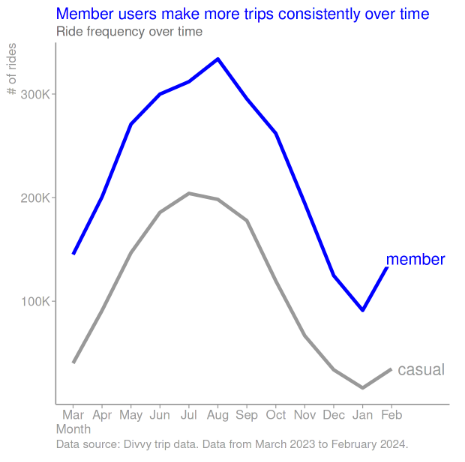
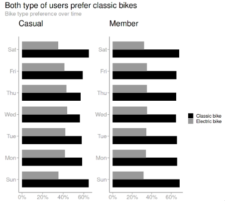
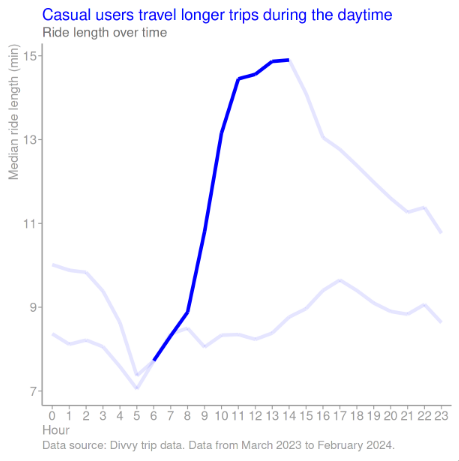

## Summary

### Goal

The objective of this project is to use the data analytics life cycle to solve the business task of Cyclistic, a fictional bike-sharing company. I use the Divvy historical trip data to support my case. My insights will help to design a marketing campaign that aims to encourage casual users (single or day pass) to become annual subscribers.


### Process

I begin the data analytic process by obtaining the questions that will drive my analysis. Once I have identified these questions, I retrieve the necessary data from Divvy and merge them into a single feather-formatted file. Before proceeding with the analysis, I verify the data integrity and clean data where necessary. On the analysis phase, I perform data transformation to extract meaningful insights. Once I have identified the key findings, I share my conclusions. Finally, I present my recommendations to drive decision-making.


### Highlights

This project is carried out using R, using data-science related packages given its capabilities to handle medium to large sized datasets.

Casual and member users show clear patterns in different travel-related metrics. Casual users tend to travel farther than member users regardless of time periods. The same happens when comparing trip length. This pattern changes in bike rides performed where member users performed most of them regardless of time periods.

[Click here for the code of this project](https://www.kaggle.com/code/christianmontenegro/cyclistic-bike-share-company-case-study)

## Introduction

The market for bike-sharing services in the United States is expanding [1], but it also faces challenges such as operational inefficiencies, a single profit model, and issues with station congestion [2-3]. A variety of factors influence this expansion,ranging from user demographics to environmental considerations and market dynamics [4]. By 2024, it's to reach a revenue of US$320.30 millions, with 96% of the total revenue generated through online sales by 2028, and the number of users expected to amount to 4.70 million users in the same year [1]. To control these challenges, it has been suggested to diversify profit sources, optimize regional distribution, and enhance marketing strategies. Cyclistic can improve marketing strategies using data, while keeping in mind the primary motivators for usage such as convenience, perceived value, and economic considerations [5] without neglecting other factors mentioned above.

## Background

In 2016, Cyclistic launched a successful bike-share offering. Since then, the program has grown to a fleet of 5,824 bicycles that are geotracked and locked into a network of 692 stations across Chicago. The bikes can be unlocked from one station and returned to any other station in the system anytime.

## Business task

Until now, Cyclistic’s marketing strategy relied on building general awareness and appealing to broad consumer segments. One approach that helped make these things possible was the flexibility of its pricing plans: single-ride passes, full-day passes, and annual memberships. Customers who purchase single-ride or full-day passes are referred to as casual riders. Customers who purchase annual memberships are Cyclistic members.

Cyclistic’s finance analysts have concluded that annual members are much more profitable than casual riders. Although the pricing flexibility helps Cyclistic attract more customers, Moreno believes that maximizing the number of annual members will be key to future growth. Rather than creating a marketing campaign that targets all-new customers, Moreno believes there is a very good chance to convert casual riders into members. She notes that casual riders are already aware of the Cyclistic program and have chosen Cyclistic for their mobility needs.


## Scenario
This capstone project involves a junior data analyst working in the marketing analyst team at Cyclistic. To provide insights that will drive business-decision making, I will use the data analysis process proposed in the Google Data Analytics Professional Certificate, containing six stages: Ask, Prepare, Process, Analyze, Share, and Act. The stages define how data is generated, collected, processed, used, and analyzed to achieve business goals.

## Load required libraries
```r
# List of necessary packages
packages <- c(
    "ggplot2",
    "devtools",
    "tidyverse",
    "ggrepel",
    "naniar",
    "mice",
    "sf",
    "sp",
    "numform",
    "data.table",
    "geosphere",
    "stats",
    "gridExtra",
    "cowplot",
    "gtable",
    "moments",
    "patchwork"
)

# Check and install missing packages in the current environment
installed_packages <- packages %in% rownames(installed.packages())
if (any(installed_packages == FALSE)) {
  install.packages(packages[!installed_packages])
}

# Load all packages
invisible(lapply(packages, library, character.only = TRUE))
```

## Ask
Moreno has set a clear goal: Design marketing strategies aimed at converting casual riders into annual members. In order to do that, however, the marketing analyst team needs to better understand the answer the following questions:

How do annual members and casual riders use Cyclistic bikes differently? Why would casual riders buy Cyclistic annual memberships? How can Cyclistic use digital media to influence casual riders to become members? Moreno and her team are interested in analyzing the Cyclistic historical bike trip data to identify trends.


## Prepare
In this phase, I gather the data, describe it, ensure it has the correct format, credibility, and understand its limitations. I use the historical trip data from Cyclistic (a ficticious bike share company),using real data from the company Divvy, for the previous 12 months to tackle this problem [6]. The data was in csv format, which has reading and writing performance limitations. With that in mind, I adopted the rds format. The data is credible, so the insights obtained will be of a prescriptive nature.


### Describe data
The Cyclistic historical trip data records trips performed per month. Each trip is anonymized and includes trip start day and time, trip end day and time, trip start station, trip end station, and rider type. Cyclistic processed the data to remove trips that are taken by staff as they service and inspect the system; and any trips below 60 seconds in length (potentially false starts or users trying to re-dock a bike to ensure it was secure).

The data provided only covers the last 12 months, not representative of the entire population of Cyclistic users and their past behavior. Therefore, it can be considered a sample. So, the insights derived from this data can only be functional under the specific circumstances of the proposed business task.


### Move and format data

The rds file storage format, has become a popular choice for data storage due to its demonstrated benefits of speed and file size compared to the csv format as discussed in [7-8]. Finally, we save them as a rds file in a separate directory (`cs1-cyclistic-prepare-phase/`), implemented in the `convert_csv_to_rds` function.

```r
convert_csv_to_rds <- function(csv_files, output_filepath) {
  # Initialize an empty data frame
  combined_data <- data.frame()

  # Loop over each CSV file
  for (file in csv_files) {
    # Read the CSV file
    data <- readr::read_csv(file,
      na = c(
        naniar::common_na_strings,
        naniar::common_na_numbers,
        "",
        " "
      ),
      skip_empty_rows = TRUE
    )

    # Concatenate the data to the combined data frame
    combined_data <- rbind(combined_data, data)
  }

  # Create output directory if it doesn't exists
  if (!file_test("-d", output_filepath)) {
    dir.create(file.path(dirname(output_filepath)), recursive = TRUE)
  }

  # Save the combined data frame as an RDS file
  saveRDS(combined_data, file = output_filepath)

  cat("The files located at", dirname(csv_files)[1], "were merged and converted successfully to rds format")
  invisible(gc())
}

# Get a list of all files in the directory with the specified format
csv_files <- list.files("/kaggle/input/divvy-trip-data-03-2023-to-02-2024/",
  pattern = "*.csv",
  full.names = TRUE
)

# Output RDS file path
output_filepath <- "/kaggle/working/cyclistic-divvy-cs-prepare-phase/cyclistic-divvy-202303-2024-04.rds"

# Call the function
convert_csv_to_rds(csv_files, output_filepath)
```

### Check data credibility

The credibility of our data can be determined using the ROCCC system proposed in the certification:

The data is reliable because it was collected by Divvy. The data is original, because it was collected by Divvy. The data is comprehensive because it contains all information needed to answers the guiding questions to produce insights that drives the decision making of the stakeholders. The data is current, because the data has a timeframe that covers the last 12 months (1 year). The data is cited because the data was obtained from the original source.


### Understand data limitations

The data possess two main limitations, unknown population size and generalizability, making it difficult to draw conclusions about the entire population. However, the data still holds value for gaining insights under the specific circumstances imposed by the business task.


## Process

To make sure the data we're working with is accurate, I used certain tools and techniques to process it. First, I looked at each piece of data closely to understand its limitations and challenges. Then, I applied processes to clean the data and remove any errors or inconsistencies. By doing this, we can trust that our results are based on accurate information.


### Explore data

To understand the structure of the data, we can load the feather files that contains observations from two months. By examining this data, we can gain insights into the usage patterns of Cyclistic users and make informed decisions about its operation and improvement.
```r
# Load dataset
cdtd_process <- readRDS("/kaggle/working/cyclistic-divvy-cs-prepare-phase/cyclistic-divvy-202303-2024-04.rds")

# Get a summary of the data
sprintf("Summary statistics of Cyclistic trip data")
summary(cdtd_process)

# Check the dimensions of your data
sprintf("Dimensions of Cyclistic trip data")
dim(cdtd_process)

# Check the names of the features
sprintf("Names of features from Cyclistic trip data")
names(cdtd_process)

# Trigger garbage collection process
# mannually for freeing up memory resources
invisible(gc())
```
The data is longitudinal due it contains information about different users over time (12 months). It can also considered transactional, as it captures individual transactions (rides) by distinct users, where each ride involves one or more items (e.g., start station, end station, bike type, etc.).

The data contains 13 columns that gives detailed information on bike rides. The columns can be divided in 3 groups by the content they contain. The first group contains columns identifying ride and bike type (`ride_id` and `bike_type`). The second group identifies when and where a ride started and ended in different information levels. The first level identifies when a user took a ride (`started_at`) and when it ended (`ended_at`). The second level reveals the start (`start_station_name`) and end station (`end_station_name`) a user took a bicycle to perform a ride. The third level uniquely identifies the start and end station for a ride. The fourth level geographically identifies where a ride begin (`start_lat`, `start_lng`) and where a ride ended (`end_lat`, `end_lng`). Finally, the third group only contains one column that indicates whether the rider was a member or a casual user (`member_casual`).

### Check data integrity

Determining data integrity is a critical process in data analysis to ensure that the data is both accurate and complete, and remains consistent throughout the analysis. In the following sections, I will demonstrate the application of various techniques designed to achieve this goal. These techniques aim to provide a thorough and effective means of managing and controlling the data during the analysis process.


#### Determine the statistical power of data, hypothesis testing, and margin of error

As previously mentioned, the sample size is unknown so the statistical power, the feasibility to perform hypothesis testing or report a margin of error is not possible. With this in mind I will only report data variability to provide some sense of uncertainty (spread of data, margin of error (indirectly), confidence intervals (indirectly)).


#### Overcome the challenges of insufficient data

The data collected by Cyclistic is enough (~6,000,000 observations) to solve the business task.


#### Discover data constraints and clean data

##### Corroborate data types

In the process of data validation, we checked all features in the dataset to ensure they presented the correct data types. We expected a character data type in 7 out of 13 features, a numerical data type in 4 out of 13 features, and a POSIXct data type in 2 out of 13 features. This was performed by using str function, which listed all the features with their corresponding data types.

```r
str(cdtd_process)

# Trigger garbage collection process
# mannually for freeing up memory resources
invisible(gc())
```
##### Validate data ranges

After verifying data ranges for most columns, the dataset posess 4,260,116 observations, representing a 25.35% decrease. Only the columns depicting spatial coordinates were left intact because they will require a more complex procedure, explained in detail later.
```r
# Filter the data frame based on multiple conditions
cdtd_process_partially_filtered_data_ranges <- cdtd_process %>%
  filter(
    # Filter for classic_bike and electric_bike
    rideable_type %in% c("classic_bike", "electric_bike") &
    # Filter for rides starting between March 1, 2023 and February 29, 2024
    (started_at >= as.POSIXct("2023-03-01 00:00:00") & started_at <= as.POSIXct("2024-02-29 23:59:59")) &
    # Filter for rides ending between March 1, 2023 and March 1, 2024
    (ended_at >= as.POSIXct("2023-03-01 00:00:00") & ended_at <= as.POSIXct("2024-03-01 23:59:59")) &
    # Exclude rides starting at the HQ QR station
    start_station_name != "HQ QR" &
    # Exclude rides ending at the HQ QR station
    end_station_name != "HQ QR" &
    # Filter for member and casual riders
    member_casual %in% c("member", "casual")
  )
dim(cdtd_process_partially_filtered_data_ranges)
```

I verified the data ranges for columns depicting spatial coordinates using city boundaries from Chicago and Evanston, obtained from [9-10]. The data contains spatial information defining the boundaries of each city, including bounding box coordinates. This spatial information allows us to compare them against Cyclistic data. In that way, I confirmed whether a ride took place in Chicago or Evanston.

```r
# Set the chunk size
chunk_size <- 512

# Initialize empty lists to store the points
start_points_in_chicago <- list(nrow(cdtd_process_partially_filtered_data_ranges))
end_points_in_chicago <- list(nrow(cdtd_process_partially_filtered_data_ranges))
start_points_in_evanston <- list(nrow(cdtd_process_partially_filtered_data_ranges))
end_points_in_evanston <- list(nrow(cdtd_process_partially_filtered_data_ranges))

# Read cities boundaries shapefiles
chicago <- sf::st_read("/kaggle/input/chicago-city-boundaries-data/")
evanston <- sf::st_read("/kaggle/input/evanston-city-boundaries-data/")

# Transform the CRS of the spatial objects to a common CRS
chicago <- sf::st_transform(chicago, "+proj=longlat +datum=WGS84")
evanston <- sf::st_transform(evanston, "+proj=longlat +datum=WGS84")

# Set the number of iterations to print progress
n_iterations <- ceiling(nrow(cdtd_process_partially_filtered_data_ranges) / chunk_size)

# Loop through the data in chunks
for (i in seq(1, nrow(cdtd_process_partially_filtered_data_ranges), chunk_size)) {
  # Print information about the current chunk
  cat(sprintf("Processing chunk %d of %d (start = %d, end = %d)\n", ceiling(i / chunk_size),
    n_iterations, i, min(i + chunk_size - 1, nrow(cdtd_process_partially_filtered_data_ranges))))

  # Extract the current chunk of data
  chunk <- cdtd_process_partially_filtered_data_ranges[i:(min(i + chunk_size - 1, nrow(cdtd_process_partially_filtered_data_ranges))), ]

  # Convert the start and end points to sf objects
  start_points <- sf::st_as_sf(chunk %>% select("start_lng", "start_lat"), coords = c("start_lng", "start_lat"), na.fail = FALSE, crs = 4326)
  end_points <- sf::st_as_sf(chunk %>% select("end_lng", "end_lat"), coords = c("end_lng", "end_lat"), na.fail = FALSE, crs = 4326)

  # Determine the points that fall within each city
  # and store the results in their corresponding list
  # for the current chunk
  start_points_in_chicago[i:(min(i + chunk_size - 1, nrow(cdtd_process_partially_filtered_data_ranges)))] <- sf::st_within(start_points, chicago)
  end_points_in_chicago[i:(min(i + chunk_size - 1, nrow(cdtd_process_partially_filtered_data_ranges)))] <- sf::st_within(end_points, chicago)
  start_points_in_evanston[i:(min(i + chunk_size - 1, nrow(cdtd_process_partially_filtered_data_ranges)))] <- sf::st_within(start_points, evanston)
  end_points_in_evanston[i:(min(i + chunk_size - 1, nrow(cdtd_process_partially_filtered_data_ranges)))] <- sf::st_within(end_points, evanston)
}

# Create output directory if it doesn't exists
if (!file_test("-d", "/kaggle/working/cyclistic-divvy-cs-process-phase/")) {
  dir.create("/kaggle/working/cyclistic-divvy-cs-process-phase/", recursive = TRUE)
}

# Save data using saveRDS() function
saveRDS(start_points_in_chicago, file = "/kaggle/working/cyclistic-divvy-cs-process-phase/start_points_in_chicago.rds")
saveRDS(end_points_in_chicago, file = "/kaggle/working/cyclistic-divvy-cs-process-phase/end_points_in_chicago.rds")
saveRDS(start_points_in_evanston, file = "/kaggle/working/cyclistic-divvy-cs-process-phase/start_points_in_evanston.rds")
saveRDS(end_points_in_evanston, file = "/kaggle/working/cyclistic-divvy-cs-process-phase/end_points_in_evanston.rds")

# Trigger garbage collection process
# mannually for freeing up memory resources
invisible(gc())
```

Upon loading the vector data into memory and incorporating it into the original dataset, I was able to streamline the computation process of the remaining features. This step effectively resolved previous computational issues, allowing for a problem-free calculation of these features.

```r
# Add ride duration
cdtd_analyze_sorted_filtered$ride_length <- difftime(
  cdtd_analyze_sorted_filtered$ended_at,
  cdtd_analyze_sorted_filtered$started_at,
  units = "secs") %>%
  as.character %>%
  as.numeric

# Create a feature representing the month of each ride
cdtd_analyze_sorted_filtered$month <- lubridate::month(
  cdtd_analyze_sorted_filtered$started_at,
  label = FALSE,
  abbr = FALSE
)

# Create a feature representing the day of each ride
cdtd_analyze_sorted_filtered$day_of_week <- lubridate::wday(
  cdtd_analyze_sorted_filtered$started_at,
  label= FALSE,
  abbr = FALSE,
  week_start = 7
)

# Create a feature representing the hour of each ride
cdtd_analyze_sorted_filtered$hour <- lubridate::hour(cdtd_analyze_sorted_filtered$started_at)


# Filter to make sure that ride_distance and ride_length
# have proper values
cdtd_analyze_sorted_filtered <- cdtd_analyze_sorted_filtered %>%
  filter(
    # Filter for ride distance greater than 0
    (ride_distance > 0) &
    # A ride should be greater than 0 if not it's
    # a false start
    (ride_length > 60)
  )

dim(cdtd_analyze_sorted_filtered)

# Show data set
head(cdtd_analyze_sorted_filtered)

# Trigger garbage collection process
# mannually for freeing up memory resources
invisible(gc())
```

Before integrating the new data into the original dataset, I loaded it into memory. Once the data was accessible, I created two logical lists to represent the specified conditions. Finally, I incorporated the lists into the original dataset, significantly reducing the space complexity.

After filtering, the dataset posess 4,250,388 observations, representing a 0.22% decrease respect to the previous step.

```r
# load data using readRDS() function
start_points_in_chicago <- readRDS("/kaggle/working/cyclistic-divvy-cs-process-phase/start_points_in_chicago.rds")
start_points_in_evanston <- readRDS("/kaggle/working/cyclistic-divvy-cs-process-phase/start_points_in_evanston.rds")
end_points_in_chicago <- readRDS("/kaggle/working/cyclistic-divvy-cs-process-phase/end_points_in_chicago.rds")
end_points_in_evanston <- readRDS("/kaggle/working/cyclistic-divvy-cs-process-phase/end_points_in_evanston.rds")

# Create logical lists
in_chicago <- start_points_in_chicago == 1 & end_points_in_chicago == 1
in_evanston <- start_points_in_evanston == 1 & end_points_in_evanston == 1

# Add data in the original dataframe
cdtd_process_partially_filtered_data_ranges$in_chicago <- in_chicago
cdtd_process_partially_filtered_data_ranges$in_evanston <- in_evanston

# Filter the original dataframe based on the logical vectors:
cdtd_process_filtered_data_ranges <- cdtd_process_partially_filtered_data_ranges %>%
  filter(
    (cdtd_process_partially_filtered_data_ranges$in_chicago == TRUE) |
    (cdtd_process_partially_filtered_data_ranges$in_evanston == TRUE))

dim(cdtd_process_filtered_data_ranges)

# Trigger garbage collection process
# mannually for freeing up memory resources
invisible(gc())
```
##### Handle missing data

The presence of missing values in a dataset is universal. When handling inadequately lead to loss of eficiency and bias. First, The extension of information loss is intrinsically linked to the analysis question. Second, the subsets of complete observations may not be representative of the population under study. Restricting analysis to complete records may then lead to biased interpretations. The extent of such bias depends on the statistical behavior of the missing data. So, a formal framework to describe this behaviour is thus fundamental. I show what methodology was applied in the following sections.


###### Amount of missing data
No missing values was found in the dataset. So we will follow with the next sections.
```r
missing_prop <- naniar::miss_var_summary(cdtd_process_filtered_data_ranges %>%
  # Select non city boundaries columns
  select(!c("in_chicago", "in_evanston")))
missing_prop
# Trigger garbage collection process
# mannually for freeing up memory resources
invisible(gc())
```

##### Verify data uniqueness

There are no duplicate entries in the dataset. To do this, I looked at the `ride_id` feature, which uniquely identifies each ride in the dataset. I counted the number of unique `ride_id` values and compared it to the total number of observations in the dataset.
```r
# Leave only relevant features
cdtd_no_cities_boundaries_columns <- cdtd_process_filtered_data_ranges %>%
  # Select non city boundaries columns
  select(!c("in_chicago", "in_evanston"))

# Verify that ride_id has no duplicate data
n_univals_rid <- n_distinct(cdtd_no_cities_boundaries_columns$ride_id)
sprintf("Does Cyclistic trip data has unique data?: %s, because it possess %s different ride ids",
  n_univals_rid == nrow(cdtd_no_cities_boundaries_columns), n_univals_rid %>%
    prettyNum(., big.mark = ",", scientific = FALSE))

# Trigger garbage collection process
# mannually for freeing up memory resources
invisible(gc())
```

##### Check cross field conditions

After validating cross field conditions the dataset possess 3,988,632 observations, representing a 6.15% decrease.
```r
cdtd_cross_field_validated <- cdtd_no_cities_boundaries_columns %>%
  filter(
    # No rides can start and end at the same time
    (started_at != ended_at) &
    # No rides can have the same station_id at
    # the start and end of a ride
    (start_station_id != end_station_id) &
    # No rides can have the same station_name at
    # the start and end of a ride
    (start_station_name != end_station_name) &
    # No ride can have the same spatial coordinates
    # (latitude) at the start and end of
    # a ride
    (start_lat != end_lat) &
    # No ride can have the same spatial coordinates
    # (longitude) at the start and end of
    # a ride
    (start_lng != end_lng)
  )
dim(cdtd_cross_field_validated)

# Trigger garbage collection process
# mannually for freeing up memory resources
invisible(gc())
```

##### Removing extra spaces

The `str_squish` function was successfully used to remove extra spaces in features with the character data type. This function operates by identifying extra spaces present at the start of the text, in between words, and at the end of the text. It then replaces these extra spaces with a single space.

```r
# Remove extra spaces across features
cdtd_process_final <- cdtd_cross_field_validated %>%
  mutate(across(where(is.character), str_squish))

# Create output directory if it doesn't exists
if (!file_test("-d","/kaggle/working/cyclistic-divvy-cs-process-phase/")) {
  dir.create("/kaggle/working/cyclistic-divvy-cs-process-phase/", recursive = TRUE)
}

# Save data using saveRDS() function
saveRDS(cdtd_process_final, file = "/kaggle/working/cyclistic-divvy-cs-process-phase/cyclistic-divvy-202303-2024-04_processed.rds")

# Trigger garbage collection process
# mannually for freeing up memory resources
invisible(gc())
```

## Analyze

In this phase, I answer the proposed first guiding question. The aim was to discover trends or patterns at different levels of granularity. With a 12-month dataset, we have the flexibility to analyze at different intervals. Monthly analysis strikes a balance, capturing short-term fluctuations, recurring patterns, and changes in Cyclistic's usage. Daily analysis provides a more detailed view, capturing variations and specific usage patterns on certain days. Finally, hourly analysis gives the most granular view, capturing daily usage patterns and peak hours for different user types. To achieve this, I organized, formatted, adjusted, and transformed the data.


### Organize the data

I performed time-based sorting of the data. This will facilitate the aggregation, visualization, and comparison of users in the share phase.

```r
# Read data set
cdtd_analyze <- readRDS("/kaggle/working/cyclistic-divvy-cs-process-phase/cyclistic-divvy-202303-2024-04_processed.rds")

# Sort dataset
cdtd_analyze_sorted <- cdtd_analyze %>%
  arrange(started_at, ended_at)
head(cdtd_analyze_sorted)
```

I leave only relevant features that will be used to our analysis.
```r
# Filter data leaving only useful columns
cdtd_analyze_sorted_filtered <- cdtd_analyze_sorted %>%
  select(!c(start_station_name, end_station_name, start_station_id, end_station_id))
head(cdtd_analyze_sorted_filtered)
```

### Format and adjust the data

Formatting and adjusting the data ensures data quality, enhances our analysis efficiency, and facilitates visualization. By creating new useful features, we accomplished this. The `ride_distance` feature, records the distance in meters between the start and end points of a ride, calculated using the Vincenty formulae with the inverse method. Furthermore, ride_length measures the time in seconds it took a Cyclistic user to complete a ride. I also created features that provide information about the date of the ride. The month feature specifies the starting month, and day_of_week reveals the day. Lastly, hour captures the hour a ride started.

Calculating the `ride_distance` was a challenging task due to the time and space complexity of the operation. To overcome this, I applied a strategy of chunking. After performing the chunking, I saved all the results in a numeric vector. Following this, I wrote the vector data to the disk. This approach enhanced the efficiency of the task while maintaining the accuracy of the `ride_distance` calculations.

```r
# Set the chunk size
chunk_size <- 512

# Initialize an empty vector to store the distances
distances <- numeric(nrow(cdtd_analyze_sorted_filtered))

# Set the number of iterations to print progress
n_iterations <- ceiling(nrow(cdtd_analyze_sorted_filtered) / chunk_size)

# Loop through the data in chunks
for (i in seq(1, nrow(cdtd_analyze_sorted_filtered), chunk_size)) {
  # Print information about the current chunk
  cat(sprintf("Processing chunk %d of %d (start = %d, end = %d)\n", ceiling(i / chunk_size),
    n_iterations, i, min(i + chunk_size - 1, nrow(cdtd_analyze_sorted_filtered))))

  # Extract the current chunk of data
  chunk <- cdtd_analyze_sorted_filtered[i:(min(i + chunk_size - 1, nrow(cdtd_analyze_sorted_filtered))), ]

  # Convert the start and end points to SpatialPoints objects
  start_points <- sp::SpatialPoints(cbind(chunk$start_lng, chunk$start_lat), sp::CRS("+proj=longlat +datum=WGS84"))
  end_points <- sp::SpatialPoints(cbind(chunk$end_lng, chunk$end_lat), sp::CRS("+proj=longlat +datum=WGS84"))

  # Calculate the Vincenty distance using the distVincentyEllipsoid() function from the geosphere package
  # and store the distances for the current chunk
  distances[i:(min(i + chunk_size - 1, nrow(cdtd_analyze_sorted_filtered)))] <- geosphere::distVincentyEllipsoid(start_points, end_points)
}

# Create output directory if it doesn't exists
if (!file_test("-d", "/kaggle/working/cyclistic-divvy-cs-analyze-phase/")) {
  dir.create("/kaggle/working/cyclistic-divvy-cs-analyze-phase/", recursive = TRUE)
}

# Save using saveRDS() function
saveRDS(distances, file = "/kaggle/working/cyclistic-divvy-cs-analyze-phase/ride_distance_2023-03-to-2024-02.rds")

# Trigger garbage collection process
# mannually for freeing up memory resources
invisible(gc())
```
Before adding the vector data to the original dataset, I loaded it into memory. With the data now accessible, I was then able to incorporate it into the original dataset. This reduced the space complexity greatly.
```r
# load using readRDS() function
ride_distance <- readRDS("/kaggle/working/cyclistic-divvy-cs-analyze-phase/ride_distance_2023-03-to-2024-02.rds")

# Add the distances as an additional column to the original dataset
cdtd_analyze_sorted_filtered$ride_distance <- ride_distance

# Trigger garbage collection process
# mannually for freeing up memory resources
invisible(gc())
```
Upon loading the vector data into memory and incorporating it into the original dataset, I was able to streamline the computation process of the remaining features. This step effectively resolved previous computational issues, allowing for a problem-free calculation of these features.

```r
# Add ride duration
cdtd_analyze_sorted_filtered$ride_length <- difftime(
  cdtd_analyze_sorted_filtered$ended_at,
  cdtd_analyze_sorted_filtered$started_at,
  units = "secs") %>%
  as.character %>%
  as.numeric

# Create a feature representing the month of each ride
cdtd_analyze_sorted_filtered$month <- lubridate::month(
  cdtd_analyze_sorted_filtered$started_at,
  label = FALSE,
  abbr = FALSE
)

# Create a feature representing the day of each ride
cdtd_analyze_sorted_filtered$day_of_week <- lubridate::wday(
  cdtd_analyze_sorted_filtered$started_at,
  label= FALSE,
  abbr = FALSE,
  week_start = 7
)

# Create a feature representing the hour of each ride
cdtd_analyze_sorted_filtered$hour <- lubridate::hour(cdtd_analyze_sorted_filtered$started_at)


# Filter to make sure that ride_distance and ride_length
# have proper values
cdtd_analyze_sorted_filtered <- cdtd_analyze_sorted_filtered %>%
  filter(
    # Filter for ride distance greater than 0
    (ride_distance > 0) &
    # A ride should be greater than 0 if not it's
    # a false start
    (ride_length > 60)
  )

dim(cdtd_analyze_sorted_filtered)

# Show data set
head(cdtd_analyze_sorted_filtered)

# Trigger garbage collection process
# mannually for freeing up memory resources
invisible(gc())
```

### Transform the data


I aggregated the data at different granularity levels (montly, daily, and hourly). The aggregations are in line with the objectives proposed in the business task.

I will use the median as central tendency measure for my analysis. This result was obtained examining different central tendency measures, together with skewness and kurtosis. All quantitative variables (`ride_distance` and `ride_length`) exhibit a right skewed (√β1>1 ) and leptokurtic (β2>3 ) distribution.

```r
# Compute ride distance summary statistics by user type in months
# Group the data by 'member_casual', then calculate summary statistics
ride_distance_by_user_type_and_month_summary_statistics <- cdtd_analyze_sorted_filtered %>%
 group_by(member_casual, month) %>%
 select(ride_distance) %>%
 summarize(
   min_value = min(ride_distance),
   Q1 = quantile(ride_distance)[2],
   median_value = median(ride_distance,),
   mean_value = mean(ride_distance),
   stdev = sd(ride_distance),
   Q3 = quantile(ride_distance)[4],
   max_value = max(ride_distance),
   IQR = Q3 - Q1,
   skewness = moments::skewness(ride_distance),
   kurtosis = moments::kurtosis(ride_distance)
 )
ride_distance_by_user_type_and_month_summary_statistics

# Compute ride distance summary statistics by user type in days
ride_distance_by_user_type_and_day_of_week_summary_statistics <- cdtd_analyze_sorted_filtered %>%
 group_by(member_casual, day_of_week) %>%
 select(ride_distance) %>%
 summarize(
   min_value = min(ride_distance),
   Q1 = quantile(ride_distance)[2],
   median_value = median(ride_distance,),
   mean_value = mean(ride_distance),
   stdev = sd(ride_distance),
   Q3 = quantile(ride_distance)[4],
   max_value = max(ride_distance),
   IQR = Q3 - Q1,
   skewness = moments::skewness(ride_distance),
   kurtosis = moments::kurtosis(ride_distance)
 )
ride_distance_by_user_type_and_day_of_week_summary_statistics

# Compute ride distance summary statistics by user type in hours
ride_distance_by_user_type_and_hour_summary_statistics <- cdtd_analyze_sorted_filtered %>%
 group_by(member_casual, hour) %>%
 select(ride_distance) %>%
 summarize(
   min_value = min(ride_distance),
   Q1 = quantile(ride_distance)[2],
   median_value = median(ride_distance,),
   mean_value = mean(ride_distance),
   stdev = sd(ride_distance),
   Q3 = quantile(ride_distance)[4],
   max_value = max(ride_distance),
   IQR = Q3 - Q1,
   skewness = moments::skewness(ride_distance),
   kurtosis = moments::kurtosis(ride_distance)
 )
ride_distance_by_user_type_and_hour_summary_statistics

# Compute ride length summary statistics by user type in months
ride_length_by_user_type_and_month_summary_statistics <- cdtd_analyze_sorted_filtered %>%
 group_by(member_casual, month) %>%
 select(ride_length) %>%
 summarize(
   min_value = min(ride_length),
   Q1 = quantile(ride_length)[2],
   median_value = median(ride_length),
   mean_value = mean(ride_length),
   stdev = sd(ride_length),
   Q3 = quantile(ride_length)[4],
   max_value = max(ride_length),
   IQR = Q3 - Q1,
   skewness = moments::skewness(ride_length),
   kurtosis = moments::kurtosis(ride_length)
 )
ride_length_by_user_type_and_month_summary_statistics

# Compute ride length summary statistics by user type in days
ride_length_by_user_type_and_day_of_week_summary_statistics <- cdtd_analyze_sorted_filtered %>%
 group_by(member_casual, day_of_week) %>%
 select(ride_length) %>%
 summarize(
   min_value = min(ride_length),
   Q1 = quantile(ride_length)[2],
   median_value = median(ride_length),
   mean_value = mean(ride_length),
   stdev = sd(ride_length),
   Q3 = quantile(ride_length)[4],
   max_value = max(ride_length),
   IQR = Q3 - Q1,
   skewness = moments::skewness(ride_length),
   kurtosis = moments::kurtosis(ride_length)
 )
ride_length_by_user_type_and_day_of_week_summary_statistics

# Compute ride length summary statistics by user type in hours
ride_length_by_user_type_and_hour_summary_statistics <- cdtd_analyze_sorted_filtered %>%
 group_by(member_casual, hour) %>%
 select(ride_length) %>%
 summarize(
   min_value = min(ride_length),
   Q1 = quantile(ride_length)[2],
   median_value = median(ride_length),
   mean_value = mean(ride_length),
   stdev = sd(ride_length),
   Q3 = quantile(ride_length)[4],
   max_value = max(ride_length),
   IQR = Q3 - Q1,
   skewness = moments::skewness(ride_length),
   kurtosis = moments::kurtosis(ride_length)
 )
ride_length_by_user_type_and_hour_summary_statistics

# Compute ride frequency by user type in months
ride_frequency_by_user_type_and_month_df <- cdtd_analyze_sorted_filtered %>%
  group_by(member_casual, month) %>%
  summarise(number_of_rides = n()) %>%
  mutate(prop = number_of_rides / sum(number_of_rides)) %>%
  mutate(labels = scales::percent(prop))
ride_frequency_by_user_type_and_month_df

# Compute ride frequency by user type in days
ride_frequency_by_user_type_and_day_of_week_df <- cdtd_analyze_sorted_filtered %>%
  group_by(member_casual, day_of_week) %>%
  summarise(number_of_rides = n()) %>%
  mutate(prop = number_of_rides / sum(number_of_rides)) %>%
  mutate(labels = scales::percent(prop))
ride_frequency_by_user_type_and_day_of_week_df

# Compute ride frequency by user type in hours
ride_frequency_by_user_type_and_hour_df <- cdtd_analyze_sorted_filtered %>%
  group_by(member_casual, hour) %>%
  summarise(number_of_rides = n()) %>%
  mutate(prop = number_of_rides / sum(number_of_rides)) %>%
  mutate(labels = scales::percent(prop))
ride_frequency_by_user_type_and_hour_df

# Compute vehicle usage by user type in months
bike_type_preference_by_user_type_and_month_df <- cdtd_analyze_sorted_filtered %>%
  group_by(member_casual, month, rideable_type) %>%
  summarise(number_of_rides = n()) %>%
  mutate(prop = number_of_rides / sum(number_of_rides)) %>%
  mutate(labels = scales::percent(prop))
bike_type_preference_by_user_type_and_month_df

# Compute vehicle usage by user type in days
bike_type_preference_by_user_type_and_day_of_week_df <- cdtd_analyze_sorted_filtered %>%
  group_by(member_casual, day_of_week, rideable_type) %>%
  summarise(number_of_rides = n()) %>%
  mutate(prop = number_of_rides / sum(number_of_rides)) %>%
  mutate(labels = scales::percent(prop))
bike_type_preference_by_user_type_and_day_of_week_df

# Compute vehicle usage by user type in hours
bike_type_preference_by_user_type_and_hour_df <- cdtd_analyze_sorted_filtered %>%
  group_by(member_casual, hour, rideable_type) %>%
  summarise(number_of_rides = n()) %>%
  mutate(prop = number_of_rides / sum(number_of_rides)) %>%
  mutate(labels = scales::percent(prop))
bike_type_preference_by_user_type_and_hour_df

# Trigger garbage collection process
# mannually for freeing up memory resources
invisible(gc())
```

I write the aggregations on the disk. With the same RDS format used in previous stages.

```r
# Write aggregations to disk
saveRDS(ride_distance_by_user_type_and_month_summary_statistics %>%
  select(member_casual, month, median_value),
  file = "/kaggle/working/cyclistic-divvy-cs-analyze-phase/ride_distance_by_user_type_and_month_2023-03-to-2024-02.rds"
)
saveRDS(ride_distance_by_user_type_and_day_of_week_summary_statistics %>%
  select(member_casual, day_of_week, median_value),
  file = "/kaggle/working/cyclistic-divvy-cs-analyze-phase/ride_distance_by_user_type_and_day_of_week_2023-03-to-2024-02.rds"
)
saveRDS(ride_distance_by_user_type_and_hour_summary_statistics %>%
  select(member_casual, hour, median_value),
  file = "/kaggle/working/cyclistic-divvy-cs-analyze-phase/ride_distance_by_user_type_and_hour_2023-03-to-2024-02.rds"
)
saveRDS(ride_length_by_user_type_and_month_summary_statistics %>%
  select(member_casual, month, median_value),
  file = "/kaggle/working/cyclistic-divvy-cs-analyze-phase/ride_length_by_user_type_and_month_2023-03-to-2024-02.rds"
)
saveRDS(ride_length_by_user_type_and_day_of_week_summary_statistics %>%
  select(member_casual, day_of_week, median_value),
  file = "/kaggle/working/cyclistic-divvy-cs-analyze-phase/ride_length_by_user_type_and_day_of_week_2023-03-to-2024-02.rds"
)
saveRDS(ride_length_by_user_type_and_hour_summary_statistics %>%
  select(member_casual, hour, median_value),
  file = "/kaggle/working/cyclistic-divvy-cs-analyze-phase/ride_length_by_user_type_and_hour_2023-03-to-2024-02.rds"
)
saveRDS(ride_frequency_by_user_type_and_month_df,
  file = "/kaggle/working/cyclistic-divvy-cs-analyze-phase/ride_frequency_by_user_type_and_month_2023-03-to-2024-02.rds"
)
saveRDS(ride_frequency_by_user_type_and_day_of_week_df,
  file = "/kaggle/working/cyclistic-divvy-cs-analyze-phase/ride_frequency_by_user_type_and_day_of_week_2023-03-to-2024-02.rds"
)
saveRDS(ride_frequency_by_user_type_and_hour_df,
  file = "/kaggle/working/cyclistic-divvy-cs-analyze-phase/ride_frequency_by_user_type_and_hour_2023-03-to-2024-02.rds"
)
saveRDS(bike_type_preference_by_user_type_and_month_df,
  file = "/kaggle/working/cyclistic-divvy-cs-analyze-phase/bike_type_preference_by_user_type_and_month_2023-03-to-2024-02.rds"
)
saveRDS(bike_type_preference_by_user_type_and_day_of_week_df,
  file = "/kaggle/working/cyclistic-divvy-cs-analyze-phase/bike_type_preference_by_user_type_and_day_of_week_2023-03-to-2024-02.rds"
)
saveRDS(bike_type_preference_by_user_type_and_hour_df,
  file = "/kaggle/working/cyclistic-divvy-cs-analyze-phase/bike_type_preference_by_user_type_and_hour_2023-03-to-2024-02.rds"
)
```
## Share
In this phase, I unveiled my insights to the audience. To make that happen, I made sure to communicate my insights to the audience in a digestible way with good visualizations and a captivating story.


### Montly trends
The monthly analysis performed provides insights into long-term trends.


#### Trends in ride distance
Both type of users travel similar distances on their rides, but casual users travel consistently larger distances. Casual users cover distances that range from 1.31 km to 1.88 km, meanwhile member users travel in the ranges of 1.31 km to 1.68 km. The following figure illustrates this.
```r
# Set plot dimensions in Kaggle notebook
# This sets the width and height of the plot to 10 units each
options(repr.plot.width = 10, repr.plot.height = 10)

# Load data
ride_distance_by_user_type_and_month <- readRDS(
  "/kaggle/working/cyclistic-divvy-cs-analyze-phase/ride_distance_by_user_type_and_month_2023-03-to-2024-02.rds"
)

# Add a label to the dataframe that will be displayed in the plot
# This label shows the user type for rides in February
ride_distance_by_user_type_and_month$label <- if_else(
 ride_distance_by_user_type_and_month$month == "2",
 as.character(ride_distance_by_user_type_and_month$member_casual),
 NA_character_
)

# Create a vector with the desired order of months
month_order <- c(3, 4, 5, 6, 7, 8, 9, 10, 11, 12, 1, 2)

# Create a vector with names of the months
month_names <- c("Mar", "Apr", "May", "Jun", "Jul", "Aug", "Sep", "Oct", "Nov", "Dec", "Jan", "Feb")

# Create a new factor variable with the desired order of months
ride_distance_by_user_type_and_month$month <- factor(ride_distance_by_user_type_and_month$month, levels = month_order)

# Define color palette
color_palette_ride_distance <- c(casual = "blue", member = "gray70")

# Create multiple line chart of ride distance by user type in months
ggplot(ride_distance_by_user_type_and_month, aes(x=month, y=median_value / 1000, color = member_casual, group = member_casual)) +
 # Add a line to the plot, set its color based on membership type, and don't show the legend
 geom_line(show.legend = FALSE, linewidth = 2) +
 # Add labels to the plot, set their position, size, and remove NA values
 ggrepel::geom_label_repel(aes(label = label),
                nudge_x = 2,
                nudge_y = -0.1,
                size = 9,
                label.size = NA,
                na.rm = TRUE) +
 # Set the color palette manually
 scale_color_manual(values = c(casual = "blue", member = "gray60")) +
 scale_x_discrete(labels = month_names) +
 # Set the labels for the plot
 labs(title="They travel similarly over time, with member\nconsistenly lower than casual users",
      subtitle = "Ride distance over time",
      caption = "Data source: Divvy trip data. Data from March 2023 to February 2024.",
      x = "Month", y = "Median ride distance (km)") +
 # Customize the appearance of the plot
 theme(text = element_text(size=24),
       plot.title = element_text(colour = "blue", size = 25),
       plot.subtitle = element_text(colour = "gray43", size = 21),
       plot.caption = element_text(size = 18, color = "gray60", hjust=0),
       axis.text = element_text(colour = "gray60", size = 20),
       axis.title.y = element_text(hjust = 1, color = "gray60", size = 20),
       axis.title.x = element_text(hjust = 0, color = "gray60", size = 20),
       axis.line = element_line(linewidth = 0.75, colour = "gray60", linetype=1),
       axis.ticks = element_line(colour = "gray60"),
       axis.ticks.length = unit(.22, "cm"),
       legend.position = "none",
       panel.background = element_blank())

# Trigger garbage collection process
# mannually for freeing up memory resources
invisible(gc())
```


In spring and the start of summer, we see the highest median ride distance across every season, which slowly decreases on other seasons. It ranges from 1.493 km to 1.868 km for casual users, representing a 20.03% increase. Similarly member users cover distances that ranges from 1.384 km to 1.694 km, representing a 18.29% increase. The following figure illustrates this.

```r
# Set plot dimensions in Kaggle notebook
# This sets the width and height of the plot to 10 units each
options(repr.plot.width = 10, repr.plot.height = 10)

# Define color palette
color_palette_ride_distance <- c(casual = "cornflowerblue", member = "gray70")

# Add label to only show the summer period
ride_distance_by_user_type_and_month$spring_to_summer_start_highlight <-
  ride_distance_by_user_type_and_month$month == 3 |
  ride_distance_by_user_type_and_month$month == 4 |
  ride_distance_by_user_type_and_month$month == 5

# Create multiple line chart of ride distance by user type in months
ggplot(ride_distance_by_user_type_and_month, aes(x=month, y=median_value / 1000, color = member_casual, group = member_casual, alpha = !!sym("spring_to_summer_start_highlight"))) +
 # Add a line to the plot, set its color based on membership type, and don't show the legend
 geom_line(show.legend = FALSE, linewidth = 2) +
 # Set the color palette manually
 scale_color_manual(values = c(casual = "blue", member = "blue")) +
 # Set month labels
 scale_x_discrete(labels = month_names) +
 # Set the labels for the plot
 labs(title="At spring and start of the summer season we\nthe highest increase in median ride distance",
      subtitle = "Ride distance over time",
      caption = "Data source: Divvy trip data. Data from March 2023 to February 2024.",
      x = "Month", y = "Median ride distance (km)") +
 # Customize the appearance of the plot
 theme(text = element_text(size=24),
       plot.title = element_text(colour = "blue", size = 25),
       plot.subtitle = element_text(colour = "gray43", size = 21),
       plot.caption = element_text(size = 18, color = "gray60", hjust=0),
       axis.text = element_text(colour = "gray60", size = 20),
       axis.title.y = element_text(hjust = 1, color = "gray60", size = 20),
       axis.title.x = element_text(hjust = 0, color = "gray60", size = 20),
       axis.line = element_line(linewidth = 0.75, colour = "gray60", linetype=1),
       axis.ticks = element_line(colour = "gray60"),
       axis.ticks.length = unit(.22, "cm"),
       legend.position = "none",
       panel.background = element_blank())

# Trigger garbage collection process
# mannually for freeing up memory resources
invisible(gc())
```


#### Trends in ride length

Casual users travel longer trips compared to casual users. Casual users spend between 8.2 to 13.7 minutes, whereas, member users spend between 7.8 and 9.8 minutes. The following figure illustrates this.
```r
# Set plot dimensions in Kaggle notebook
# This sets the width and height of the plot to 10 units each
options(repr.plot.width = 10, repr.plot.height = 10)

# Load data
ride_length_by_user_type_and_month <- readRDS(
  "/kaggle/working/cyclistic-divvy-cs-analyze-phase/ride_length_by_user_type_and_month_2023-03-to-2024-02.rds"
)

# Add a label to the dataframe that will be displayed in the plot
# This label shows the user type for rides in February
ride_length_by_user_type_and_month$label <- if_else(
 ride_length_by_user_type_and_month$month == "2",
 as.character(ride_length_by_user_type_and_month$member_casual),
 NA_character_
)

# Create a vector with the desired order of months
month_order <- c(3, 4, 5, 6, 7, 8, 9, 10, 11, 12, 1, 2)

# Create a vector with names of the months
month_names <- c(
  "Mar",
  "Apr",
  "May",
  "Jun",
  "Jul",
  "Aug",
  "Sep",
  "Oct",
  "Nov",
  "Dec",
  "Jan",
  "Feb"
)

# Create a new factor variable with the desired order of months
ride_length_by_user_type_and_month$month <- factor(ride_distance_by_user_type_and_month$month, levels = month_order)

# Create multiple line chart of ride distance by user type in months
ggplot(ride_length_by_user_type_and_month, aes(x=month, y=median_value / 60, color = member_casual, group = member_casual)) +
 # Add a line to the plot, set its color based on membership type, and don't show the legend
 geom_line(show.legend = FALSE, linewidth = 2) +
 # Add labels to the plot, set their position, size, and remove NA values
 ggrepel::geom_label_repel(aes(label = label),
                nudge_x = 2,
                nudge_y = -0.1,
                size = 9,
                label.size = NA,
                na.rm = TRUE) +
 # Set the color palette manually
 scale_color_manual(values = c(casual = "blue", member = "gray60")) +
 scale_x_discrete(labels = month_names) +
 # Set the labels for the plot
 labs(title="Casual users travel longer trips than member users",
      subtitle = "Ride length over time",
      caption = "Data source: Divvy trip data. Data from March 2023 to February 2024.",
      x = "Month", y = "Median ride length (min)") +
 # Customize the appearance of the plot
 theme(text = element_text(size=24),
       plot.title = element_text(colour = "blue", size = 25),
       plot.subtitle = element_text(colour = "gray43", size = 21),
       plot.caption = element_text(size = 18, color = "gray60", hjust=0),
       axis.text = element_text(colour = "gray60", size = 20),
       axis.title.y = element_text(hjust = 1, color = "gray60", size = 20),
       axis.title.x = element_text(hjust = 0, color = "gray60", size = 20),
       axis.line = element_line(linewidth = 0.75, colour = "gray60", linetype=1),
       axis.ticks = element_line(colour = "gray60"),
       axis.ticks.length = unit(.22, "cm"),
       legend.position = "none",
       panel.background = element_blank())

# Trigger garbage collection process
# mannually for freeing up memory resources
invisible(gc())
```


In spring and the start of summer, we see the highest median ride length across every season, which slowly decreases on other seasons. It ranges from 9 to 12.5 minutes for casual users, representing a 28% increase. Similarly member users cover distances that ranges from 7.7 to 9.3 minutes, representing a 17.20% increase. The following figure illustrates this.
```r
# Set plot dimensions in Kaggle notebook
# This sets the width and height of the plot to 10 units each
options(repr.plot.width = 10, repr.plot.height = 10)

# Add label to only show the summer period
ride_length_by_user_type_and_month$spring_to_summer_start_highlight <-
  ride_length_by_user_type_and_month$month == 3 |
  ride_length_by_user_type_and_month$month == 4 |
  ride_length_by_user_type_and_month$month == 5

# Create multiple line chart of ride distance by user type in months
ggplot(ride_length_by_user_type_and_month, aes(x=month, y=median_value / 60, color = member_casual, group = member_casual, alpha = !!sym("spring_to_summer_start_highlight"))) +
 # Add a line to the plot, set its color based on membership type, and don't show the legend
 geom_line(show.legend = FALSE, linewidth = 2) +
 # Set the color palette manually
 scale_color_manual(values = c(casual = "blue", member = "blue")) +
 scale_x_discrete(labels = month_names) +
 # Set the labels for the plot
 labs(title="At spring and start of the summer season we\nthe highest increase in median ride length",
      subtitle = "Ride length over time",
      caption = "Data source: Divvy trip data. Data from March 2023 to February 2024.",
      x = "Month", y = "Median ride length (min)") +
 # Customize the appearance of the plot
 theme(text = element_text(size=24),
       plot.title = element_text(colour = "blue", size = 25),
       plot.subtitle = element_text(colour = "gray43", size = 21),
       plot.caption = element_text(size = 18, color = "gray60", hjust=0),
       axis.text = element_text(colour = "gray60", size = 20),
       axis.title.y = element_text(hjust = 1, color = "gray60", size = 20),
       axis.title.x = element_text(hjust = 0, color = "gray60", size = 20),
       axis.line = element_line(linewidth = 0.75, colour = "gray60", linetype=1),
       axis.ticks = element_line(colour = "gray60"),
       axis.ticks.length = unit(.22, "cm"),
       legend.position = "none",
       panel.background = element_blank())

# Trigger garbage collection process
# mannually for freeing up memory resources
invisible(gc())
```


#### Trends in ride frequency

Member users performed most rides in every month consistently. The combined amount of member users performed between 91K and 333K trips, whereas casual users performed between 16K and 204K trips. The following figure illustrates this.
```r
# Set plot dimensions in Kaggle notebook
# This sets the width and height of the plot to 10 units each
options(repr.plot.width = 10, repr.plot.height = 10)

# Load data
ride_frequency_by_user_type_and_month <- readRDS(
  "/kaggle/working/cyclistic-divvy-cs-analyze-phase/ride_frequency_by_user_type_and_month_2023-03-to-2024-02.rds"
)

# Add a label to the dataframe that will be displayed in the plot
# This label shows the user type for rides in February
ride_frequency_by_user_type_and_month$label <- if_else(
 ride_frequency_by_user_type_and_month$month == "2",
 as.character(ride_frequency_by_user_type_and_month$member_casual),
 NA_character_
)

# Create a vector with the desired order of months
month_order <- c(3, 4, 5, 6, 7, 8, 9, 10, 11, 12, 1, 2)

# Create a vector with names of the months
month_names <- c(
  "Mar",
  "Apr",
  "May",
  "Jun",
  "Jul",
  "Aug",
  "Sep",
  "Oct",
  "Nov",
  "Dec",
  "Jan",
  "Feb"
)

# Create a new factor variable with the desired order of months
ride_frequency_by_user_type_and_month$month <-
  factor(
  ride_frequency_by_user_type_and_month$month,
  levels = month_order
)

# Create multiple line chart of ride distance by user type in months
ggplot(ride_frequency_by_user_type_and_month, aes(x=month, y=number_of_rides, color = member_casual, group = member_casual)) +
 # Add a line to the plot, set its color based on membership type, and don't show the legend
 geom_line(show.legend = FALSE, linewidth = 2) +
 # Add labels to the plot, set their position, size, and remove NA values
 ggrepel::geom_label_repel(aes(label = label),
                nudge_x = 2,
                nudge_y = -0.1,
                size = 9,
                label.size = NA,
                na.rm = TRUE) +
 # Set the color palette manually
 scale_color_manual(values = c(casual = "gray60" , member = "blue")) +
 # Set month names
 scale_x_discrete(labels = month_names) +
 # Set number abbreviation
 scale_y_continuous(labels = numform::f_denom) +
 # Set the labels for the plot
 labs(title="Member users make more trips consistently over time",
      subtitle = "Ride frequency over time",
      caption = "Data source: Divvy trip data. Data from March 2023 to February 2024.",
      x = "Month", y = "# of rides") +
 # Customize the appearance of the plot
 theme(text = element_text(size=24),
       plot.title = element_text(colour = "blue", size = 25),
       plot.subtitle = element_text(colour = "gray43", size = 21),
       plot.caption = element_text(size = 18, color = "gray60", hjust=0),
       axis.text = element_text(colour = "gray60", size = 20),
       axis.title.y = element_text(hjust = 1, color = "gray60", size = 20),
       axis.title.x = element_text(hjust = 0, color = "gray60", size = 20),
       axis.line = element_line(linewidth = 0.75, colour = "gray60", linetype=1),
       axis.ticks = element_line(colour = "gray60"),
       axis.ticks.length = unit(.22, "cm"),
       legend.position = "none",
       panel.background = element_blank())

# Trigger garbage collection process
# mannually for freeing up memory resources
invisible(gc())
```


During the spring and summer, I observe the highest increase in the number of rides performed, which gradually decreases in other seasons. For member users, it ranges from 145K to 333K, representing a 56.56% increase. These seasons represent 65.879% of all rides performed. Similarly, casual users perform rides ranging from 40K to 204K, which represents a 80.36% increase. This seasons account for 45.99% of all rides performed. The following data viz provides a visual representation of this trend.
```r
# Set plot dimensions in Kaggle notebook
# This sets the width and height of the plot to 10 units each
options(repr.plot.width = 10, repr.plot.height = 10)

# Add label to only show the summer period
ride_frequency_by_user_type_and_month$spring_to_summer_highlight <-
  ride_frequency_by_user_type_and_month$month == 3 |
  ride_frequency_by_user_type_and_month$month == 4 |
  ride_frequency_by_user_type_and_month$month == 5 |
  ride_frequency_by_user_type_and_month$month == 6 |
  ride_frequency_by_user_type_and_month$month == 7

# Create multiple line chart of ride distance by user type in months
ggplot(ride_frequency_by_user_type_and_month, aes(x=month, y=number_of_rides, color = member_casual, group = member_casual, alpha = !!sym("spring_to_summer_highlight"))) +
 # Add a line to the plot, set its color based on membership type, and don't show the legend
 geom_line(show.legend = FALSE, linewidth = 2) +
 # Set the color palette manually
 scale_color_manual(values = c(casual = "blue", member = "blue")) +
 # Set month names
 scale_x_discrete(labels = month_names) +
 # Set number abbreviation
 scale_y_continuous(labels = numform::f_denom) +
 # Set the labels for the plot
 labs(title="The spring and summer season see\nthe highest increase in ride frequency",
      subtitle = "Ride frequency over time",
      caption = "Data source: Divvy trip data. Data from March 2023 to February 2024.",
      x = "Month", y = "# of rides") +
 # Customize the appearance of the plot
 theme(text = element_text(size=24),
       plot.title = element_text(colour = "blue", size = 25),
       plot.subtitle = element_text(colour = "gray43", size = 21),
       plot.caption = element_text(size = 18, color = "gray60", hjust=0),
       axis.text = element_text(colour = "gray60", size = 20),
       axis.title.y = element_text(hjust = 1, color = "gray60", size = 20),
       axis.title.x = element_text(hjust = 0, color = "gray60", size = 20),
       axis.line = element_line(linewidth = 0.75, colour = "gray60", linetype=1),
       axis.ticks = element_line(colour = "gray60"),
       axis.ticks.length = unit(.22, "cm"),
       legend.position = "none",
       panel.background = element_blank())

# Trigger garbage collection process
# mannually for freeing up memory resources
invisible(gc())
```


#### Trends in bike preference

Both members and casual riders have a preference for classic bikes over electric ones. More than 50% of casual users and member users prefer them for the majority of their monthly rides.
```r
# Set plot dimensions in Kaggle notebook
# This sets the width and height of the plot to 10 units each
options(repr.plot.width = 10, repr.plot.height = 10)

# Load data
bike_type_preference_by_user_type_and_month <- readRDS(
  "/kaggle/working/cyclistic-divvy-cs-analyze-phase/bike_type_preference_by_user_type_and_month_2023-03-to-2024-02.rds"
)

# Define color palette
color_palette_vehicle_usage <- c(classic_bike = "black", electric_bike = "gray60")

# Create a vector with the desired order of months
month_order <- c(3, 4, 5, 6, 7, 8, 9, 10, 11, 12, 1, 2)

# Create a vector with names of the months
month_names <- c(
  "Mar",
  "Apr",
  "May",
  "Jun",
  "Jul",
  "Aug",
  "Sep",
  "Oct",
  "Nov",
  "Dec",
  "Jan",
  "Feb"
)

# Create a new factor variable with the desired order of months
bike_type_preference_by_user_type_and_month$month <- factor(
  bike_type_preference_by_user_type_and_month$month, levels = month_order)

# Only casual users
bike_type_preference_of_casual_users_by_month <- bike_type_preference_by_user_type_and_month %>%
  filter(member_casual == "casual")

# Only member users
bike_type_preference_of_member_users_by_month <- bike_type_preference_by_user_type_and_month %>%
  filter(member_casual == "member")

# Create a grouped bar chart of casual users
bike_type_preference_of_casual_users_in_months <- ggplot(bike_type_preference_of_casual_users_by_month,
 aes(x=month, y=prop, group = rideable_type, fill = factor(rideable_type))) +
 # Add a violin plot to the plot, set its color based on membership type
 geom_bar(stat="identity", position="dodge", width = 0.73) +
 # Set the color palette manually
 scale_fill_manual(labels = c("Classic bike", "Electric bike"),
   values = color_palette_vehicle_usage) +
 # Set month names
 scale_x_discrete(labels = month_names) +
 # Convert proportions to percentages
 scale_y_continuous(labels = scales::percent_format()) +
 # Set the labels for the plot
 labs(title="Casual",
     subtitle = "",
     caption = "",
     x = "", y = "") +
 # Set the legend title
 guides(fill = guide_legend(title = "", colour = "gray43")) +
 # Customize the appearance of the plot
 theme(text = element_text(size=20),
      axis.text = element_text(colour = "gray60", size = 18),
      axis.title.y = element_text(hjust = 1, color = "gray60", size = 20),
      axis.title.x = element_text(hjust = 0, color = "gray60", size = 20),
      axis.line = element_line(linewidth = 0.75, colour = "gray60", linetype=1),
      axis.ticks = element_line(colour = "gray60"),
      axis.ticks.length = unit(.22, "cm"),
      legend.title=element_text(size=18),
      legend.text=element_text(size=15),
      panel.background = element_blank()) +
coord_flip()

# Create a grouped bar chart of member users
bike_type_preference_of_member_users_in_months <- ggplot(bike_type_preference_of_member_users_by_month,
 aes(x=month, y=prop, group = rideable_type, fill = factor(rideable_type))) +
 # Add a violin plot to the plot, set its color based on membership type
 geom_bar(stat="identity", position="dodge", width = 0.73) +
 # Set the color palette manually
 scale_fill_manual(labels = c("Classic bike", "Electric bike"),values = color_palette_vehicle_usage) +
 # Set month names
 scale_x_discrete(labels = month_names) +
 # Convert proportions to percentages
 scale_y_continuous(labels = scales::percent_format()) +
 # Set the labels for the plot
 labs(title="Member",
     subtitle = "",
     caption = "",
     x = "", y = "") +
 # Set the legend title
 guides(fill = guide_legend(title = "", colour = "gray43")) +
 # Customize the appearance of the plot
 theme(text = element_text(size=20),
      plot.title = element_text(colour = "gray60", size = 10),
      axis.text = element_text(colour = "gray60", size = 18),
      axis.title.y = element_text(hjust = 1, color = "gray60", size = 20),
      axis.title.x = element_text(hjust = 0, color = "gray60", size = 20),
      axis.line = element_line(linewidth = 0.75, colour = "gray60", linetype=1),
      axis.ticks = element_line(colour = "gray60"),
      axis.ticks.length = unit(.22, "cm"),
      legend.title=element_text(size=18),
      legend.text=element_text(size=15),
      panel.background = element_blank()) +
coord_flip()

# Arrange the plots in a grid
ggp_all <- (bike_type_preference_of_casual_users_in_months + bike_type_preference_of_member_users_in_months + plot_layout(guides = "collect") & xlab(NULL)) +
  plot_annotation(title = "Both type of users prefer classic bikes",
    subtitle = "Bike type preference over time",
    caption = "Data source: Divvy trip data. Data from March 2023 to February 2024.") &
  theme(plot.title = element_text(color = "black", size = 25, hjust = 0.0),
    plot.subtitle = element_text(color = "gray60", size = 18, hjust = 0.0),
    plot.caption = element_text(color = "gray60", size = 18, hjust = 0.0))
ggp_all

# Trigger garbage collection process
# mannually for freeing up memory resources
invisible(gc())
```


### Daily trends
The daily analysis performed provides insights into medium-term trends.


#### Trends in ride distance

Casual users travel consistently larger distances across the week. Casual users cover distances that range from 1.661 km to 1.866 km, meanwhile member users travel in the ranges of 1.502 km to 1.641 km. The following figure illustrates this.
```r
# Set plot dimensions in Kaggle notebook
# This sets the width and height of the plot to 10 units each
options(repr.plot.width = 10, repr.plot.height = 10)

# Load data
ride_distance_by_user_type_and_day_of_week <- readRDS(
  "/kaggle/working/cyclistic-divvy-cs-analyze-phase/ride_distance_by_user_type_and_day_of_week_2023-03-to-2024-02.rds"
)

# Add a label to the dataframe that will be displayed in the plot
# This label shows the user type for rides in February
ride_distance_by_user_type_and_day_of_week$label <- if_else(
 ride_distance_by_user_type_and_day_of_week$day_of_week == "7",
 as.character(ride_distance_by_user_type_and_day_of_week$member_casual),
 NA_character_
)

# Create a vector with day of the week abbreviations
weekdays <- c("Sun", "Mon", "Tue", "Wed", "Thu", "Fri", "Sat")

# Create a new factor variable with the desired order of months
ride_distance_by_user_type_and_day_of_week$day_of_week <- factor(
  ride_distance_by_user_type_and_day_of_week$day_of_week,
  labels = weekdays
)

# Define color palette
color_palette_ride_distance <- c(casual = "blue", member = "gray70")

# Create multiple line chart of ride distance by user type in months
ggplot(ride_distance_by_user_type_and_day_of_week, aes(x=day_of_week, y=median_value / 1000, color = member_casual, group = member_casual)) +
 # Add a line to the plot, set its color based on membership type, and don't show the legend
 geom_line(show.legend = FALSE, linewidth = 2) +
 # Add labels to the plot, set their position, size, and remove NA values
 ggrepel::geom_label_repel(aes(label = label),
                nudge_x = 1.2,
                nudge_y = 0,
                size = 9,
                label.size = NA,
                na.rm = TRUE) +
 # Set the color palette manually
 scale_color_manual(values = color_palette_ride_distance) +
 # Set the labels for the plot
 labs(title="Casual users travel larger distances across the week",
      subtitle = "Ride distance over time",
      caption = "Data source: Divvy trip data. Data from March 2023 to February 2024.",
      x = "Day of week", y = "Median ride distance (km)") +
 # Customize the appearance of the plot
 theme(text = element_text(size=24),
       plot.title = element_text(colour = "blue", size = 25),
       plot.subtitle = element_text(colour = "gray43", size = 21),
       plot.caption = element_text(size = 18, color = "gray60", hjust=0),
       axis.text = element_text(colour = "gray60", size = 20),
       axis.title.y = element_text(hjust = 1, color = "gray60", size = 20),
       axis.title.x = element_text(hjust = 0, color = "gray60", size = 20),
       axis.line = element_line(linewidth = 0.75, colour = "gray60", linetype=1),
       axis.ticks = element_line(colour = "gray60"),
       axis.ticks.length = unit(.22, "cm"),
       legend.position = "none",
       panel.background = element_blank())

# Trigger garbage collection process
# mannually for freeing up memory resources
invisible(gc())
```


Both casual and member users tend to travel longer distances on the weekends. Casual users travel between 1.846 km and 1.866 km on the weekends compared to 1.661 km and 1.723 km on weekdays. Similarly, member users travel between 1.620 km to 1.641 km on weekends, compared to 1.502 km to 1.534 km on weekdays. The following figure illustrates this trend.

```r
# Set plot dimensions in Kaggle notebook
# This sets the width and height of the plot to 10 units each
options(repr.plot.width = 10, repr.plot.height = 10)

# Define color palette
#color_palette_ride_distance <- c(casual = "cornflowerblue", member = "gray70")

# Add label to only show the summer period
ride_distance_by_user_type_and_day_of_week$weekend_highlight <-
  ride_distance_by_user_type_and_day_of_week$day_of_week == "Sun" |
  ride_distance_by_user_type_and_day_of_week$day_of_week == "Sat" |
  ride_distance_by_user_type_and_day_of_week$day_of_week == "Fri"

# Create multiple line chart of ride distance by user type in months
ggplot(ride_distance_by_user_type_and_day_of_week, aes(x=day_of_week, y=median_value / 1000, color = member_casual, group = member_casual, alpha = !!sym("weekend_highlight"))) +
 # Add a line to the plot, set its color based on membership type, and don't show the legend
 geom_line(show.legend = FALSE, linewidth = 2) +
 # Set the color palette manually
 scale_color_manual(values = c(casual = "blue", member = "blue")) +
 #scale_x_discrete(labels = month_names) +
 # Set the labels for the plot
 labs(title="Both casual travelers and members tend\nto travel longer distances on the weekends",
      subtitle = "Ride distance over time",
      caption = "Data source: Divvy trip data. Data from March 2023 to February 2024.",
      x = "Month", y = "Median ride distance (km)") +
 # Customize the appearance of the plot
 theme(text = element_text(size=24),
       plot.title = element_text(colour = "blue", size = 25),
       plot.subtitle = element_text(colour = "gray43", size = 21),
       plot.caption = element_text(size = 18, color = "gray60", hjust=0),
       axis.text = element_text(colour = "gray60", size = 20),
       axis.title.y = element_text(hjust = 1, color = "gray60", size = 20),
       axis.title.x = element_text(hjust = 0, color = "gray60", size = 20),
       axis.line = element_line(linewidth = 0.75, colour = "gray60", linetype=1),
       axis.ticks = element_line(colour = "gray60"),
       axis.ticks.length = unit(.22, "cm"),
       legend.position = "none",
       panel.background = element_blank())

# Trigger garbage collection process
# mannually for freeing up memory resources
invisible(gc())
```


#### Trends in ride length

Casual users travel longer trips compared to casual users. Casual users spend between 10.65 to 14.7 minutes, whereas, member users spend between 8.56 and 9.7 minutes. The following figure illustrates this.
```r
# Set plot dimensions in Kaggle notebook
# This sets the width and height of the plot to 10 units each
options(repr.plot.width = 10, repr.plot.height = 10)

# Load data
ride_length_by_user_type_and_day_of_week <- readRDS(
  "/kaggle/working/cyclistic-divvy-cs-analyze-phase/ride_length_by_user_type_and_day_of_week_2023-03-to-2024-02.rds"
)

# Add a label to the dataframe that will be displayed in the plot
# This label shows the user type for rides in February
ride_length_by_user_type_and_day_of_week$label <- if_else(
 ride_length_by_user_type_and_day_of_week$day_of_week == 7,
 as.character(ride_length_by_user_type_and_day_of_week$member_casual),
 NA_character_
)

# Create a vector with day of the week abbreviations
weekdays <- c("Sun", "Mon", "Tue", "Wed", "Thu", "Fri", "Sat")

# Create a new factor variable with the desired order of months
ride_length_by_user_type_and_day_of_week$day_of_week <- factor(
  ride_length_by_user_type_and_day_of_week$day_of_week,
  labels = weekdays
)

# Define color palette
color_palette_ride_distance <- c(casual = "blue", member = "gray70")

# Create multiple line chart of ride distance by user type in months
ggplot(ride_length_by_user_type_and_day_of_week, aes(x=day_of_week, y=median_value / 60, color = member_casual, group = member_casual)) +
 # Add a line to the plot, set its color based on membership type, and don't show the legend
 geom_line(show.legend = FALSE, linewidth = 2) +
 # Add labels to the plot, set their position, size, and remove NA values
 ggrepel::geom_label_repel(aes(label = label),
                nudge_x = 1.4,
                nudge_y = 0,
                size = 9,
                label.size = NA,
                na.rm = TRUE) +
 # Set the color palette manually
 scale_color_manual(values = c(casual = "blue", member = "gray60")) +
 scale_x_discrete(labels = weekdays) +
 # Set the labels for the plot
 labs(title="Casual users travel longer trips than member users",
      subtitle = "Ride length over time",
      caption = "Data source: Divvy trip data. Data from March 2023 to February 2024.",
      x = "Month", y = "Median ride length (min)") +
 # Customize the appearance of the plot
 theme(text = element_text(size=24),
       plot.title = element_text(colour = "blue", size = 25),
       plot.subtitle = element_text(colour = "gray43", size = 21),
       plot.caption = element_text(size = 18, color = "gray60", hjust=0),
       axis.text = element_text(colour = "gray60", size = 20),
       axis.title.y = element_text(hjust = 1, color = "gray60", size = 20),
       axis.title.x = element_text(hjust = 0, color = "gray60", size = 20),
       axis.line = element_line(linewidth = 0.75, colour = "gray60", linetype=1),
       axis.ticks = element_line(colour = "gray60"),
       axis.ticks.length = unit(.22, "cm"),
       legend.position = "none",
       panel.background = element_blank())

# Trigger garbage collection process
# mannually for freeing up memory resources
invisible(gc())
```


Both casual and member users tend to travel longer distances on the weekends. Casual users spend between 14.53 to 14.7 minutes, whereas, member users spend between 8.3 and 8.6 minutes. The following figure illustrates this trend.
```r
# Set plot dimensions in Kaggle notebook
# This sets the width and height of the plot to 10 units each
options(repr.plot.width = 10, repr.plot.height = 10)

# Add label to only show the summer period
ride_length_by_user_type_and_day_of_week$weekend_highlight <-
  ride_length_by_user_type_and_day_of_week$day_of_week == "Sun" |
  ride_length_by_user_type_and_day_of_week$day_of_week == "Sat" |
  ride_length_by_user_type_and_day_of_week$day_of_week == "Fri"

# Create multiple line chart of ride distance by user type in months
ggplot(ride_length_by_user_type_and_day_of_week, aes(x=day_of_week, y=median_value / 60, color = member_casual, group = member_casual, alpha = !!sym("weekend_highlight"))) +
 # Add a line to the plot, set its color based on membership type, and don't show the legend
 geom_line(show.legend = FALSE, linewidth = 2) +
 # Set the color palette manually
 scale_color_manual(values = c(casual = "blue", member = "blue")) +
 # Set the labels for the plot
 labs(title="Both casual and members users tend\ntravel longer trips on the weekends",
      subtitle = "Ride length over time",
      caption = "Data source: Divvy trip data. Data from March 2023 to February 2024.",
      x = "Day of week", y = "Median ride length (min)") +
 # Customize the appearance of the plot
 theme(text = element_text(size=24),
       plot.title = element_text(colour = "blue", size = 25),
       plot.subtitle = element_text(colour = "gray43", size = 21),
       plot.caption = element_text(size = 18, color = "gray60", hjust=0),
       axis.text = element_text(colour = "gray60", size = 20),
       axis.title.y = element_text(hjust = 1, color = "gray60", size = 20),
       axis.title.x = element_text(hjust = 0, color = "gray60", size = 20),
       axis.line = element_line(linewidth = 0.75, colour = "gray60", linetype=1),
       axis.ticks = element_line(colour = "gray60"),
       axis.ticks.length = unit(.22, "cm"),
       legend.position = "none",
       panel.background = element_blank())

# Trigger garbage collection process
# mannually for freeing up memory resources
invisible(gc())
```


#### Trends in ride frequency¶

Member users performed most rides in every month consistently. The combined amount of member users performed between 91K and 333K trips, whereas casual users performed between 16K and 204K trips. The following figure illustrates this.

```r
# Set plot dimensions in Kaggle notebook
# This sets the width and height of the plot to 10 units each
options(repr.plot.width = 10, repr.plot.height = 10)

# Load data
ride_frequency_by_user_type_and_day_of_week <- readRDS(
  "/kaggle/working/cyclistic-divvy-cs-analyze-phase/ride_frequency_by_user_type_and_day_of_week_2023-03-to-2024-02.rds"
)

# Add a label to the dataframe that will be displayed in the plot
# This label shows the user type for rides in February
ride_frequency_by_user_type_and_day_of_week$label <- if_else(
 ride_frequency_by_user_type_and_day_of_week$day_of_week == 7,
 as.character(ride_frequency_by_user_type_and_day_of_week$member_casual),
 NA_character_
)

# Create a vector with day of the week abbreviations
weekdays <- c("Sun", "Mon", "Tue", "Wed", "Thu", "Fri", "Sat")

# Create a new factor variable with the desired order of months
ride_frequency_by_user_type_and_day_of_week$day_of_week <- factor(
  ride_frequency_by_user_type_and_day_of_week$day_of_week,
  labels = weekdays
)

# Create multiple line chart of ride frequency by user type on the week
ggplot(ride_frequency_by_user_type_and_day_of_week, aes(x=day_of_week, y=number_of_rides, color = member_casual, group = member_casual)) +
 # Add a line to the plot, set its color based on membership type, and don't show the legend
 geom_line(show.legend = FALSE, linewidth = 2) +
 # Add labels to the plot, set their position, size, and remove NA values
 ggrepel::geom_label_repel(aes(label = label),
                nudge_x = 1.4,
                nudge_y = -0.1,
                size = 9,
                label.size = NA,
                na.rm = TRUE) +
 # Set the color palette manually
 scale_color_manual(values = c(casual = "gray60", member = "blue")) +
 # Set weekday label
 scale_x_discrete(labels = weekdays) +
 # Set number abbreviation
 scale_y_continuous(labels = numform::f_denom) +
 # Set the labels for the plot
 labs(title="Member users performed most rides on every month",
      subtitle = "Ride frequency over time",
      caption = "Data source: Divvy trip data. Data from March 2023 to February 2024.",
      x = "Day of week", y = "# of rides") +
 # Customize the appearance of the plot
 theme(text = element_text(size=24),
       plot.title = element_text(colour = "blue", size = 25),
       plot.subtitle = element_text(colour = "gray43", size = 21),
       plot.caption = element_text(size = 18, color = "gray60", hjust=0),
       axis.text = element_text(colour = "gray60", size = 20),
       axis.title.y = element_text(hjust = 1, color = "gray60", size = 20),
       axis.title.x = element_text(hjust = 0, color = "gray60", size = 20),
       axis.line = element_line(linewidth = 0.75, colour = "gray60", linetype=1),
       axis.ticks = element_line(colour = "gray60"),
       axis.ticks.length = unit(.22, "cm"),
       legend.position = "none",
       panel.background = element_blank())

# Trigger garbage collection process
# mannually for freeing up memory resources
invisible(gc())
```


Weekdays were the most popular days for rides in casual and member users, representing 64.23% and 77.19% of all rides respectively. The following data viz provides a visual representation of this trend.
```r
# Set plot dimensions in Kaggle notebook
# This sets the width and height of the plot to 10 units each
options(repr.plot.width = 10, repr.plot.height = 10)

# Add label to only show the summer period
ride_frequency_by_user_type_and_day_of_week$weekday_highlight <-
  ride_frequency_by_user_type_and_day_of_week$day_of_week == "Mon" |
  ride_frequency_by_user_type_and_day_of_week$day_of_week == "Tue" |
  ride_frequency_by_user_type_and_day_of_week$day_of_week == "Wed" |
  ride_frequency_by_user_type_and_day_of_week$day_of_week == "Thu"

# Create multiple line chart of ride distance by user type in months
ggplot(ride_frequency_by_user_type_and_day_of_week, aes(x=day_of_week, y=number_of_rides, color = member_casual, group = member_casual, alpha = !!sym("weekday_highlight"))) +
 # Add a line to the plot, set its color based on membership type, and don't show the legend
 geom_line(show.legend = FALSE, linewidth = 2) +
 # Set the color palette manually
 scale_color_manual(values = c(casual = "blue", member = "blue")) +
 # Set number abbreviation
 scale_y_continuous(labels = numform::f_denom) +
 # Set the labels for the plot
 labs(title="Both user types perform most of their rides on weekdays",
      subtitle = "Ride frequency over time",
      caption = "Data source: Divvy trip data. Data from March 2023 to February 2024.",
      x = "Day of week", y = "# of rides") +
 # Customize the appearance of the plot
 theme(text = element_text(size=24),
       plot.title = element_text(colour = "blue", size = 25),
       plot.subtitle = element_text(colour = "gray43", size = 21),
       plot.caption = element_text(size = 18, color = "gray60", hjust=0),
       axis.text = element_text(colour = "gray60", size = 20),
       axis.title.y = element_text(hjust = 1, color = "gray60", size = 20),
       axis.title.x = element_text(hjust = 0, color = "gray60", size = 20),
       axis.line = element_line(linewidth = 0.75, colour = "gray60", linetype=1),
       axis.ticks = element_line(colour = "gray60"),
       axis.ticks.length = unit(.22, "cm"),
       legend.position = "none",
       panel.background = element_blank())

# Trigger garbage collection process
# mannually for freeing up memory resources
invisible(gc())
```


#### Trends in bike preference

Classic bikes are preferred by both member and casual users in over 60% of their weekly rides, as opposed to electric bikes.

```r
# Set plot dimensions in Kaggle notebook
# This sets the width and height of the plot to 10 units each
options(repr.plot.width = 10, repr.plot.height = 10)

# Load data
bike_type_preference_by_user_type_and_day_of_week <- readRDS(
  "/kaggle/working/cyclistic-divvy-cs-analyze-phase/bike_type_preference_by_user_type_and_day_of_week_2023-03-to-2024-02.rds"
)

# Create a vector with day of the week abbreviations
weekdays <- c("Sun", "Mon", "Tue", "Wed", "Thu", "Fri", "Sat")

# Create a new factor variable with the desired order of months
bike_type_preference_by_user_type_and_day_of_week$day_of_week <- factor(
  bike_type_preference_by_user_type_and_day_of_week$day_of_week,
  labels = weekdays
)

# Define color palette
color_palette_vehicle_usage <- c(classic_bike = "black", electric_bike = "gray60")

# Create a new factor variable with the desired order of months
bike_type_preference_by_user_type_and_day_of_week$day_of_week <- factor(
  bike_type_preference_by_user_type_and_day_of_week$day_of_week, labels = weekdays)

# Only casual users
bike_type_preference_of_casual_users_by_day_of_week <- bike_type_preference_by_user_type_and_day_of_week %>%
  filter(member_casual == "casual")

# Only member users
bike_type_preference_of_member_users_by_day_of_week <-bike_type_preference_by_user_type_and_day_of_week %>%
  filter(member_casual == "member")

# Create a grouped bar chart of casual users
bike_type_preference_of_casual_users_by_day_of_week <- ggplot(bike_type_preference_of_casual_users_by_day_of_week,
 aes(x=day_of_week, y=prop, group = rideable_type, fill = factor(rideable_type))) +
 # Add a violin plot to the plot, set its color based on membership type
 geom_bar(stat="identity", position="dodge", width = 0.73) +
 # Set the color palette manually
 scale_fill_manual(labels = c("Classic bike", "Electric bike"),
   values = color_palette_vehicle_usage) +
 # Set month names
 scale_x_discrete(labels = weekdays) +
 # Convert proportions to percentages
 scale_y_continuous(labels = scales::percent_format()) +
 # Set the labels for the plot
 labs(title="Casual",
     subtitle = "",
     caption = "",
     x = "", y = "") +
 # Set the legend title
 guides(fill = guide_legend(title = "", colour = "gray43")) +
 # Customize the appearance of the plot
 theme(text = element_text(size=20),
      axis.text = element_text(colour = "gray60", size = 18),
      axis.title.y = element_text(hjust = 1, color = "gray60", size = 20),
      axis.title.x = element_text(hjust = 0, color = "gray60", size = 20),
      axis.line = element_line(linewidth = 0.75, colour = "gray60", linetype=1),
      axis.ticks = element_line(colour = "gray60"),
      axis.ticks.length = unit(.22, "cm"),
      legend.title=element_text(size=18),
      legend.text=element_text(size=15),
      panel.background = element_blank()) +
coord_flip()

# Create a grouped bar chart of member users
bike_type_preference_of_member_users_by_day_of_week <- ggplot(bike_type_preference_of_member_users_by_day_of_week,
 aes(x=day_of_week, y=prop, group = rideable_type, fill = factor(rideable_type))) +
 # Add a violin plot to the plot, set its color based on membership type
 geom_bar(stat="identity", position="dodge", width = 0.73) +
 # Set the color palette manually
 scale_fill_manual(labels = c("Classic bike", "Electric bike"),values = color_palette_vehicle_usage) +
 # Set month names
 scale_x_discrete(labels = weekdays) +
 # Convert proportions to percentages
 scale_y_continuous(labels = scales::percent_format()) +
 # Set the labels for the plot
 labs(title="Member",
     subtitle = "",
     caption = "",
     x = "", y = "") +
 # Set the legend title
 guides(fill = guide_legend(title = "", colour = "gray43")) +
 # Customize the appearance of the plot
 theme(text = element_text(size=20),
      plot.title = element_text(colour = "gray60", size = 10),
      axis.text = element_text(colour = "gray60", size = 18),
      axis.title.y = element_text(hjust = 1, color = "gray60", size = 20),
      axis.title.x = element_text(hjust = 0, color = "gray60", size = 20),
      axis.line = element_line(linewidth = 0.75, colour = "gray60", linetype=1),
      axis.ticks = element_line(colour = "gray60"),
      axis.ticks.length = unit(.22, "cm"),
      legend.title=element_text(size=18),
      legend.text=element_text(size=15),
      panel.background = element_blank()) +
coord_flip()

# Arrange the plots in a grid
ggp_all <- (bike_type_preference_of_casual_users_by_day_of_week + bike_type_preference_of_member_users_by_day_of_week + plot_layout(guides = "collect") & xlab(NULL)) +
  plot_annotation(title = "Both type of users prefer classic bikes",
    subtitle = "Bike type preference over time",
    caption = "Data source: Divvy trip data. Data from March 2023 to February 2024.") &
  theme(plot.title = element_text(color = "black", size = 25, hjust = 0.0),
    plot.subtitle = element_text(color = "gray60", size = 18, hjust = 0.0),
    plot.caption = element_text(color = "gray60", size = 18, hjust = 0.0))
ggp_all

# Trigger garbage collection process
# mannually for freeing up memory resources
invisible(gc())
```


### Hourly trends
The hourly analysis performed provides insights into the most granular trends.


#### Trends in ride distance
Casual users travel consistently larger distances across the day. Casual users cover distances that range from 1.661 km to 1.866 km, meanwhile member users travel in the ranges of 1.502 km to 1.641 km. The following figure illustrates this.

```r
# Set plot dimensions in Kaggle notebook
# This sets the width and height of the plot to 10 units each
options(repr.plot.width = 10, repr.plot.height = 10)

# Load data
ride_distance_by_user_type_and_hour <- readRDS(
  "/kaggle/working/cyclistic-divvy-cs-analyze-phase/ride_distance_by_user_type_and_hour_2023-03-to-2024-02.rds"
)

# Add a label to the dataframe that will be displayed in the plot
# This label shows the user type for rides in February
ride_distance_by_user_type_and_hour$label <- if_else(
 ride_distance_by_user_type_and_hour$hour == 23,
 as.character(ride_distance_by_user_type_and_hour$member_casual),
 NA_character_
)


# Create a new factor variable with the desired order of months
ride_distance_by_user_type_and_hour$hour <- factor(
  ride_distance_by_user_type_and_hour$hour
)

# Define color palette
color_palette_ride_distance <- c(casual = "blue", member = "gray70")

# Create multiple line chart of ride distance by user type in months
ggplot(ride_distance_by_user_type_and_hour, aes(x=hour, y=median_value / 1000, color = member_casual, group = member_casual)) +
 # Add a line to the plot, set its color based on membership type, and don't show the legend
 geom_line(show.legend = FALSE, linewidth = 2) +
 # Add labels to the plot, set their position, size, and remove NA values
 ggrepel::geom_label_repel(aes(label = label),
                nudge_x = 4.5,
                nudge_y = 0,
                size = 9,
                label.size = NA,
                na.rm = TRUE) +
 # Set the color palette manually
 scale_color_manual(values = color_palette_ride_distance) +
 # Set the labels for the plot
 labs(title="Casual users travel larger distances across the day\nwith some minor exceptions",
      subtitle = "Ride distance over time",
      caption = "Data source: Divvy trip data. Data from March 2023 to February 2024.",
      x = "Hour", y = "Median ride distance (km)") +
 # Customize the appearance of the plot
 theme(text = element_text(size=24),
       plot.title = element_text(colour = "blue", size = 25),
       plot.subtitle = element_text(colour = "gray43", size = 21),
       plot.caption = element_text(size = 18, color = "gray60", hjust=0),
       axis.text = element_text(colour = "gray60", size = 20),
       axis.title.y = element_text(hjust = 1, color = "gray60", size = 20),
       axis.title.x = element_text(hjust = 0, color = "gray60", size = 20),
       axis.line = element_line(linewidth = 0.75, colour = "gray60", linetype=1),
       axis.ticks = element_line(colour = "gray60"),
       axis.ticks.length = unit(.22, "cm"),
       legend.position = "none",
       panel.background = element_blank())

# Trigger garbage collection process
# mannually for freeing up memory resources
invisible(gc())
```


Casual users typically travel 1.51 to 1.81 km during the daytime. This is longer, compared to the night, ranging from 1.5 to 1.74 km.

```r
# Set plot dimensions in Kaggle notebook
# This sets the width and height of the plot to 10 units each
options(repr.plot.width = 10, repr.plot.height = 10)

# Define color palette
color_palette_ride_distance <- c(casual = "cornflowerblue", member = "gray70")

# Add label to only show the summer period
ride_distance_by_user_type_and_hour$daytime_highlight <-
  (ride_distance_by_user_type_and_hour$hour == 8 & ride_distance_by_user_type_and_hour$member_casual == "casual") |
  (ride_distance_by_user_type_and_hour$hour == 9 & ride_distance_by_user_type_and_hour$member_casual == "casual") |
  (ride_distance_by_user_type_and_hour$hour == 10 & ride_distance_by_user_type_and_hour$member_casual == "casual") |
  (ride_distance_by_user_type_and_hour$hour == 11 & ride_distance_by_user_type_and_hour$member_casual == "casual") |
  (ride_distance_by_user_type_and_hour$hour == 12 & ride_distance_by_user_type_and_hour$member_casual == "casual") |
  (ride_distance_by_user_type_and_hour$hour == 13 & ride_distance_by_user_type_and_hour$member_casual == "casual") |
  (ride_distance_by_user_type_and_hour$hour == 14 & ride_distance_by_user_type_and_hour$member_casual == "casual") |
  (ride_distance_by_user_type_and_hour$hour == 15 & ride_distance_by_user_type_and_hour$member_casual == "casual") |
  (ride_distance_by_user_type_and_hour$hour == 16 & ride_distance_by_user_type_and_hour$member_casual == "casual") |
  (ride_distance_by_user_type_and_hour$hour == 17 & ride_distance_by_user_type_and_hour$member_casual == "casual")

# Create multiple line chart of ride distance by user type in months
ggplot(ride_distance_by_user_type_and_hour, aes(x=hour, y=median_value / 1000, color = member_casual, group = member_casual, alpha = !!sym("daytime_highlight"))) +
 # Add a line to the plot, set its color based on membership type, and don't show the legend
 geom_line(show.legend = FALSE, linewidth = 2) +
 # Set the color palette manually
 scale_color_manual(values = c(casual = "blue", member = "blue")) +
 #scale_x_discrete(labels = month_names) +
 # Set the labels for the plot
 labs(title="Casual users travel longer distances during the daytime",
      subtitle = "Ride distance over time",
      caption = "Data source: Divvy trip data. Data from March 2023 to February 2024.",
      x = "Hour", y = "Median ride distance (km)") +
 # Customize the appearance of the plot
 theme(text = element_text(size=24),
       plot.title = element_text(colour = "blue", size = 25),
       plot.subtitle = element_text(colour = "gray43", size = 21),
       plot.caption = element_text(size = 18, color = "gray60", hjust=0),
       axis.text = element_text(colour = "gray60", size = 20),
       axis.title.y = element_text(hjust = 1, color = "gray60", size = 20),
       axis.title.x = element_text(hjust = 0, color = "gray60", size = 20),
       axis.line = element_line(linewidth = 0.75, colour = "gray60", linetype=1),
       axis.ticks = element_line(colour = "gray60"),
       axis.ticks.length = unit(.22, "cm"),
       legend.position = "none",
       panel.background = element_blank())

# Trigger garbage collection process
# mannually for freeing up memory resources
invisible(gc())
```


Member users typically travel 1.51 to 1.68 km during the nightime. This is longer, compared to the daytime, ranging from 1.38 to 1.62 km.

```r
# Set plot dimensions in Kaggle notebook
# This sets the width and height of the plot to 10 units each
options(repr.plot.width = 10, repr.plot.height = 10)

# Define color palette
color_palette_ride_distance <- c(casual = "cornflowerblue", member = "gray70")

# Add label to only show the summer period
ride_distance_by_user_type_and_hour$daytime_highlight <-
  (ride_distance_by_user_type_and_hour$hour == 0 & ride_distance_by_user_type_and_hour$member_casual == "member") |
  (ride_distance_by_user_type_and_hour$hour == 1 & ride_distance_by_user_type_and_hour$member_casual == "member") |
  (ride_distance_by_user_type_and_hour$hour == 2 & ride_distance_by_user_type_and_hour$member_casual == "member") |
  (ride_distance_by_user_type_and_hour$hour == 3 & ride_distance_by_user_type_and_hour$member_casual == "member") |
  (ride_distance_by_user_type_and_hour$hour == 4 & ride_distance_by_user_type_and_hour$member_casual == "member") |
  (ride_distance_by_user_type_and_hour$hour == 5 & ride_distance_by_user_type_and_hour$member_casual == "member") |
  (ride_distance_by_user_type_and_hour$hour == 6 & ride_distance_by_user_type_and_hour$member_casual == "member") |
  (ride_distance_by_user_type_and_hour$hour == 7 & ride_distance_by_user_type_and_hour$member_casual == "member") |
  (ride_distance_by_user_type_and_hour$hour == 19 & ride_distance_by_user_type_and_hour$member_casual == "member") |
  (ride_distance_by_user_type_and_hour$hour == 20 & ride_distance_by_user_type_and_hour$member_casual == "member") |
  (ride_distance_by_user_type_and_hour$hour == 21 & ride_distance_by_user_type_and_hour$member_casual == "member") |
  (ride_distance_by_user_type_and_hour$hour == 22 & ride_distance_by_user_type_and_hour$member_casual == "member") |
  (ride_distance_by_user_type_and_hour$hour == 23 & ride_distance_by_user_type_and_hour$member_casual == "member")

# Create multiple line chart of ride distance by user type in months
ggplot(ride_distance_by_user_type_and_hour, aes(x=hour, y=median_value / 1000, color = member_casual, group = member_casual, alpha = !!sym("daytime_highlight"))) +
 # Add a line to the plot, set its color based on membership type, and don't show the legend
 geom_line(show.legend = FALSE, linewidth = 2) +
 # Set the color palette manually
 scale_color_manual(values = c(casual = "blue", member = "blue")) +
 #scale_x_discrete(labels = month_names) +
 # Set the labels for the plot
 labs(title="Member users travel longer distances during the nightime",
      subtitle = "Ride distance over time",
      caption = "Data source: Divvy trip data. Data from March 2023 to February 2024.",
      x = "Hour", y = "Median ride distance (km)") +
 # Customize the appearance of the plot
 theme(text = element_text(size=24),
       plot.title = element_text(colour = "blue", size = 25),
       plot.subtitle = element_text(colour = "gray43", size = 21),
       plot.caption = element_text(size = 18, color = "gray60", hjust=0),
       axis.text = element_text(colour = "gray60", size = 20),
       axis.title.y = element_text(hjust = 1, color = "gray60", size = 20),
       axis.title.x = element_text(hjust = 0, color = "gray60", size = 20),
       axis.line = element_line(linewidth = 0.75, colour = "gray60", linetype=1),
       axis.ticks = element_line(colour = "gray60"),
       axis.ticks.length = unit(.22, "cm"),
       legend.position = "none",
       panel.background = element_blank())

# Trigger garbage collection process
# mannually for freeing up memory resources
invisible(gc())
```


#### Trends in ride length

Casual users travel consistently longer trips across the day. Casual users make trips that takes from 7.7 to 14.8 minutes, meanwhile member users trips takes from of 7.1 to 9.1 minutes. The following figure illustrates this.
```r
# Set plot dimensions in Kaggle notebook
# This sets the width and height of the plot to 10 units each
options(repr.plot.width = 10, repr.plot.height = 10)

# Load data
ride_length_by_user_type_and_hour <- readRDS(
  "/kaggle/working/cyclistic-divvy-cs-analyze-phase/ride_length_by_user_type_and_hour_2023-03-to-2024-02.rds"
)

# Add a label to the dataframe that will be displayed in the plot
# This label shows the user type for rides in February
ride_length_by_user_type_and_hour$label <- if_else(
 ride_length_by_user_type_and_hour$hour == 23,
 as.character(ride_length_by_user_type_and_hour$member_casual),
 NA_character_
)

# Create a new factor variable with the desired order of months
ride_length_by_user_type_and_hour$hour <- factor(
  ride_length_by_user_type_and_hour$hour
)

# Define color palette
color_palette_ride_length <- c(casual = "blue", member = "gray70")

# Create multiple line chart of ride distance by user type in months
ggplot(ride_length_by_user_type_and_hour, aes(x=hour, y=median_value / 60, color = member_casual, group = member_casual)) +
 # Add a line to the plot, set its color based on membership type, and don't show the legend
 geom_line(show.legend = FALSE, linewidth = 2) +
 # Add labels to the plot, set their position, size, and remove NA values
 ggrepel::geom_label_repel(aes(label = label),
                nudge_x = 4.5,
                nudge_y = 0,
                size = 9,
                label.size = NA,
                na.rm = TRUE) +
 # Set the color palette manually
 scale_color_manual(values = color_palette_ride_length) +
 # Set the labels for the plot
 labs(title="Casual users travel longer trips across the day",
      subtitle = "Ride length over time",
      caption = "Data source: Divvy trip data. Data from March 2023 to February 2024.",
      x = "Hour", y = "Median ride length (min)") +
 # Customize the appearance of the plot
 theme(text = element_text(size=24),
       plot.title = element_text(colour = "blue", size = 25),
       plot.subtitle = element_text(colour = "gray43", size = 21),
       plot.caption = element_text(size = 18, color = "gray60", hjust=0),
       axis.text = element_text(colour = "gray60", size = 20),
       axis.title.y = element_text(hjust = 1, color = "gray60", size = 20),
       axis.title.x = element_text(hjust = 0, color = "gray60", size = 20),
       axis.line = element_line(linewidth = 0.75, colour = "gray60", linetype=1),
       axis.ticks = element_line(colour = "gray60"),
       axis.ticks.length = unit(.22, "cm"),
       legend.position = "none",
       panel.background = element_blank())

# Trigger garbage collection process
# mannually for freeing up memory resources
invisible(gc())
```


Casual users typically travel 8 to 14.8 minutes during the daytime. This is longer, compared to the nighttime, ranging from 7.1 to 12.8 minutes.
```r
# Set plot dimensions in Kaggle notebook
# This sets the width and height of the plot to 10 units each
options(repr.plot.width = 10, repr.plot.height = 10)

# Add label to only show the summer period
ride_length_by_user_type_and_hour$daytime_highlight <-
  (ride_length_by_user_type_and_hour$hour == 6 & ride_length_by_user_type_and_hour$member_casual == "casual") |
  (ride_length_by_user_type_and_hour$hour == 7 & ride_length_by_user_type_and_hour$member_casual == "casual") |
  (ride_length_by_user_type_and_hour$hour == 8 & ride_length_by_user_type_and_hour$member_casual == "casual") |
  (ride_length_by_user_type_and_hour$hour == 9 & ride_length_by_user_type_and_hour$member_casual == "casual") |
  (ride_length_by_user_type_and_hour$hour == 10 & ride_length_by_user_type_and_hour$member_casual == "casual") |
  (ride_length_by_user_type_and_hour$hour == 11 & ride_length_by_user_type_and_hour$member_casual == "casual") |
  (ride_length_by_user_type_and_hour$hour == 12 & ride_length_by_user_type_and_hour$member_casual == "casual") |
  (ride_length_by_user_type_and_hour$hour == 13 & ride_length_by_user_type_and_hour$member_casual == "casual")

# Create multiple line chart of ride distance by user type in months
ggplot(ride_length_by_user_type_and_hour, aes(x=hour, y=median_value / 60, color = member_casual, group = member_casual, alpha = !!sym("daytime_highlight"))) +
 # Add a line to the plot, set its color based on membership type, and don't show the legend
 geom_line(show.legend = FALSE, linewidth = 2) +
 # Set the color palette manually
 scale_color_manual(values = c(casual = "blue", member = "blue")) +
 #scale_x_discrete(labels = month_names) +
 # Set the labels for the plot
 labs(title="Casual users travel longer trips during the daytime",
      subtitle = "Ride length over time",
      caption = "Data source: Divvy trip data. Data from March 2023 to February 2024.",
      x = "Hour", y = "Median ride length (min)") +
 # Customize the appearance of the plot
 theme(text = element_text(size=24),
       plot.title = element_text(colour = "blue", size = 25),
       plot.subtitle = element_text(colour = "gray43", size = 21),
       plot.caption = element_text(size = 18, color = "gray60", hjust=0),
       axis.text = element_text(colour = "gray60", size = 20),
       axis.title.y = element_text(hjust = 1, color = "gray60", size = 20),
       axis.title.x = element_text(hjust = 0, color = "gray60", size = 20),
       axis.line = element_line(linewidth = 0.75, colour = "gray60", linetype=1),
       axis.ticks = element_line(colour = "gray60"),
       axis.ticks.length = unit(.22, "cm"),
       legend.position = "none",
       panel.background = element_blank())

# Trigger garbage collection process
# mannually for freeing up memory resources
invisible(gc())
```


Member users typically travel 8 to 9.1 minutes during the daytime. This is longer, compared to the nighttime, ranging from 7.1 to 9.1 minutes.

```r
# Set plot dimensions in Kaggle notebook
# This sets the width and height of the plot to 10 units each
options(repr.plot.width = 10, repr.plot.height = 10)

# Add label to only show the summer period
ride_length_by_user_type_and_hour$daytime_highlight <-
  (ride_length_by_user_type_and_hour$hour == 6 & ride_length_by_user_type_and_hour$member_casual == "member") |
  (ride_length_by_user_type_and_hour$hour == 7 & ride_length_by_user_type_and_hour$member_casual == "member") |
  (ride_length_by_user_type_and_hour$hour == 8 & ride_length_by_user_type_and_hour$member_casual == "member") |
  (ride_length_by_user_type_and_hour$hour == 9 & ride_length_by_user_type_and_hour$member_casual == "member") |
  (ride_length_by_user_type_and_hour$hour == 10 & ride_length_by_user_type_and_hour$member_casual == "member") |
  (ride_length_by_user_type_and_hour$hour == 11 & ride_length_by_user_type_and_hour$member_casual == "member") |
  (ride_length_by_user_type_and_hour$hour == 12 & ride_length_by_user_type_and_hour$member_casual == "member") |
  (ride_length_by_user_type_and_hour$hour == 13 & ride_length_by_user_type_and_hour$member_casual == "member") |
  (ride_length_by_user_type_and_hour$hour == 14 & ride_length_by_user_type_and_hour$member_casual == "member") |
  (ride_length_by_user_type_and_hour$hour == 15 & ride_length_by_user_type_and_hour$member_casual == "member") |
  (ride_length_by_user_type_and_hour$hour == 16 & ride_length_by_user_type_and_hour$member_casual == "member")

# Create multiple line chart of ride distance by user type in months
ggplot(ride_length_by_user_type_and_hour, aes(x=hour, y=median_value / 60, color = member_casual, group = member_casual, alpha = !!sym("daytime_highlight"))) +
 # Add a line to the plot, set its color based on membership type, and don't show the legend
 geom_line(show.legend = FALSE, linewidth = 2) +
 # Set the color palette manually
 scale_color_manual(values = c(casual = "blue", member = "blue")) +
 # Set the labels for the plot
 labs(title="Member users travel longer trips during the daytime",
      subtitle = "Ride length over time",
      caption = "Data source: Divvy trip data. Data from March 2023 to February 2024.",
      x = "Hour", y = "Median ride length (min)") +
 # Customize the appearance of the plot
 theme(text = element_text(size=24),
       plot.title = element_text(colour = "blue", size = 25),
       plot.subtitle = element_text(colour = "gray43", size = 21),
       plot.caption = element_text(size = 18, color = "gray60", hjust=0),
       axis.text = element_text(colour = "gray60", size = 20),
       axis.title.y = element_text(hjust = 1, color = "gray60", size = 20),
       axis.title.x = element_text(hjust = 0, color = "gray60", size = 20),
       axis.line = element_line(linewidth = 0.75, colour = "gray60", linetype=1),
       axis.ticks = element_line(colour = "gray60"),
       axis.ticks.length = unit(.22, "cm"),
       legend.position = "none",
       panel.background = element_blank())

# Trigger garbage collection process
# mannually for freeing up memory resources
invisible(gc())
```


#### Trends in ride frequency

Member users performed most rides in every hour of the day consistently. The combined amount of member users performed between 10K and 290K trips, whereas casual users performed between 10K and 110K trips. The following figure illustrates this.
```r
# Set plot dimensions in Kaggle notebook
# This sets the width and height of the plot to 10 units each
options(repr.plot.width = 10, repr.plot.height = 10)

# Load data
ride_frequency_by_user_type_and_hour <- readRDS(
  "/kaggle/working/cyclistic-divvy-cs-analyze-phase/ride_frequency_by_user_type_and_hour_2023-03-to-2024-02.rds"
)

# Add a label to the dataframe that will be displayed in the plot
# This label shows the user type for rides in February
ride_frequency_by_user_type_and_hour$label <- if_else(
 ride_frequency_by_user_type_and_hour$hour == 23,
 as.character(ride_frequency_by_user_type_and_hour$member_casual),
 NA_character_
)

# Create a new factor variable with the desired order of months
ride_frequency_by_user_type_and_hour$hour <- factor(
  ride_frequency_by_user_type_and_hour$hour
)

# Define color palette
color_palette_ride_frequency <- c(casual = "gray70", member = "blue")

# Create multiple line chart of ride distance by user type in months
ggplot(ride_frequency_by_user_type_and_hour, aes(x=hour, y=number_of_rides, color = member_casual, group = member_casual)) +
 # Add a line to the plot, set its color based on membership type, and don't show the legend
 geom_line(show.legend = FALSE, linewidth = 2) +
 # Add labels to the plot, set their position, size, and remove NA values
 ggrepel::geom_label_repel(aes(label = label),
                nudge_x = 6.25,
                nudge_y = 0,
                size = 9,
                label.size = NA,
                na.rm = TRUE) +
 # Set the color palette manually
 scale_color_manual(values = color_palette_ride_frequency) +
 # Set number abbreviation
 scale_y_continuous(labels = numform::f_denom) +
 # Set the labels for the plot
 labs(title="Member users performed most rides on every month",
      subtitle = "Ride frequency over time",
      caption = "Data source: Divvy trip data. Data from March 2023 to February 2024.",
      x = "Hour", y = "# of rides") +
 # Customize the appearance of the plot
 theme(text = element_text(size=24),
       plot.title = element_text(colour = "blue", size = 25),
       plot.subtitle = element_text(colour = "gray43", size = 21),
       plot.caption = element_text(size = 18, color = "gray60", hjust=0),
       axis.text = element_text(colour = "gray60", size = 20),
       axis.title.y = element_text(hjust = 1, color = "gray60", size = 20),
       axis.title.x = element_text(hjust = 0, color = "gray60", size = 20),
       axis.line = element_line(linewidth = 0.75, colour = "gray60", linetype=1),
       axis.ticks = element_line(colour = "gray60"),
       axis.ticks.length = unit(.22, "cm"),
       legend.position = "none",
       panel.background = element_blank())

# Trigger garbage collection process
# mannually for freeing up memory resources
invisible(gc())
```


Most rides were taken during the daytime by both member and casual users, with member users taking between 80K to 290K rides and casual users taking between 10K to 110K rides. This is illustrated in the figure below.
```r
# Set plot dimensions in Kaggle notebook
# This sets the width and height of the plot to 10 units each
options(repr.plot.width = 10, repr.plot.height = 10)

# Add label to only show the summer period
ride_frequency_by_user_type_and_hour$daytime_highlight <-
  ride_frequency_by_user_type_and_hour$hour == 6 |
  ride_frequency_by_user_type_and_hour$hour == 7 |
  ride_frequency_by_user_type_and_hour$hour == 8 |
  ride_frequency_by_user_type_and_hour$hour == 9 |
  ride_frequency_by_user_type_and_hour$hour == 10 |
  ride_frequency_by_user_type_and_hour$hour == 11 |
  ride_frequency_by_user_type_and_hour$hour == 12  |
  ride_frequency_by_user_type_and_hour$hour == 13 |
  ride_frequency_by_user_type_and_hour$hour == 14 |
  ride_frequency_by_user_type_and_hour$hour == 15 |
  ride_frequency_by_user_type_and_hour$hour == 16

# Create multiple line chart of ride distance by user type in months
ggplot(ride_frequency_by_user_type_and_hour, aes(x=hour, y=number_of_rides, color = member_casual, group = member_casual, alpha = !!sym("daytime_highlight"))) +
 # Add a line to the plot, set its color based on membership type, and don't show the legend
 geom_line(show.legend = FALSE, linewidth = 2) +
 # Set the color palette manually
 scale_color_manual(values = c(casual = "blue", member = "blue")) +
 # Set number abbreviation
 scale_y_continuous(labels = numform::f_denom) +
 # Set the labels for the plot
 labs(title="Both user types perform most of their\nrides during the daytime",
      subtitle = "Ride frequency over time",
      caption = "Data source: Divvy trip data. Data from March 2023 to February 2024.",
      x = "Hour", y = "# of rides") +
 # Customize the appearance of the plot
 theme(text = element_text(size=24),
       plot.title = element_text(colour = "blue", size = 25),
       plot.subtitle = element_text(colour = "gray43", size = 21),
       plot.caption = element_text(size = 18, color = "gray60", hjust=0),
       axis.text = element_text(colour = "gray60", size = 20),
       axis.title.y = element_text(hjust = 1, color = "gray60", size = 20),
       axis.title.x = element_text(hjust = 0, color = "gray60", size = 20),
       axis.line = element_line(linewidth = 0.75, colour = "gray60", linetype=1),
       axis.ticks = element_line(colour = "gray60"),
       axis.ticks.length = unit(.22, "cm"),
       legend.position = "none",
       panel.background = element_blank())

# Trigger garbage collection process
# mannually for freeing up memory resources
invisible(gc())
```


#### Trends in bike preference

Classic bikes are preferred by both member and casual users in over 60% of their weekly rides, as opposed to electric bikes.

```r
# Set plot dimensions in Kaggle notebook
# This sets the width and height of the plot to 10 units each
options(repr.plot.width = 10, repr.plot.height = 10)

# Load data
bike_type_preference_by_user_type_and_hour <- readRDS(
  "/kaggle/working/cyclistic-divvy-cs-analyze-phase/bike_type_preference_by_user_type_and_hour_2023-03-to-2024-02.rds"
)

# Create a new factor variable with the desired order of months
bike_type_preference_by_user_type_and_hour$hour <- factor(
  bike_type_preference_by_user_type_and_hour$hour
)

# Define color palette
color_palette_vehicle_usage <- c(classic_bike = "black", electric_bike = "gray60")

# Create a new factor variable with the desired order of months
bike_type_preference_by_user_type_and_hour$hour <- factor(
  bike_type_preference_by_user_type_and_hour$hour
)

# Only casual users
bike_type_preference_of_casual_users_by_hour <- bike_type_preference_by_user_type_and_hour %>%
  filter(member_casual == "casual")

# Only member users
bike_type_preference_of_member_users_by_hour <- bike_type_preference_by_user_type_and_hour %>%
  filter(member_casual == "member")

# Create a grouped bar chart of casual users
bike_type_preference_of_casual_users_by_hour <- ggplot(bike_type_preference_of_casual_users_by_hour,
 aes(x=rev(hour), y=prop, group = rideable_type, fill = factor(rideable_type))) +
 # Add a violin plot to the plot, set its color based on membership type
 geom_bar(stat="identity", position="dodge", width = 0.73) +
 # Set the color palette manually
 scale_fill_manual(labels = c("Classic bike", "Electric bike"),
   values = color_palette_vehicle_usage) +
 # Convert proportions to percentages
 scale_y_continuous(labels = scales::percent_format()) +
 # Set the labels for the plot
 labs(title="Casual",
     subtitle = "",
     caption = "",
     x = "", y = "") +
 # Set the legend title
 guides(fill = guide_legend(title = "", colour = "gray43")) +
 # Customize the appearance of the plot
 theme(text = element_text(size=20),
      axis.text = element_text(colour = "gray60", size = 18),
      axis.title.y = element_text(hjust = 1, color = "gray60", size = 20),
      axis.title.x = element_text(hjust = 0, color = "gray60", size = 20),
      axis.line = element_line(linewidth = 0.75, colour = "gray60", linetype=1),
      axis.ticks = element_line(colour = "gray60"),
      axis.ticks.length = unit(.22, "cm"),
      legend.title=element_text(size=18),
      legend.text=element_text(size=15),
      panel.background = element_blank()) +
coord_flip()

# Create a grouped bar chart of member users
bike_type_preference_of_member_users_by_hour <- ggplot(bike_type_preference_of_member_users_by_hour,
 aes(x=rev(hour), y=prop, group = rideable_type, fill = factor(rideable_type))) +
 # Add a violin plot to the plot, set its color based on membership type
 geom_bar(stat="identity", position="dodge", width = 0.73) +
 # Set the color palette manually
 scale_fill_manual(labels = c("Classic bike", "Electric bike"),values = color_palette_vehicle_usage) +
 # Convert proportions to percentages
 scale_y_continuous(labels = scales::percent_format()) +
 # Set the labels for the plot
 labs(title="Member",
     subtitle = "",
     caption = "",
     x = "", y = "") +
 # Set the legend title
 guides(fill = guide_legend(title = "", colour = "gray43")) +
 # Customize the appearance of the plot
 theme(text = element_text(size=20),
      plot.title = element_text(colour = "gray60", size = 10),
      axis.text = element_text(colour = "gray60", size = 18),
      axis.title.y = element_text(hjust = 1, color = "gray60", size = 20),
      axis.title.x = element_text(hjust = 0, color = "gray60", size = 20),
      axis.line = element_line(linewidth = 0.75, colour = "gray60", linetype=1),
      axis.ticks = element_line(colour = "gray60"),
      axis.ticks.length = unit(.22, "cm"),
      legend.title=element_text(size=18),
      legend.text=element_text(size=15),
      panel.background = element_blank()) +
coord_flip()

# Arrange the plots in a grid
ggp_all <- (bike_type_preference_of_casual_users_by_hour + bike_type_preference_of_member_users_by_hour + plot_layout(guides = "collect") & xlab(NULL)) +
  plot_annotation(title = "Both type of users prefer classic bikes",
    subtitle = "Bike type preference over time",
    caption = "Data source: Divvy trip data. Data from March 2023 to February 2024.") &
  theme(plot.title = element_text(color = "black", size = 25, hjust = 0.0),
    plot.subtitle = element_text(color = "gray60", size = 18, hjust = 0.0),
    plot.caption = element_text(color = "gray60", size = 18, hjust = 0.0))
ggp_all

# Trigger garbage collection process
# mannually for freeing up memory resources
invisible(gc())
```


### Conclusions

Casual and member users show clear patterns in travel distances, which vary with different factors. Casual users always travel farther than members. This pattern is present regardless of time periods. They both travel more in spring and summer. They also travel farthest on weekends. In particular, casual users travel longer distances during the day.

Casual and member users show clear patterns in trip length during specific times and periods. They take longer trips on weekends than weekdays. Additionally, both types of users travel longer during spring and summer than other seasons. Similarly, both groups take longer trips during the day than at night.

Member users frequently make the majority of bike rides over different time periods. Nonetheless, both have comparable patterns regarding peak riding hours. Both groups favor daytime riding over nighttime trips. Additionally, weekdays experience more rides from both of them than weekends. Spring and summer are the most popular riding seasons for both groups, while fall and winter have less activity.

They prefer classic bikes over electric bikes in over 50% of their rides across all time periods.

## Act

Here are the recommendations based on my insights:

To attract casual users and convert them to annual subscribers, the marketing team can use digital platforms. They can create targeted advertisements on social media and Google Ads that showcase the benefits of an annual membership, such as cost savings, convenience, and exclusive rewards.

Collaborate with influential figures in your community or those specializing in specific areas (such as health or environmentalism) to promote your annual subscriptions to their followers. This strategy can enhance your brand visibility and trustworthiness among potential customers interested in long-term membership.

Casual riders exhibit the highest activity levels during spring and summer. Therefore, the campaign should be focused on these periods. Offer rewards on weekdays for annual subscriptions specifically designed for casual riders. This strategy will promote the conversion of casual riders to annual subscribers, thereby increasing our membership base during the peak season.


## References

[1] Statista, “Bike-sharing - United States | Statista Market Forecast,” Statista. https://www.statista.com/outlook/mmo/shared-mobility/bike-sharing/united-states (accessed March 12, 2024).

[2] Z. Haider, A. Nikolaev, J. E. Kang, and C. Kwon, “Inventory rebalancing through pricing in public bike sharing systems,” European Journal of Operational Research, vol. 270, no. 1, pp. 103–117, Oct. 2018, doi: https://doi.org/10.1016/j.ejor.2018.02.053 (accessed March 12, 2024).

[3] S. Ghosh, P. Varakantham, Y. Adulyasak, and P. Jaillet, “Dynamic Repositioning to Reduce Lost Demand in Bike Sharing Systems,” Journal of Artificial Intelligence Research, vol. 58, pp. 387–430, Feb. 2017, doi: https://doi.org/10.1613/jair.5308 (accessed March 12, 2024).

[4] E. Eren and V. E. Uz, “A review on bike-sharing: The factors affecting bike-sharing demand,” Sustainable Cities and Society, vol. 54, p. 101882, Oct. 2019, doi: https://doi.org/10.1016/j.scs.2019.101882 (accessed March 12, 2024).

[5] E. Fishman, S. Washington, and N. Haworth, “Bike Share: A Synthesis of the Literature,” Transport Reviews, vol. 33, no. 2, pp. 148–165, Mar. 2013, doi: https://doi.org/10.1080/01441647.2013.775612 (accessed March 12, 2024).

[6] Divvy, “Divvy Data,” Divvy bikes. https://divvybikes.com/system-data (accessed March 12, 2024)

[7] tomaztsql, “Comparing performances of CSV to RDS, parquet, and feather file formats in R,", R-bloggers. https://www.r-bloggers.com/2022/05/comparing-performances-of-csv-to-rds-parquet-and-feather-file-formats-in-r/ (accessed March 12, 2024).

[8] T. Kastrun, “Comparing performances of file formats in R: CSV to RDS, Parquet, and Feather,” Medium, May 09, 2022. https://medium.com/@tomazkastrun/comparing-performances-of-file-formats-in-r-csv-to-rds-parquet-and-feather-b6e3a83712e6 (accessed March 12, 2024).

[9] “Boundaries - City | City of Chicago | Data Portal,” The City of Chicago's open data portal. https://data.cityofchicago.org/Facilities-Geographic-Boundaries/Boundaries-City/ewy2-6yfk (accessed March 13, 2024).

[10] “The City of Evanston | City of Evanston, IL Open Data,” The City of Evanston’s open data portal. https://data.cityofevanston.org/Information-Technology-includes-maps-geospatial-da/The-City-of-Evanston/4qkz-evsc/about_data (accessed March 13, 2024).
